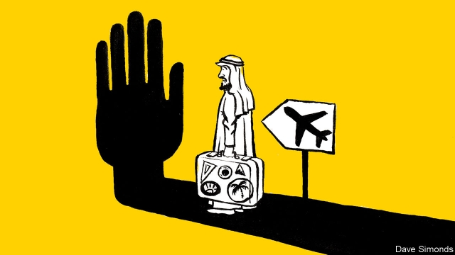

###### Boycotts of summer

# Arab governments want to control where their citizens go on holiday 

 

> print-edition iconPrint edition | Middle East and Africa | Jul 20th 2019 

A COUNTRY THAT draws 39m foreign tourists each year is on the brink of anarchy, if you believe the Saudi media. “Turkey is not safe for travel,” blared a recent headline in a Saudi newspaper. The kingdom’s embassy in Ankara has warned of rising petty crime aimed at Saudi citizens. Another story claimed that 2,187 people were killed in gun violence in Turkey in 2017. (There are no such warnings about America, where gun deaths are far more common.) 

It is true that one Saudi visitor in Turkey last year was murdered and dismembered. However, his killers were not locals but a 15-member Saudi hit squad and the murder took place inside a Saudi consulate. The victim was a journalist, Jamal Khashoggi, who had upset the Saudi regime. His death made tense relations between the two countries much worse. Hence the campaign by Saudi officials to discourage their citizens from travelling to Turkey. It seems to be working: Saudi tourist arrivals were down by 31% in the first five months of this year compared with last. 

Many Arab regimes restrict where their citizens may travel. In 1989 a Thai labourer stole jewellery from the palace of a Saudi prince, a caper known as the “blue diamond affair”. Three Saudi diplomats were then murdered in Bangkok in murky incidents that may or may not have been connected with the theft. The kingdom promptly banned its nationals from visiting Thailand. Most of the jewels were returned. But the prohibition remains in force. Last year Thailand saw just 28,000 Saudi visitors, compared with 75,000 from much smaller Kuwait. 

Cheap, Arabic-speaking and comparatively clement, Egypt has always been a popular destination for Gulf tourists. But Qataris now avoid it because of politics: Egypt was one of four countries to impose an embargo on the emirate in 2017. The embargo has even turned the hajj, the pilgrimage to Mecca, into a political spat: Saudi Arabia and Qatar accuse each other of obstructing travel for Qatari pilgrims. The United Arab Emirates has forbidden travel to Lebanon since 2012, supposedly because of kidnapping risks. In 2011 some 32,000 Emiratis flew to Beirut. Last year fewer than 1,800 did. 

In Egypt, citizens aged under 40 need state-security approval before flying to Turkey. The ban was imposed in 2014 to stop Egyptians from crossing into Syria to join Islamic State. That is no longer a worry. Yet the rule remains in place, as one woman recently discovered while trying to spend a long weekend in Istanbul with her foreign partner. (Airport police helpfully encouraged him to take the holiday solo.) Permits are also sometimes required for notorious hotbeds of Islamism like Georgia and South Korea. 

By discouraging travel to Turkey, the Saudi government may hope to keep tourist rials at home. King Salman has set an example the past two summers. Instead of his usual visit to a palace in Morocco, he has taken staycations at Neom, a planned $500bn city on the kingdom’s north-western coast. The summer heat is no doubt unbearable, but on the bright side, there are no crowds at the beach: the city has no residents yet. 
<<<<<<< HEAD

-- 

 单词注释:

1.Jul[]:七月 

2.brink[briŋk]:n. 边缘, 陡岸 

3.anarchy['ænәki]:n. 无政府状态, 政治混乱 [法] 混乱, 无秩序, 无政府状态 

4.saudi['sajdi]:a. 沙乌地阿拉伯（人或语）的 

5.blare[blєә]:n. 巨响, 吼叫声, 光泽 vi. 高声鸣叫, 大叫 vt. 大声喊出 

6.Ankara['æŋkәrә]:n. 安卡拉(土耳其首都) 

7.petty['peti]:a. 琐碎的, 小规模的, 小气的, 委琐的 [经] 小额的, 微小的, 小规模的 

8.dismember[dis'membә]:vt. 割断手足, 支解, 分割 

9.killer['kilә]:n. (非正式)杀人者, 屠杀者, 猛兽, 致死(疾病), 杀手, 止痛药, 限制器, 瞄准器 [计] 删除程序; 断路器 

10.squad[skwɒd]:n. 班, 小队, 小集团 vt. 编成班 

11.consulate['kɒnsjulit]:n. 领事, 领事任期, 领事馆 [经] 领事馆 

12.Jamal[]:n. 贾马尔（男子名） 

13.khashoggi[]:卡舒吉 

14.regime[rei'ʒi:m]:n. 政权, 当权期间, 政体, 社会制度, 体制, 情态 [医] 制度, 生活制度 

15.Thai[tai]:n. 泰国人, 泰语 

16.jewellery['dʒu:әlri]:n. 宝石, 贵重饰物, 珠宝, 宝石饰物, 受珍视的人/物, 宝贝, 有价值的人/物 

17.caper['keipә]:n. 跳跃 vi. 雀跃, 蹦跳 

18.diplomat['diplәmæt]:n. 外交官, 有外交手腕的人 [法] 外交家, 外交官, 有权谋的人 

19.Bangkok['bæŋkɒk]:n. 曼谷 

20.murky['mә:ki]:a. 黝暗的, 阴沉的, 朦胧的 

21.promptly['prɒmptli]:adv. 敏捷地, 迅速地 

22.Thailand['tailәnd]:n. 泰国 

23.prohibition[.prәuhi'biʃәn]:n. 禁令, 禁止 

24.Kuwait[kә'wait]:n. 科威特 

25.clement['klemәnt]:a. 仁慈的, 宽厚的, 温和的 

26.Egypt['i:dʒipt]:n. 埃及 

27.alway['ɔ:lwei]:adv. 永远；总是（等于always） 

28.qataris[]:[网络] 卡塔尔人；卡达人 

29.embargo[im'bɑ:gәu]:n. 封港令, 禁运 vt. 禁止出入港口, 禁运 

30.emirate[e'miәrit]:n. 埃米尔的地位, 酋长国 

31.hajj[hædʒ]:n. [伊斯兰教]麦加朝圣 

32.pilgrimage['pilgrimidʒ]:n. 朝圣, 漫游, 人生的一段经历 vi. 朝拜, 朝圣, 漫游 

33.Mecca['mekә]:n. 麦加 

34.Arabia[ә'reibiә]:n. 阿拉伯半岛 

35.Qatar['kɑ:tәr]:n. 卡塔尔 

36.obstruct[әb'strʌkt]:vt. 阻隔, 妨碍, 阻塞, 遮没 vi. 设障碍 

37.Qatari['kɑ:təri]:n. 卡塔尔人 a. 卡塔尔的 

38.pilgrim['pilgrim]:n. 旅行者, 朝圣者, 香客 vi. 朝圣 

39.Lebanon['lebәnәn]:n. 黎巴嫩 

40.supposedly[sә'pәuzidli]:adv. 想象上, 看上去像, 被认为是, 恐怕, 按照推测 

41.kidnap['kidnæp]:vt. 绑架, 诱拐, 拐骗 [法] 拐带, 诱拐, 绑架 

42.emiratis[]:[网络] 自视甚高的阿联人；酋长国国民 

43.Beirut[.bei'ru:t]:n. 贝鲁特 

44.Syria['siriә]:n. 叙利亚 [经] 叙利亚 

45.Islamic[iz'læmik]:a. 伊斯兰教的, 穆斯林的 

46.Istanbul[.istæn'bu:l]:n. 伊斯坦布尔 

47.helpfully[]:adv. 有用地；有益地 

48.solo['sәulәu]:n. 独奏, 独唱, 单独表演 a. 单独的, 独奏的, 独唱的 vi. 放单飞 

49.notorious[nәu'tɒ:riәs]:a. 声名狼藉的, 臭名昭著的, 众人皆知的 

50.hotbed['hɒtbed]:n. 温床 

51.Islamism['izlәmizm]:n. 伊斯兰教 

52.Georgia['dʒɒ:dʒjә]:n. 乔治亚州 

53.Korea[kә'riә]:n. 朝鲜, 韩国 

54.rial['raiәl]:n. 里亚尔(伊朗货币单位) 

55.Salman[]:n. 萨尔曼（男子名） 

56.Morocco[mә'rɒkәu]:n. 摩洛哥, 摩洛哥皮革 [机] 摩洛哥革 

57.staycations[]:[网络] 宅族；在家度假；和宅 
=======
>>>>>>> 50f1fbac684ef65c788c2c3b1cb359dd2a904378

