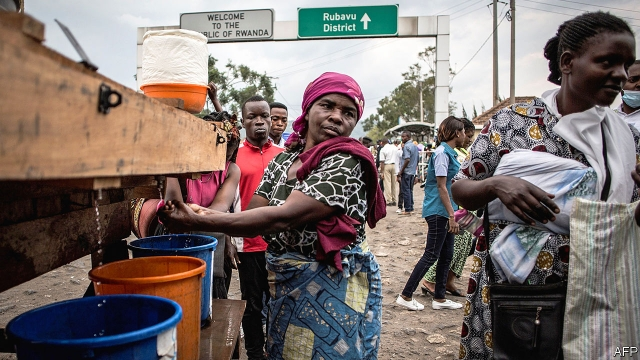

###### The virus spreads

# Ebola has been declared an international public health emergency 

 

> print-edition iconPrint edition | Middle East and Africa | Jul 20th 2019 

EBOLA SHOULD never have made it to Goma, the second biggest city in the east of the Democratic Republic of Congo. It did because a pastor, who had been in Butembo apparently trying to cure patients by laying hands on them, then travelled back. At each of the three health checkpoints he passed through, he gave a fake name, keeping his temperature down with heavy doses of paracetamol. On arriving in the city, he checked into a clinic where he tested positive for the disease; he died in an ambulance some hours later while being taken to a treatment centre back in Butembo. 

Such are the difficulties health workers face when trying to stop the spread of Ebola, the latest outbreak of which has now killed almost 1,700 people in Congo. It is the second biggest outbreak ever, after the one in west Africa in 2014-2016, and the first to happen in a war zone, where doctors have to worry about guerrillas with machetes, not just the virus. On the evening of July 17th, Tedros Adhanom Ghebreyesus, the director-general of the World Health Organisation (WHO), announced he had been advised by the WHO’s emergency committee to declare the disease a “public health emergency of international concern”, only the fifth in history. 

Officials long dreaded the moment the virus makes it to Goma. The city has a population of 2m people, cramped between Lake Kivu and Mount Nyiragongo, an active volcano. It directly abuts the Rwandan city of Gisenyi, and thousands cross the border each day. Until now the virus has been contained in regions with lousy roads that are hard to access. In a densely populated urban area, it could be much harder to keep track of those whom patients might have touched. 

So far, however, the situation seems to be under control. No other cases have been reported in the city and the Congolese ministry of health and the WHO have been busy vaccinating anyone who could possibly have touched the pastor. Outside the scruffy clinic where he turned himself in, rows of fidgeting children and their mothers sit around on plastic chairs, waiting for nurses to prick their arms. Roughly 200 people have been vaccinated in Goma. 

Dr Tedros’s declaration came as a surprise to many aid workers. “[Ebola] really becomes a problem when a chain of transmission is launched,” says Tariq Riebl of the International Rescue Committee, an NGO. Declaring an emergency will not change the nature of the response, says Oly Ilunga, the Congolese minister of health. Previously, doctors had worried that declaring an emergency might lead other countries to close their borders. In west Africa, that hampered the response, as sick people avoided checkpoints. Now the WHO says that more international co-ordination is needed, especially given the threat of a spread to Rwanda, which is thought to be less well prepared than Congo and Uganda. 

But the response is also running desperately low on funds. The next phase will need roughly $233m, says the WHO, and donor countries have so far not contributed enough. Some suspect that declaring an emergency is an attempt to unlock some cash. That sets an awkward precedent, says David Heyman of the London School of Hygiene and Tropical Medicine. 

In Goma, buckets of chlorinated water alongside health workers armed with thermometers are stationed throughout the city. Residents greet one another coolly, with nods and fist bumps instead of effusive Congolese handshakes and kisses.■ 

-- 

 单词注释:

1.ebola[i'bəulə]:n. 埃博拉病毒 

2.Jul[]:七月 

3.ebola[i'bəulə]:n. 埃博拉病毒 

4.goma[]:abbr. general officer money allowance 将级军官货币津贴 

5.Congo['kɔŋ^әu]:n. 刚果, 刚果河, 工夫茶 [建] 刚果, 直接刚果红 

6.pastor['pæstә]:n. 牧师 

7.Butembo[]:[地名] 布滕博 ( 刚(金) ) 

8.apparently[ә'pærәntli]:adv. 表面上, 清楚地, 显然地 

9.checkpoint['tʃekpɒint]:n. 检查站 [计] 检查点 

10.fake[feik]:n. 假货, 欺骗, 诡计 a. 假的 vt. 假造, 仿造 vi. 伪装 

11.paracetamol[]:[化] 对乙酰氨基酚; 扑热息痛 [医] 醋氨酚, 对乙酰氨基酚 

12.outbreak['autbreik]:n. 爆发, 暴动 [医] 暴发 

13.guerrilla[gә'rilә]:n. 游击队 

14.machete[mә'tʃeiti]:n. 大砍刀 [化] 马歇特; 丁草胺 

15.organisation[,ɔ: ^әnaizeiʃən; - ni'z-]:n. 组织, 团体, 体制, 编制 

16.cramp[kræmp]:n. 痉挛, 腹部绞痛, 铁夹钳 a. 狭窄的, 难认的 vt. 使抽筋, 以铁箍扣紧, 束缚 

17.kivu[]:n. 基伏（位于刚果民主共和国与卢旺达的边界的湖） 

18.nyiragongo[]: [地名] [刚果民主共和国] 尼拉贡戈火山 

19.abut[ә'bʌt]:v. 邻接, 毗邻 

20.Rwandan[rj'ɑ:ndәn, -'æn-]:a. 卢旺达的 

21.gisenyi[]: [地名] [卢旺达] 吉塞尼 

22.lousy['lauzi]:a. 污秽的, 恶心的, 生虱的 

23.densely['densli]:adv. 浓密地, 浓厚地 

24.populate['pɔpjuleit]:vt. 使人口聚居在...中, 殖民于, 移民于, 居住于, 定居于 

25.Congolese[,kɔŋ^ә'li:z]:n. 刚果人, 刚果语 a. 刚果的, 刚果语的, 刚果人的 

26.vaccinate['væksineit]:v. 预防接种 

27.scruffy['skrʌfi]:a. 不整齐的, 肮脏的, 破旧的, 褴褛的 

28.prick[prik]:vt. 刺, 戳, 刺痛, 使竖起 vi. 刺, 竖起 n. 扎, 一刺, 刺痛 a. 竖起的 

29.declaration[.deklә'reiʃәn]:n. 宣告, 说明, 宣布 [计] 说明 

30.Tariq[]:n. (Tariq)人名；(阿拉伯、巴基)塔里克 

31.ngo[]:abbr. 民间组织；非政府组织（Non-Governmental Organization） 

32.oly[]:abbr. Washington, D. C. , Olympics 华盛顿奥运会（国家协会） 

33.ilunga[]: [地名] [坦桑尼亚] 伊隆加 

34.hamper['hæpә]:n. 食篮, 阻碍物, 食盒 vt. 阻碍, 使困累, 妨碍, 牵制 

35.rwanda[rj'ændә]:n. 卢旺达（东非国家）；卢旺达语 

36.les[lei]:abbr. 发射脱离系统（Launch Escape System） 

37.Uganda[ju(:)'^ændә, u:'^ændә]:n. 乌干达 

38.desperately['despәrәtli]:adv. 拼命地；绝望地；极度地 

39.donor['dәunә]:n. 捐赠人 [化] 给体; 供体 

40.unlock[.ʌn'lɒk]:vt. 开...的锁, 开启, 表露, 放出 vi. 被开启, 揭开, 解放 [计] 解出锁定 

41.precedent['presidәnt]:n. 先例, 前例 a. 在先的, 在前的 

42.david['deivid]:n. 大卫；戴维（男子名） 

43.heyman[]: [人名] [英格兰人姓氏] 海曼 Hayman的变体 

44.hygiene['haidʒi:n]:n. 卫生保健, 卫生学, 保健法 [医] 卫生, 卫生学 

45.chlorinate['klɒ:rineit]:vt. 使氯化, 用氯消毒 

46.coolly['ku:li]:adv. 沉着, 自若 

47.bump[bʌmp]:n. 撞击, 肿块 vt. 碰撞 vi. 撞, 颠簸而行 

48.effusive[i'fju:siv]:a. 感情横溢的, 奔放的, 流出的 

49.handshake['hændʃeik]:n. 握手 

