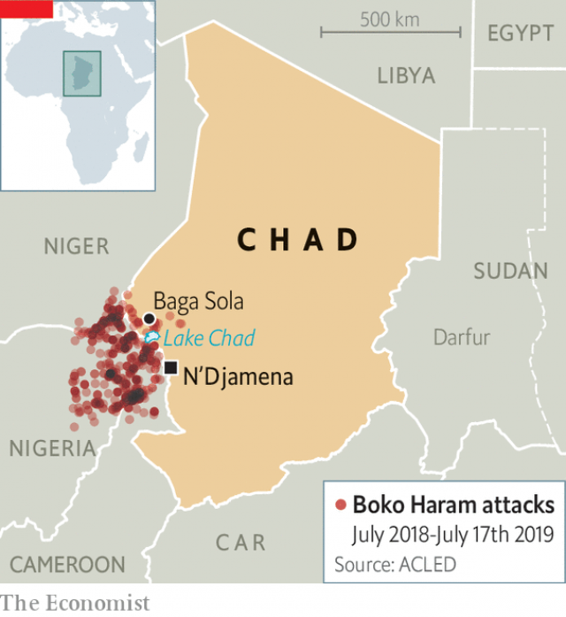

###### Hanging Chad

# Idriss Déby, Chad’s despot, is struggling to stay in power 

 

> print-edition iconPrint edition | Middle East and Africa | Jul 20th 2019 

YUSUF NUHAN, a 65-year-old Chadian villager, remembers when he could sail across Lake Chad to visit markets and relatives. His village used to be rich with thousands of cattle, he says. But three years ago, jihadists from Boko Haram attacked and took everything. “They just killed people. We don’t know why,” he says, fiddling with his prayer beads. “The government has done nothing to help us.” 

He and his family fled to Baga Sola, a small, dry market town a few kilometres away. They set up camp outside the walls of a United Nations base and prayed that one day they could return to their land. But over the past few months, there has been a resurgence of Boko Haram attacks, killing dozens of soldiers. In theory Mr Nuhan could walk to his childhood home in two hours, but he has given up hope of ever seeing his land again. 

Chad is at the heart of Africa’s most ungovernable region. Landlocked, it shares borders with conflict-ridden Libya, Sudan, the Central African Republic and Boko Haram’s strongholds in Nigeria, Niger and Cameroon. Many Western military officials see the president, Idriss Déby, as a bulwark against that insecurity. Through brutality and military cunning he has managed to hold on to power for almost three decades. But the state he leads is rotten and his rule precarious. 

In February three columns of Toyota pickup trucks packed with Chadian rebels sped out of the desert from Libya towards N’Djamena, Chad’s capital. The rebels were led by Mr Déby’s cousin and were largely disgruntled members of the president’s ethnic group, the Zaghawa. At Chad’s request, French warplanes from Barkhane, France’s anti-jihadist force in the Sahel, strafed the rebels for three days. France, the former colonial power, had intervened to help out Mr Déby before, but never with such a show of force. 

Since the 1960s Lake Chad, on which farmers and fisherfolk depend, has shrunk by half. Almost all of the country’s 16m people are poor. Chadians joke: “We are all going to heaven as we’ve already experienced hell on earth.” The president regularly imprisons opponents. But his real source of power is the ability to distribute patronage paid for by Chad’s main export, oil. 

 

There has been less of that available since the sharp decline in oil prices in 2014. Big international debts give the government little room for manoeuvre. Civil-servant and army salaries have been cut. Income per person fell from $1,200 in 2014 to $810 in 2017, according to the IMF. “Life is much harder now. Outside the capital, lots of people are struggling and there is serious discontent,” says Marielle Debos, the author of “Living by the Gun in Chad”. 

Mr Déby commands a small but professional army formed mainly of Zaghawa soldiers. They are well armed, often trained by the French, and can be an effective force. Despite military spending that is only a ninth that of Nigeria, Chad has been better at fighting Boko Haram. In 2015 Chadian soldiers helped push the jihadists out of big towns in northern Nigeria. 

But today Mr Déby’s army is overstretched. A new wave of attacks by Boko Haram and Islamic State of West Africa (a Boko Haram offshoot) has hit the Lake Chad Basin. Analysts say the new attackers are better trained and better armed than they were in the past. And while the Chadian army is good at fighting outside the country, inside it is less effective. According to Ms Debos, the need for France’s intervention showed that some high-ranking officers were unwilling to fight their kith and kin among the rebels. 

Relations with neighbouring Sudan are also a problem. Mr Déby backed fighters in Sudan’s rebellious Darfur region. In response the government in Khartoum sponsored Chadian opponents who almost killed the president in 2008. Now that his rival dictator in Sudan, Omar al-Bashir, has been ousted Mr Déby will fear meeting the same fate. Chad does not have a professional middle class like the one that spearheaded Sudan’s revolution, but protests erupted last year at Mr Déby’s promotion of a law that could allow him to stay as president until 2033, when he will be 81. In response the government banned social media for over a year, only reallowing it on July 14th. 

France and America have several thousand troops between them stationed in N’Djamena. These soldiers give the president no small amount of comfort. But Mr Déby’s foreign patrons cannot protect him from everything.■ 

