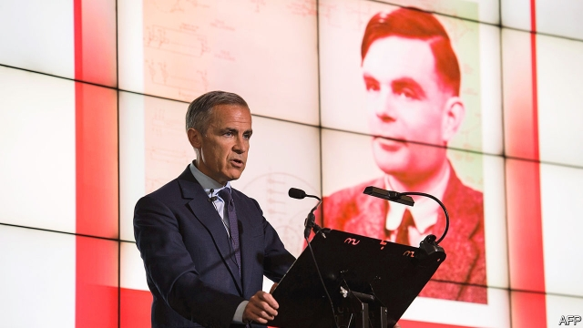

###### Celebrating inventors

# Alan Turing, a computing pioneer, will feature on Britain’s £50 notes 

 

> print-edition iconPrint edition | Science and technology | Jul 20th 2019 

AT THE MOMENT, Bank of England £50 notes feature James Watt, whose steam engines powered the Industrial Revolution, and his business partner Matthew Boulton. On July 15th, however, the bank announced that from 2021 fifties will instead depict Alan Turing, the man who built Colossus, the world’s first programmable, electronic, digital computer and who also developed much of the theory of computer science, especially the idea of algorithms. Colossus was used to break German codes during the second world war, shortening hostilities considerably. That won Turing scant recognition though, partly because of the project’s secrecy and partly because he was gay, and homosexual activity was then illegal in Britain. Which changed the world more, steam engines or computers, is debatable. But Watt died in his 80s, rich and lauded by his fellows. Turing died of cyanide poisoning, possibly self-inflicted, at the age of 41. ■ 
<<<<<<< HEAD

-- 

 单词注释:

1.alan['ælәn]:n. 艾伦（男子名） 

2.ture[]: 油温测量装置；介观结构 

3.computing[kәm'pju:tiŋ]:[计] 计算 

4.Jul[]:七月 

5.jame[]: 灰岩井 

6.watt[wɒt]:n. 瓦(特) [化] 瓦; 瓦特 

7.Matthew['mæθju:]:n. 马太, 马太福音 

8.Boulton[]:博尔顿 

9.depict[di'pikt]:vt. 描述, 描写 

10.colossus[kә'lɒsәs]:n. 巨像, 巨人 

11.programmable['prәugræmәbl]:a. 可设计的, 可编程的 

12.algorithm['ælgәriðm]:n. 算法 [计] 算法 

13.shorten['ʃɒ:tn]:vt. 弄短, 缩短, 减少 vi. 缩小, 变短 

14.hostility[hɒs'tiliti]:n. 敌意, 敌对, 反对 

15.considerably[kәn'sidәrәbli]:adv. 非常地, 很, 颇 

16.scant[skænt]:a. 不充分的, 不足的 vt. 减少, 吝啬, 限制, 藐视, 忽略 

17.secrecy['si:krisi]:n. 秘密, 保密 [法] 秘密, 秘密状态, 保密 

18.homosexual[.hɒmәu'sekjuәl]:a. 同性恋的 n. 同性恋者 

19.debatable[di'beitәbl]:a. 可争论的, 成问题的, 未决定的 

20.laud[lɒ:d]:n. 赞美, 称赞 vt. 赞美, 称赞 

21.cyanide['saiәnaid]:n. 氰化物 vt. 用氰化物处理 [计] 氰化物 
=======
>>>>>>> 50f1fbac684ef65c788c2c3b1cb359dd2a904378

