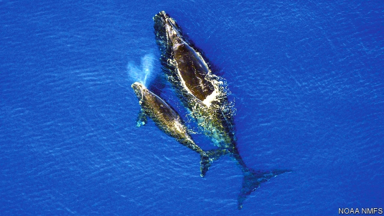

###### Right whales, wrong place

# To save whales, Canada sets a maritime speed limit 

 

> print-edition iconPrint edition | The Americas | Jul 20th 2019 

WHEN 12 NORTH ATLANTIC right whales died in the Gulf of St Lawrence in the spring and early summer of 2017, Canada imposed speed limits on large ships in the area and told snow-crab fishermen to move. In the following year the government worked with researchers, fishermen and the shipping industry to refine the restrictions. No whales died in the gulf in 2018. “We kept wondering if what we had done was good, or were we lucky?” says Moira Brown, a scientist at the Canadian Whale Institute, a research body. 

Apparently it was luck. Six right whales died in the gulf in June this year after colliding with ships or getting entangled in fishing lines. Three others were spotted near Miscou Island trailing ropes, which attach crab and lobster traps on the seabed to buoys (see map). Just 400 North Atlantic right whales, which can grow to 18 metres (60 feet) in length, remain alive. The steps Canada is taking to save them from extinction are expensive for industry. 

 

On July 8th Canada responded to the latest deaths by expanding the zone in which ships must observe a ten-knot speed limit, reducing to 13 metres from 20 the length of ships that must comply, increasing aerial surveillance of whales and extending the period during which a fishing area must close after a whale is sighted. The measures will reduce risk for whales but will not eliminate it, says Jonathan Wilkinson, Canada’s fisheries minister. 

The whales, which migrate annually north from the coast of Florida, have been “showing up in areas where we did not anticipate they would be”, says Mr Wilkinson. Because of climate change the Gulf of Maine, where the whales used to stay, is warming faster than almost all other ocean regions. That has pushed northward their favourite food, copepods, a kind of small crustacean. 

The Canadian waters into which the whales are now venturing hold some 400,000 fishing lines. That is in addition to the 600,000 the animals navigate already. An analysis of 30 years of data showed that every year a quarter of right whales, which can live to be 100, are wounded by fishing gear. There is “no place within the fished area along the east coast of North America for which entanglement risk is zero”, concluded a report in 2018 by the National Oceanic and Atmospheric Administration (NOAA), an American government agency. 

Some solutions cause problems. In 2015 the NOAA told American fishermen to put more traps on each fishing line to reduce the number of lines in the water. That required stronger rope, which made it harder for whales to free themselves. Some ships are thought to speed up before entering a speed-limit zone, raising the risk of killing a whale. In American waters, the speed limits near whale sightings are voluntary. 

The whale-protection measures have reduced fishermen’s catch. The speed limit on large boats can lengthen by eight hours the time it takes to get from Cabot strait to Montreal. Cruise ships have had to cancel stops. Owners of container ships may need to add more vessels to meet delivery schedules. Despite the extra costs, captains have mostly obeyed the rule. According to the Canadian transport department, only 111 of the 1,472 ships that sailed through restricted zones between April 28th and June 27th broke the speed limit. 

The government hopes that eventually new devices, like ropeless fishing gear, will save some whales. It is giving more money to organisations like Campobello Whale Rescue, a group of scientists, researchers and fishermen on Campobello Island in New Brunswick. They set forth in inflatable speedboats to free whales from fishing lines. It is dangerous work. In 2017 a whale struck one of its rescuers with its tail, killing him. On July 8th this year another team sped out from Campobello to free the whales off Miscou island. By July 15th they had disentangled two of them partially. The whales swam off trailing ropes.■ 

