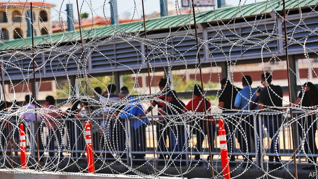
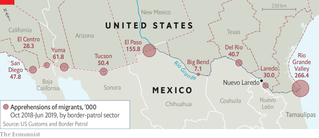

###### Border order

# Trump builds a bureaucratic wall to keep out migrants 

 

> print-edition iconPrint edition | The Americas | Jul 20th 2019 

AT A MIGRANT shelter in Nuevo Laredo, a city in the Mexican border state of Tamaulipas, the mood is cheerful. Children play among cinderblocks and piles of sand. Volunteers fry eggs in the kitchen. Residents tell their stories. “The salaries! It’s seven dollars a week in Cuba,” says Eldis, an engineer who left the island in May. A woman, her arms draped around her two daughters, one-ups him. “In Venezuela, it’s six dollars a month,” she replies. They are smiling because these hardships seem to lie behind them. But the mood darkens when the conversation turns to news from the United States, where they are heading.  

On July the Trump administration promulgated a rule that upends the United States’ system of dealing with asylum-seekers and could dash the hopes of those in Nuevo Laredo and thousands more. Under the new rules, no migrant can apply for asylum unless he or she has sought it in “at least one” other country along the way and been refused. 

The rules affect anyone who is not Mexican and arrives at the American border by land. That describes a lot of America-bound migrants. Of the 688,000 apprehended at the border between October 2018 and June this year, only 18% were Mexican. Most of the rest came from Central America and countries elsewhere in Latin America. Now they must appeal for asylum to Mexico or somewhere farther south.  

The order is President Donald Trump’s latest attempt to keep immigrants out of the country but in the headlines. It followed the last-minute cancellation of a visit to the White House by Guatemala’s president, Jimmy Morales. He had been expected to conclude a “safe-third-country agreement”, which would have allowed the United States to deny asylum to anyone who had passed through Guatemala from other countries. The deal fell apart, perhaps because Guatemala’s constitutional court seemed likely to block it. 

 

Even before the new rule took effect, the migrants in Nuevo Laredo were subject to an earlier decision by Mr Trump to require asylum-seekers to remain in Mexico while American courts process their claims. In June Mexico’s government agreed to extend that all along its border, and to step up policing of its borders, after Mr Trump threatened to impose tariffs on Mexican exports if it failed to stop the migrant flow. 

“Metering” will make the migrants’ wait longer. That is a revival of an American policy, used during the Obama administration, to limit the number of asylum claims the border authorities will consider each day. This year apprehensions at the border have been soaring, which suggests that the bureaucratic wall has had little effect. That may be starting to change. In June the number of apprehensions dropped 29% from May. Hot weather usually reduces the number but the decline was bigger than expected. Even so, 95,000 people were nabbed. 

Under international and American law, people are entitled to asylum if they face persecution in their home countries because of their race, religion, nationality, membership of a social group or political opinion. In recent years, governments and judges have expanded their understanding of what constitutes persecution. A growing number of migrants have tried to use those rights to gain admission to the United States. The share asking for asylum after being apprehended without the right documents has risen from 5% to 40% over the past decade. Many do not qualify even under an elastic definition of persecution. Central Americans are more likely to be fleeing poverty. Relatives in the United States are a big draw. 

A “large majority” of asylum claims at the border are rejected, says the Justice Department. Officials say that “meritless” claims worsen overcrowding in American detention centres and lengthen delays. Even genuine refugees should not be able to “shop” for asylum in their preferred country, they grumble. 

The Trump administration’s response has been to narrow its interpretation of what asylum means and, at the same time, to transfer to other countries responsibility for caring for asylum-seekers and judging their cases. It has tightened the standards under which victims of gang violence or domestic abuse can claim they are suffering from “persecution”. 

Mr Trump’s latest order makes migrants’ situation more uncertain than ever. The recent deal with Mexico now seems “obsolete”, says Andrew Selee of the Migration Policy Institute, a think-tank in Washington, DC. Instead of waiting in Mexico for a ruling from American authorities, migrants are now expected to stay in a country that cannot provide security to its own citizens. Those still determined to reach the United States may have to pay large sums to people-trafficking gangs and risk their lives in the desert. 

Migrants’ hopes of a less perilous passage depend on whether American courts overturn the new policies. They have already struck down a rule that denied the right to claim asylum to people who cross the border without authorisation. The “remain in Mexico” policy faces a challenge. Mr Trump’s latest order is illegal because the United States has no safe-third-country agreements with any of the Latin American countries to which it might send asylum-seekers, contends Lee Gelernt of the American Civil Liberties Union, which has filed a lawsuit against the new rule. 

Tamaulipas, a hub for drug-trafficking, is among Mexico’s least safe states. Newspaper offices have memorials to murdered journalists. Truckloads of armed men prowl the roads at night. But more migrants go through Tamaulipas than any other state. Miami-bound Cubans and Venezuelans often choose it as the shortest route without taking account of the dangers. America sends a third of deported Mexican migrants to Nuevo Laredo. Those waiting in shelters are reluctant to venture outside. One risk is that drug gangs will try to press them into service. Their favourite recruits are said to be Cubans, who typically have military training (as conscripts in the Cuban army). 

Eldis, the 46-year-old from central Cuba, has waited eight weeks in Tamaulipas to apply for asylum in the United States but is now unsure what to do. He expects that Mr Trump will reverse his decision, at least as it applies to Cubans, when he realises that it could cost him votes in Florida, a swing state. If not, he will ring the Canadian embassy, he says. Chances are, he will get a friendlier refusal. ■ 

-- 

 单词注释:

1.migrant['maigrәnt]:n. 候鸟, 移居者 [法] 移居者 

2.Jul[]:七月 

3.migrant['maigrәnt]:n. 候鸟, 移居者 [法] 移居者 

4.nuevo[]: [地名] [美国] 努埃沃 

5.laredo[lə'reidəu]:n. 拉雷多（美国得克萨斯州南部城市） 

6.Tamaulipas[,tɑ:mɑ:u'li:pɑ:s]:n. 塔毛利帕斯（墨西哥东北部的州） 

7.cinderblock[ˈsɪndə blɔk]:un. 煤渣砖 [网络] 石头怪 

8.Cuba['kju:bә]:n. 古巴 

9.drape[dreip]:n. 布帘, 褶皱 vt. 用布帘覆盖, 披上 vi. 成褶皱状 

10.Venezuela[,vene'zweilә]:n. 委内瑞拉 

11.darken['dɑ:kn]:vt. 弄暗, 使模糊 vi. 暗下来, 颜色变深 

12.promulgate[prә'mʌlgeit]:vt. 发布, 公布, 发表, 传播 [法] 颁布, 公告, 散播 

13.upend[ʌp'end]:v. 颠倒, 倒放 

14.asylum[ә'sailәm]:n. 庇护, 收容所 [医] 养育院 

15.apprehend[.æpri'hend]:vt. 理解, 忧虑, 逮捕 vi. 担心, 理解 

16.cancellation[kænsә'leiʃәn]:n. 取消, 作废, 注销戳 [经] 注销, 取消, 保险单的注销 

17.jimmy['dʒimi]:n. 铁撬 vt. 撬 

18.morale[mɒ'rɑ:l]:n. 士气, 道德 

19.Guatemala[.gwɑ:tә'mɑ:lә]:n. 危地马拉 

20.constitutional[.kɒnsti'tju:ʃәnl]:a. 宪法的, 立宪的, 体质的 [医] 全身的; 体质的 

21.tariff['tærif]:n. 关税, 关税表, 价格表, 收费表 vt. 课以关税 [计] 价目表 

22.meter['mi:tә]:n. 米, 公尺, 仪表, 计量器 vt. 以仪表计量 

23.revival[ri'vaivl]:n. 复兴, 复活, 恢复精神, 苏醒 [医] 复苏, 回生, 精神重振 

24.obama[]:n. 奥巴马(姓) 

25.apprehension[.æpri'henʃәn]:n. 理解, 忧惧, 逮捕 [医] 领会 

26.soar[sɒ:]:n. 高扬, 翱翔 vi. 往上飞舞, 高耸, 翱翔 

27.nab[næb]:vt. 捉住, 逮捕, 抢夺 [电] 国际广播协会的简写 

28.persecution[.pә:si'kju:ʃәn]:n. 虐待, 迫害运动, 迫害, 烦扰 [法] 迫害, 虐待, 困扰 

29.membership['membәʃip]:n. 会员的资格, 全体会员, 会员数目 [法] 会员资格, 成员资格, 会籍 

30.constitute[kәn'stitjut]:vt. 构成, 组成, 任命 [建] 构造, 组成 

31.meritless[]:不道德的 

32.worsen['wә:sn]:vt. 使更坏, 使恶化 vi. 变得更坏, 恶化 

33.overcrowd[.әuvә'kraud]:vt. 容纳过多的人, 使过度拥挤 

34.detention[di'tenʃәn]:n. 阻止, 监禁, 拘留 [医] 隔离, 拘留, 滞留, 停滞 

35.lengthen['leŋθәn]:vt. 加长, 使延长 vi. 变长 

36.refugee[.refju'dʒi:]:n. 难民, 流亡者 [法] 避难者, 流亡者, 难民 

37.grumble['grʌmbl]:n. 怨言, 满腹牢骚 vi. 抱怨, 发牢骚, 发隆隆声 vt. 抱怨 

38.tighten['taitn]:vt. 勒紧, 使变紧 vi. 变紧, 绷紧 

39.obsolete['ɒbsәli:t]:a. 荒废的, 成废物的, 陈旧的, 老式的 n. 废词, 废物 

40.andrew['ændru:]:n. 安德鲁（男子名） 

41.migration[mai'greiʃәn]:n. 移民, 移往, 移动 [计] 迁移 

42.Washington['wɒʃiŋtn]:n. 华盛顿 

43.DC[]:直流电 [计] 数据单元, 数据中心, 数据代码, 数据通信, 数据控制, 数字控制, 直流 

44.cannot['kænɒt]:aux. 无法, 不能 

45.les[lei]:abbr. 发射脱离系统（Launch Escape System） 

46.perilous['perilәs]:a. 危险的, 濒临毁灭的 

47.overturn[.әuvә'tә:n]:n. 倾覆, 破灭, 革命 vt. 推翻, 颠倒 vi. 翻倒 

48.authorisation[,ɔ:θəraɪ'zeɪʃən]:n. 授权；批准 

49.contend[kәn'tend]:vi. 奋斗, 斗争, 竞争 vt. 为...斗争 

50.lee[li:]:n. 背风处, 避风处, 下风处, 保护, 庇护 a. 避风的, 背风的, 下风的, 保护的 

51.lawsuit['lɒ:sju:t]:n. 诉讼 [法] 诉讼, 诉讼案件 

52.hub[hʌb]:n. 毂, 木片, 中心 [计] 插座; 插孔; 集线器, 集中器, 连接器, 中继站 

53.truckload['trʌklәjd]:n. 货车荷载, 最低起运量 

54.prowl[praul]:n. 潜行, 徘徊, 悄悄踱步 vi. 潜行以觅食, 徘徊 vt. 徘徊 

55.Cuban['kju:bәn]:a. 古巴的, 古巴人的 n. 古巴人 

56.venezuelan[,venә'zweilәŋ]:a. 委内瑞拉的；委内瑞拉人的 

57.deport[di'pɒ:t]:vt. 举止, 驱逐出境 [法] 放逐, 驱逐, 递解 

58.typically['tipikәli]:adv. 代表性地；作为特色地 

59.conscript['kɒnskript]:a. 被征入伍的, 被征召的 n. 征兵 vt. 征召 

60.Cuban['kju:bәn]:a. 古巴的, 古巴人的 n. 古巴人 

61.unsure[.ʌn'ʃuә]:a. 不肯定的, 不确定的, 没有自信的 

62.Florida['flɒridә]:n. 佛罗里达州 

