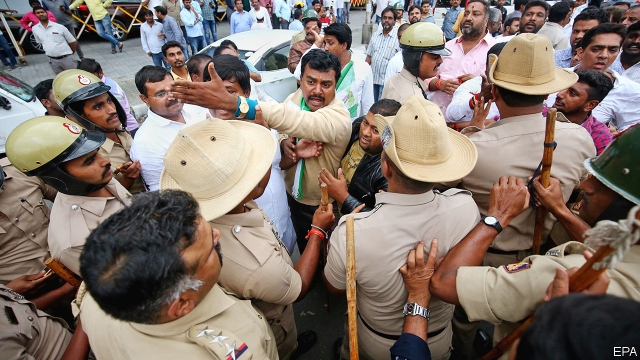

###### Indian politics

# India’s ruling party keeps on winning seats, even after the elections 

 

> print-edition iconPrint edition | Asia | Jul 27th 2019 

IN THE END, the vote of no-confidence on July 23rd that brought down the government of Karnataka state came as an act of mercy. Despite three postponements and countless impassioned speeches, only 99 of the assembly’s 225 members supported the chief minister, H.D. Kumaraswamy. This month 16 members of his coalition government jumped ship, soon after Narendra Modi’s crushing victory in national elections. They “defected”, in Indian political argot, by resigning—ditching their comrades in the Congress party and Mr Kumaraswamy’s provincial party, in favour of Mr Modi’s Bharatiya Janata Party (BJP). The party’s national dominance has not lessened its determination to seize further power at the state level. 

The defecting lawmakers of Karnataka were spirited to a heavily guarded hotel in Maharashtra, a neighbouring state governed by the BJP. When D.K. Shivakumar, a member of the Congress party who supported Mr Kumaraswamy’s government, went there to try to stare down his former comrades he was blocked—by state police—and left to sulk outside in the monsoon drizzle. Back in Bangalore, the capital of Karnataka, the government’s death was protracted and dramatic. Its people were buying time to lure back the defectors before a floor vote. Politicians donned pyjamas for an all-night slumber party in the legislature. They traded accusations of black magic and eventually imposed a citywide ban on liquor sales, as if that might calm things down. As the government crumbled, Mr Shivakumar mused: “My friends who backstabbed me will backstab the BJP too. What is the point of all this? We are all going to die anyway.” 

Traditionally Indian voters punish incumbents. But the BJP’s vote share in this year’s general election was 37%, up from 31% in 2014. Success nationally begets success at state level. Karnataka, among a handful of states that have escaped the party’s grip, is one example. Similar shows are playing around the country, with elected politicians switching sides to stand beside Mr Modi. 

In the bellwether state of Uttar Pradesh, ostensible socialists have joined their BJP foes. In Mr Modi’s home state of Gujarat, an important caste leader abandoned Congress for the BJP fold. In Goa, a small state with a large Christian minority, Congress won the most seats in state-assembly elections in 2017 and one of Goa’s two seats in the general election this April. But on July 10th two-thirds of state legislators decided nonetheless to join the BJP. Upper-house parliamentarians in Andhra Pradesh filed lawsuits to leave their regional party in order to side with the BJP. 

These suits were necessary because India has an anti-defection law which bars legislators from simply swapping parties. It is intended to prevent rich parties from buying the support of poorer ones but it is dismally ineffective. Most Indians assume that powerful parties will use bribery and extortion to lure defectors. With its unfathomably deep pockets and control of national enforcement agencies, Mr Modi’s BJP is an attractive destination for ambitious lawmakers of many parties. When the prime minister boasted on the campaign trail in West Bengal that 40 of the opposition’s assemblymen were in touch with him, his opponents were outraged. He seemed to be flaunting his party’s illicit pulling power. 

The anti-defection legislation took a beating last week when the Supreme Court ruled that the renegades from Karnataka could not be compelled to stick to voting with their party. But even if the law worked as it is supposed to, barring defections would only force politicians to obey their party presidents. That would hardly be a magic fix for India’s democracy.■ 
<<<<<<< HEAD

-- 

 单词注释:

1.politic['pɒlitik]:a. 精明的, 明智的, 策略的 

2.Jul[]:七月 

3.Karnataka[kɑ:'nɑ:tәkә]:卡纳塔克邦[印度邦名](旧称迈索尔邦) 

4.postponement[pәust'pәunmәnt]:n. 延迟, 延期 [法] 延期, 延迟 

5.countless['kauntlis]:a. 数不尽的, 无数的 

6.impassioned[im'pæʃәnd]:a. 充满激情的, 狂热的, 热烈的 

7.HD[]:[计] 层次相关性, 高密度 

8.coalition[.kәuә'liʃәn]:n. 结合体, 结合, 联合 [经] 联合, 联盟 

9.narendra[]:[网络] 纳伦德拉；纳兰德；纳然陀 

10.argot['ɑ:gәu]:n. 行话, 俚语, 黑话 

11.provincial[prә'vinʃәl]:n. 外地人, 粗野的人 a. 省的, 外地的, 偏狭的 

12.Bharatiya[]:[网络] 巴拉蒂亚 

13.Janata['dʒʌnətɑ:]:n. （印度）人民团体；人民党（印度联合政党） 

14.bjp[]: [医][=Bence Jones protein]本周（氏）蛋白，凝溶蛋白 

15.dominance['dɔminәns]:n. 优势, 显性, 统治, 控制, 支配 [计] 控制, 扰势 

16.lawmaker[lɒ:'meikә]:n. 立法者 

17.Maharashtra[,mɑ:hə'rɑ:ʃtrə]:n. 马哈拉施特拉邦（印度西部邦） 

18.dk[]:abbr. 丹麦（Denmark） 

19.sulk[sʌlk]:n. 闹情绪, 闷闷不乐 vi. 不高兴, 闷闷不乐, 不悦, 生气, 愠怒 

20.monsoon[mɒn'su:n]:n. 季风, 吹季风的季节, 雨季 

21.drizzle['drizl]:n. 细雨 v. 下毛毛雨 

22.Bangalore[,bæŋ^ә'lɔ:]:n. 炸药桶 

23.protract[prәu'trækt]:vt. 延长, 拖延, 伸出, 绘制 [法] 延迟, 拖延, 延长 

24.lure[luә]:n. 饵, 诱惑 vt. 引诱, 诱惑 

25.defector[di'fektә]:n. 背叛者, 叛离者 [法] 变节分子, 背叛者, 开小差者 

26.don[dɒn]:n. 西班牙贵族(或绅士), 先生, 阁下 vt. 穿上 

27.pyjama[pә'dʒɑ:mә, pi-]:n. 睡衣裤, 宽松裤 

28.slumber['slʌmbә]:n. 睡眠, 麻木状态 vi. 微睡, 静止, 麻木 vt. 睡着度过(时间) 

29.legislature['ledʒisleitʃә]:n. 立法机关, 议会, 立法院 [法] 立法机构, 立法机关 

30.accusation[ækju:'zeiʃәn]:n. 控告, 指控, 指责 [法] 控告, 起诉, 告发 

31.citywide['siti.waid]:a. 全市的, 全市性的 

32.crumble['krʌmbl]:v. (使)粉碎, (使)成为碎屑, 瓦解, 崩溃, 败落 

33.backstabbed[]:[网络] 恩仇报恨 

34.backstab['bækˌstæb]:v. 以卑鄙的手段陷害 

35.traditionally[]:adv. 传统上；传说上；习惯上 

36.voter['vәutә]:n. 选民, 投票人 [法] 选民, 选举人, 投票人 

37.incumbent[in'kʌmbәnt]:a. 现任的, 依靠的, 负有义务的 n. 领圣俸者, 在职者 

38.nationally['næʃәnәli]:adv. 作为整个民族, 举国一致地, 全国性地 

39.beget[bi'get]:vt. 为某人之生父, 招致, 产生, 引起 

40.MODI['mәudai]:[计] 模块化光学数字接口 

41.bellwether['bel.weðә]:n. 系铃带头羊, 前导, 领导者 

42.uttar[]:[网络] 北方；乌塔茹阿；太邦 

43.Pradesh[]:邦 

44.ostensible[ɒs'tensibl]:a. 表面的, 假装的, 看得出的 [经] 表面的, 诡称的 

45.foe[fou]:n. 仇敌, 反对者, 敌人, 对手 

46.Gujarat[,ɡu:dʒe'rɑ:t]:n. 古吉拉特邦（印度西部的邦） 

47.caste[kæst. kɑ:st]:n. 印度的种姓制度, (排他的)社会团体 

48.goa['gәuә]:n. 西藏原羚, 西藏小羚羊 [化] 柯桠粉 

49.legislator['ledʒisleitә]:n. 立法者, 立法官, 立法委员 [法] 立法者, 立法机关成员, 立法委员 

50.nonetheless[,nʌnðә'les]:conj. 然而, 尽管, 不过 adv. 不过, 仍然, 尽管如此, 然而 

51.parliamentarian['pɑ:lәmen'teәriәn]:n. 议会法规专家, 国会议员, 熟悉议会法规而又有经验的议员 

52.andhra[]:[网络] 安得拉邦；安德拉；印度安得拉 

53.lawsuit['lɒ:sju:t]:n. 诉讼 [法] 诉讼, 诉讼案件 

54.regional['ri:dʒәnәl]:a. 地方的, 地域性的 [医] 区的, 部位的 

55.dismally[]:adv. 沉闷地；阴暗地 

56.ineffective[.ini'fektiv]:a. 无效的 [法] 失效的, 无效的, 效率低的 

57.bribery['braibәri]:n. 贿赂行为, 行贿, 受贿 [经] 行贿, 受贿 

58.extortion[ik'stɒ:ʃәn]:n. 勒索, 敲诈, 强取 [经] 勒索, 强夺 

59.unfathomably[]:[网络] 深不可测 

60.enforcement[in'fɒ:smәnt]:n. 执行, 强制 [法] 实施, 加强, 厉行 

61.ambitious[æm'biʃәs]:a. 有野心的, 抱负不凡的, 雄心勃勃的 

62.bengal[beŋ'^ɔ:l]:n. 孟加拉（位于亚洲） 

63.assemblyman[ә'semblimәn]:n. 议员 

64.outrage['autreidʒ]:n. 暴行, 侮辱, 愤怒 vt. 凌辱, 虐待, 触犯 

65.flaunt[flaunt]:n. 炫耀, 飘扬 v. 炫耀, 飘扬 

66.illicit[i'lisit]:a. 不法的, 不正当的, 禁止的 [法] 违法的, 违禁的, 被禁止的 

67.renegade['renigeid]:n. 背教者, 变节者, 脱党者 a. 背弃的, 脱离的, 叛徒的 vi. 背叛, 背弃, 脱离 

68.defection[di'fekʃәn]:n. 背叛, 缺乏, 毛病 [法] 缺点, 过失, 背叛 
=======
>>>>>>> 50f1fbac684ef65c788c2c3b1cb359dd2a904378

