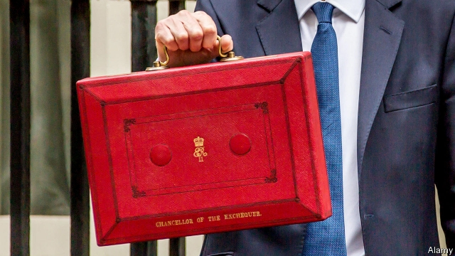

###### The end of an era

# Britain’s Tories used to relish fiscal discipline. No longer 

 

> print-edition iconPrint edition | Britain | Jul 27th 2019 

BORIS JOHNSON’S appointment as prime minister does not just mean a new approach to Europe. On July 24th he appointed Sajid Javid, formerly the home secretary, to replace Philip Hammond as chancellor. An emergency budget is said to be in the works. It seems likely that Mr Johnson’s tenure will confirm a crucial shift in Tory economic policy. A party that was obsessed with fiscal discipline is turning lax. 

When the Conservatives came to power in 2010 Britain was in a tight economic spot. Following the financial crisis it was running a budget deficit of 10% of GDP, one of the largest in the rich world (see chart 1). George Osborne, then the chancellor, implemented big spending cuts and tax rises. After promising more fiscal austerity in the run-up to the general election in 2015, the Tories won a majority. 

The shift away from this ascetic stance started shortly after the election. Evidence emerged that public services had begun to deteriorate. The number of “delayed transfers of care”—people stuck in hospital because they had no care home to go to—rose sharply from 2014-15, as did the number of violent incidents in prisons. More people came to believe that higher taxes and more government spending were necessary (see chart 2). A surprisingly strong economy in 2016-18 meant that the deficit fell. 

 

Mr Hammond, who succeeded Mr Osborne in 2016, loosened fiscal policy a little. Yet with Brexit hanging over the economy, he eschewed costly crowd-pleasers in favour of amassing what became known as his “Brexit war-chest”. This is the difference between the forecast structural deficit in 2020-21 and Mr Hammond’s self-imposed target for that year. At present there is some £27bn ($34bn, or 1.2% of GDP) of fiscal headroom, which would have allowed Mr Hammond to give the economy a one-off boost in the event of a slowdown. 

Many Tories, however, believe the war-chest is a pot of money squirrelled away in the Treasury. In her final days as prime minister, Theresa May tried to get all sorts of costly projects past Mr Hammond. On the campaign trail, Mr Johnson referred to the war-chest as the source of funds for tax cuts and extra spending. This is nonsense. Mr Johnson’s promises—including a rise in the points at which people pay national insurance and the higher rate of income tax, and lots more cash for schools and the police—would instead lead to a permanent rise in public borrowing. 

 

Drawing on the theories of Art Laffer, President Donald Trump’s favourite economist, both Mr Johnson and Mr Javid have claimed that by geeing up the economy, looser fiscal policy can pay for itself. “There are plenty of taxes that you can cut which will actually increase your revenues,” says the new prime minister. Almost no economist would agree that this argument applies to what Mr Johnson has proposed, in part because most of the benefits of the tax cuts would accrue to richer folk, who are more likely to save their windfalls. 

The upshot is that under Mr Johnson’s plans, the deficit might rise by £30bn. And that is before any fiscal hit from a no-deal Brexit. On July 18th the Office for Budget Responsibility, the fiscal watchdog, said that even assuming a relatively benign version of no-deal, public borrowing would rise by £30bn. All in all, the budget deficit would probably end up 3% of GDP higher. 

This is all the more worrying given the long-term pressures on the public finances. Britain will become a much older country in the 2020s, straining the National Health Service and social care, both of which are already underfunded. In the long run, spending cannot go up as taxes are cut. At some point politicians will have to be honest about that. ■ 
<<<<<<< HEAD

-- 

 单词注释:

1.Tory['tɒ:ri]:n. 托利党党员, 保守党员, 亲英分子 a. 保守分子的 

2.relish['reliʃ]:n. 滋味, 风味, 美味, 爱好, 食欲, 调味品 vt. 调味, 喜欢, 玩味 vi. 有味道 

3.fiscal['fiskәl]:a. 财政的, 国库的 [经] 财政上的, 会计的, 国库的 

4.Jul[]:七月 

5.boris['bɔris]:n. 鲍里斯（男子名） 

6.sajid[]:n. (Sajid)人名；(印尼)赛义德 

7.javid[]:[网络] 加威；贾维德 

8.formerly['fɒ:mәli]:adv. 从前, 以前 

9.philip['filip]:n. 菲利普（男子名） 

10.hammond['hæmәnd]:n. 哈蒙德（美国城市） 

11.chancellor['tʃɑ:nsәlә]:n. 大臣, 总理, 首相, 大使馆/领事馆的一等秘书, 司法官, 大学校长 

12.tenure['tenjuә]:n. 享有, 保有期 [经] (财产,职位等的)占有, 占有权 

13.Tory['tɒ:ri]:n. 托利党党员, 保守党员, 亲英分子 a. 保守分子的 

14.obsess[әb'ses]:vt. 迷住, 使困扰 

15.lax[læks]:a. 松的, 不严格的, 腹泻的, 松弛的 n. 腹泻, 松元音 

16.deficit['defisit]:n. 赤字, 不足额 [医] 短缺 

17.george[dʒɔ:dʒ]:n. 乔治（男子名）；自动操纵装置；英国最高勋爵勋章上的圣乔治诛龙图 

18.Osborne[]:n. 奥斯本（男子名） 

19.austerity[ɒ'sterәti]:n. 朴素, 苦行, 严格, 严峻 

20.ascetic[ә'setik]:n. 苦行者, 禁欲者, 修道者 a. 苦行的, 禁欲的 

21.stance[stæns]:n. 准备击球姿势, 站立的姿势, 位置, 姿态 [经] 地位, 形势 

22.deteriorate[di'tiәriәreit]:v. (使)恶化 

23.Brexit[]:[网络] 英国退出欧盟 

24.eschew[is'tʃu:]:vt. 避开, 远避 

25.amass[ә'mæs]:vt. 积聚, 堆积 

26.headroom['hedru:m]:n. 净空, 车身内部高度 

27.slowdown['slәudaun]:n. 降低速度, 减速 

28.treasury['treʒәri]:n. 国库, 宝库, 财政部, 国库券 [经] 库存, 国库, 金库 

29.theresa[ti'ri:zә]:n. 特丽萨（女子名） 

30.johnson['dʒɔnsn]:n. 约翰逊（姓氏） 

31.Laffer['læfә(r)]:curve [经](表明税率与税收关系的)拉弗曲线 

32.economist[i:'kɒnәmist]:n. 经济学者, 经济家 [经] 经济学家 

33.gee['dʒi:]:n. 马, 家伙 interj. 向右, 前进, 哎呀(惊讶时所发声音) v. (使)向右转 

34.loos[]:n. 损耗, 洗手间（loo复数形式） 

35.accrue[ә'kru:]:vi. 自然增加, 产生 [经] 应计, 产生, 出现 

36.windfall['windfɒ:l]:n. 被风吹落的果子, 横财 [经] 意外损失 

37.upshot['ʌpʃɒt]:n. 结果, 结局, (论证的)要点 

38.watchdog['wɒtʃdɒg]:n. 看门狗, 监察人 [化] 监控设备; 监视器 

39.benign[bi'nain]:a. 善良的, 良性的 [医] 良性的 

40.underfunded[ˌʌndəˈfʌndɪd]:a. 资金不足的 

41.cannot['kænɒt]:aux. 无法, 不能 
=======
>>>>>>> 50f1fbac684ef65c788c2c3b1cb359dd2a904378

