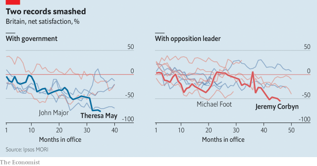

###### Brexit boom to Brexit bust?

# Jo Swinson takes over the Liberal Democrats 

 

> print-edition iconPrint edition | Britain | Jul 25th 2019 

IT WAS, as usual, an upbeat atmosphere at Proud Embankment. But the typical cabaret acts—including Chastity Belt, Vicious Delicious and Dave the Bear—were nowhere to be seen. Instead, the nightclub was adorned with bright yellow “stop Brexit” banners as it played host to the announcement of a new Liberal Democrat leader on July 22nd. Raucous cheers greeted the declaration of Jo Swinson’s comfortable victory, with 63% of the vote, over Sir Edward Davey. 

The joyful mood reflects a remarkable turnaround for the Lib Dems. The party was almost wiped out in the 2015 general election, falling to just eight MPs, as voters expressed their displeasure with its record as a junior coalition partner to the Conservatives. Since then two leaders, Tim Farron and Sir Vince Cable, have begun the slow job of rebuilding the party. Both have focused on opposing Brexit. 

Only recently has that strategy started to pay dividends. The Lib Dems finished third in this year’s local elections and second in the European elections, suggesting voters are beginning once again to see them as an acceptable protest option. Polls by YouGov indicate that the party is on about a fifth of the vote, with a quarter of people who voted Labour at the last general election backing it. Theresa May’s government was deeply unpopular by the end; Jeremy Corbyn is viewed as a hopeless leader of the opposition (see chart). Although the Lib Dems have always struggled under the first-past-the-post system used for elections to Parliament, the new four-way split—between them, the Tories, Labour and the Brexit Party—should make it easier for them to pick up seats. 

 

Ms Swinson, a sober, state-educated, 39-year-old former business minister who worked as a diversity consultant for two years when she lost her seat in Parliament and enjoys playing board games in her spare time, appears well-suited to the role of Boris Johnson’s opposite. In her victory speech, she was quick to brand the new Tory leader “unfit to be prime minister” and to link him to Donald Trump and Nigel Farage. She has repeatedly labelled Mr Corbyn a Brexiteer. 

The Liberal Democrats have their principles—but they also have a useful ability to say different things to different voters, which parties facing more scrutiny struggle to match. As memories of the coalition government fade, the party can return to its own form of “cakeism”, says Robert Ford of the University of Manchester (as in having your cake and eating it). Candidates can campaign as anti-Brexit warriors in urban, Labour-held constituencies and as sensible moderates in suburban Tory ones. 

Yet the party’s future depends on factors beyond Ms Swinson’s control. Alliances with other remain-supporting parties offer the Lib Dems a route to gains in Parliament, and they are expected to win a forthcoming by-election in Brecon, Wales, where the Greens and Plaid Cymru have stepped aside to help their candidate. But any alliance, formal or otherwise, between the Conservatives and the Brexit Party would go some way to balancing out the Lib Dems’ advantage. As would Labour’s embrace of a more anti-Brexit position, which many of its activists want. 

The Liberal Democrats’ recent improvement owes a good deal to their vehement opposition to leaving the European Union (their slogan for the European elections was “Bollocks to Brexit”). Scarred by the punishment that voters meted out in 2015, Ms Swinson has said there is no chance of the party entering a coalition with a Labour government led by Mr Corbyn or a Conservative one led by Mr Johnson. But a confidence-and-supply arrangement, in which the party backs the government on key issues, remains possible. 

These potential routes to greater influence are all based on one assumption: that Mr Johnson does not manage to leave the European Union before the next election. If he does, the Lib Dems would be in a much trickier position. Tom Brake, the party’s Brexit spokesperson, admits that they would have to work out whether to seek immediate re-entry to the EU. The party’s clarity of purpose, on which its recent electoral improvement has been based, would be gone. In which case, leaving the EU would be a double disaster for the Liberal Democrats. ■ 

