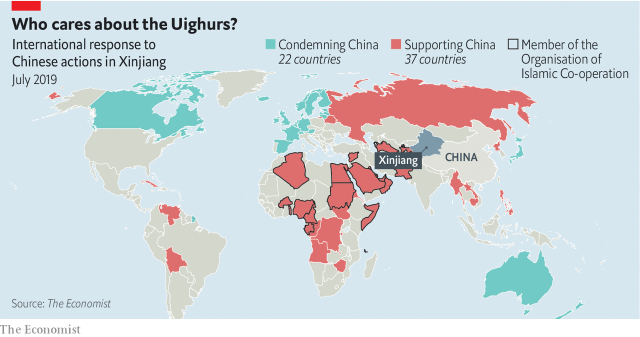

###### International reactions to China in Xinjiang

# Chinese actions in Xinjiang become a matter of international dispute 

 

> print-edition iconPrint edition | China | Jul 27th 2019 

 FOR THE PAST three years China’s government, citing national-security concerns, has run relentless campaigns against the culture and religion of the Uighur people, 11m Muslims who speak a Turkic language and live in Xinjiang, China’s north-westernmost corner. Mosques have been shut. Men are forbidden to grow beards, women may not wear head coverings and children are barred from prayers. Most troubling are the growing details emerging about a network of detention facilities, which Chinese officials call vocational-training centres but which look for all the world like internment camps. Credible reports say these are holding at least 1m people—mostly Uighurs but also Chinese people of Kazakh and Kyrgyz ethnicity—in extra-judicial detention. 

Until the middle of 2018, Chinese diplomats managed to keep international criticism of the camps in check. At that point America’s vice-president, Mike Pence, raised concerns about “round-the-clock political indoctrination”. Since then, the Chinese have lost their battle to persuade foreign countries that Xinjiang is purely an internal matter, of no concern to anyone else. But they have turned it into an issue that polarises diplomatic opinion. That polarisation has now burst into the open. 

On July 8th, 22 countries signed a letter to the UN Human Rights Council, calling on China to end the “mass arbitrary detention” of Uighurs and other Muslims, and to allow international observers access to detention camps. This was the first concerted international condemnation of Chinese actions in Xinjiang. Signatories included most European countries, Canada, Japan and Australia but not the United States (see map), which withdrew from the council in 2018. However, Mike Pompeo, the secretary of state, later called China’s treatment of the Uighurs “the stain of the century”. 

 

Days later, 37 countries, among them Russia and Saudi Arabia, responded with a letter of their own, defending China’s policies on the grounds of fighting terrorism. Some signatories were anti-Western autocracies which can be relied upon to rally round anyone that the West criticises. They include Russia and Venezuela. Other signatories are Western allies, such as Egypt and Saudi Arabia, which oppose what might be called the global human-rights regime. They lock up plenty of their own opponents on security grounds. Still others are beneficiaries of Chinese investment, such as Pakistan and Laos, which cannot easily afford to bite the hand that feeds them. 

Most intriguing, however are Gulf states which back China for a combination of defence, economic and even religious reasons. The United Arab Emirates, for example, cannot get the drones it wants from America, so is buying China’s Wing Loong 2 drones. (Its de facto ruler was in Beijing this week.) It signed the letter, along with 19 other members of the Organisation of Islamic Co-operation, an international group of mostly Muslim-majority states. In 2018 China signed construction and investment contracts worth $28bn in the Middle East, a region that is struggling to attract foreign investment elsewhere. And some Gulf states, such as the UAE and Saudi Arabia, are trying to fight jihadist extremism at home by encouraging more modern forms of Islam. They seem receptive to China’s claim that it is merely attempting to modernise Uighur beliefs (though in reality Chinese actions go far beyond that). 

China’s attempt to divide international opinion about Xinjiang has worked so far. But, as more details leak out about the region’s camps, Muslim leaders are beginning to come under domestic pressure to defend their co-religionists. One day, they may find it harder to kowtow. ■ 
<<<<<<< HEAD

-- 

 单词注释:

1.Jul[]:七月 

2.cite[sait]:vt. 引用, 引证, 表彰 [建] 引证, 指引 

3.relentless[ri'lentlis]:a. 无情的, 冷酷的, 残酷的 

4.Uighur[]:n. 维吾尔族人, 维吾尔语, 维吾尔人 

5.Muslim['mjzlim; (?@) 'mʌzlem]:n. 伊斯兰教, 伊斯兰教教徒 

6.Turkic['tә:kik]:n. 突厥语 

7.mosque[mɒsk]:n. 清真寺 

8.covering['kʌvәriŋ]:n. 覆盖物, 掩蔽物 a. 掩护的, 掩盖的 [计] 覆盖 

9.detention[di'tenʃәn]:n. 阻止, 监禁, 拘留 [医] 隔离, 拘留, 滞留, 停滞 

10.internment[in'tә:nmәnt]:n. 拘留 [法] 拘留, 收容, 禁闭 

11.credible['kredәbl]:a. 可信的, 可靠的 [法] 可信的, 可靠的 

12.Uighur[]:n. 维吾尔族人, 维吾尔语, 维吾尔人 

13.kazakh[kɑ:'zɑ:k]:n. 哈萨克人[族] 

14.Kyrgyz[]:n. 吉尔吉斯；柯尔克孜族；吉尔吉斯坦语 

15.diplomat['diplәmæt]:n. 外交官, 有外交手腕的人 [法] 外交家, 外交官, 有权谋的人 

16.mike[maik]:vi. 偷懒, 游手好闲 n. 休息, 游手好闲, 扩音器, 话筒 

17.indoctrination[in.dɒktri'neiʃәn]:n. 教导, 教化 [法] 教育, 教训, 灌输 

18.polarise['pәjlәraiz]:vi.vt. (使)极化, (使)偏振, (使)两极分化 

19.diplomatic[.diplә'mætik]:a. 外交的, 老练的 [法] 外交的, 外交上的, 文献上的 

20.polarisation[,pәjlәrai'zeiʃәn; -ri'z-]:n. [物]偏振(现象),极化(作用),两极化,分化 

21.UN[ʌn]:pron. 家伙, 东西 [经] 联合国 

22.concerted[kәn'sә:tid]:a. 商定的, 协定的, 一致的 [法] 一致的, 协力的, 共同的 

23.condemnation[kɒndem'neiʃәn]:n. 非难, 宣告有罪, 非难的理由 

24.signatory['si^nәtәri]:n. 协议的签署者, 签约国 a. 签署的, 签约的 

25.pompeo[]:n. (Pompeo)人名；(意)蓬佩奥 

26.saudi['sajdi]:a. 沙乌地阿拉伯（人或语）的 

27.Arabia[ә'reibiә]:n. 阿拉伯半岛 

28.terrorism['terәrizm]:n. 恐怖主义, 恐怖统治, 恐怖状态 [法] 胁迫, 暴政, 恐怖政治 

29.autocracy[ɒ:'tɒkrәsi]:n. 独裁统治, 独裁统治的国家 [法] 独裁政治, 专制政治, 独裁政府 

30.rally['ræli]:n. 重振旗鼓, 集合, 群众集会, 跌停回升 v. 重整旗鼓, 集合, 恢复精神, 团结, 挖苦, 嘲笑 

31.criticise['kritisaiz]:v. 批评, 吹毛求疵, 非难 

32.Venezuela[,vene'zweilә]:n. 委内瑞拉 

33.ally['ælai. ә'lai]:n. 同盟者, 同盟国, 助手 vt. 使联盟, 使联合, 使有关系 vi. 结盟 

34.Egypt['i:dʒipt]:n. 埃及 

35.regime[rei'ʒi:m]:n. 政权, 当权期间, 政体, 社会制度, 体制, 情态 [医] 制度, 生活制度 

36.beneficiary[.beni'fiʃәri]:n. 受惠者, 受益人 a. 受封的 

37.Pakistan[.pɑ:ki'stɑ:n]:n. 巴基斯坦 

38.lao[lau, 'lɑ:әu]:n. 老挝语；老挝人 

39.cannot['kænɒt]:aux. 无法, 不能 

40.intrigue[in'tri:g]:n. 阴谋, 复杂的事 vi. 密谋, 私通 vt. 激起...的兴趣, 用诡计取得 

41.emirate[e'miәrit]:n. 埃米尔的地位, 酋长国 

42.drone[drәun]:n. 雄蜂, 懒惰者, 嗡嗡的声音, 无人驾驶飞机(或船) vi. 嗡嗡作声, 混日子 vt. 低沉地说 

43.loong[lu:ŋ]:n. 龙; 中国龙; 吉祥物; 中华民族的图腾和象征 

44.de[di:]:[化] 非对映体过量 [医] 铥(69号元素铥的别名,1916年Eder离得的假想元素) 

45.facto[]:[法] 实际上, 事实上 

46.organisation[,ɔ: ^әnaizeiʃən; - ni'z-]:n. 组织, 团体, 体制, 编制 

47.Islamic[iz'læmik]:a. 伊斯兰教的, 穆斯林的 

48.UAE[]:阿拉伯联合酋长国 

49.jihadist[]:n. 伊斯兰圣战士 

50.extremism[ik'stri:mizm]:n. 极端倾向, 极端论, 过激主义 

51.Islam['izlɑ:m]:n. 伊斯兰教 

52.receptive[ri'septiv]:a. 能接纳的 [医] 接受的, 感受的 

53.modernise['mɔdәnaiz]:vt.vi. (使)现代化, (使)适应现代需要 vi. 用现代方法 

54.Muslim['mjzlim; (?@) 'mʌzlem]:n. 伊斯兰教, 伊斯兰教教徒 

55.kowtow[.kәu'tau]:n. 磕头 vi. 叩头 
=======
>>>>>>> 50f1fbac684ef65c788c2c3b1cb359dd2a904378

