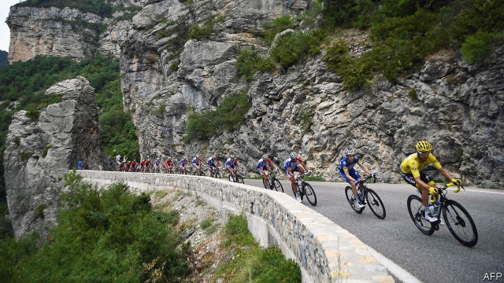

###### Cycling’s coming home

# A French cyclist may win the Tour de France 

 

> print-edition iconPrint edition | Europe | Jul 27th 2019 

AS FAR AS live spectator sports go, the Tour de France has to be one of the strangest. For hours, thousands of enthusiasts line the route under a baking sun. Aficionados bring parasols, folding chairs and picnics. At last, there is action on the road. But it is the long caravan of advertising vehicles which precedes the racers. And then suddenly, in a flash of lime green and yellow, the breakaway cyclists, followed by the peloton, or cycling pack, pass. It all lasts a matter of seconds. But then again the world’s most famous cycling race is as much about the geography and national identity of France as it is about the sport. 

The tour is thrilling the French this year. For the first time in 34 years, a Frenchman—either Thibaut Pinot or Julian Alaphilippe—has a chance of winning when the race finishes on the Champs-Elysées on July 28th. For decades, the French have watched with dismay as the Spanish, Americans and British have successively monopolised the trophy (see chart). French suspicions of cheating used to seem like sour grapes. But in 2012 Lance Armstrong, a seven-time American winner, was stripped of his titles after a doping scandal. 

Today, the tour has recovered its credibility as an extreme test of muscular endurance, and with it the country’s enthusiasm. The French airwaves have been filled with breathless live coverage of the race, with its 21 separate stages covering 3,480km (2,162 miles). This year is also the centenary of the maillot jaune, or yellow jersey, awarded daily to the race leader. To celebrate, on July 20th President Emmanuel Macron was at the Col du Tourmalet in the Pyrenees to congratulate maillot jaune-wearing Mr Alaphilippe as well as the day’s winner, who happened to be Mr Pinot. 

 

In 1903 Henri Desgrange, an early cycling enthusiast, devised the tour to help publicise his sports newspaper. Yet these days the tour also serves to promote France. On July 24th cyclists sped past the medieval village of Faucon, having started at the Roman aqueduct of the Pont du Gard, before ending in the foothills of the Alps. More of the French think of the race as an opportunity to admire the scenery than see it as a great sporting event, says a poll. This being France, existential musings are also in order. The tour, said Christian Prudhomme, its director, is “life, condensed… all the wonderful, exceptional, disconcerting, unfortunate things that can happen: it is life.” 

-- 

 单词注释:

1.de[di:]:[化] 非对映体过量 [医] 铥(69号元素铥的别名,1916年Eder离得的假想元素) 

2.Jul[]:七月 

3.spectator[spek'teitә]:n. 观众, 目击者, 旁观者 

4.enthusiast[in'θju:ziæst]:n. 热心家, 狂热者, 爱好者 

5.aficionado[ә.fisjә'nɑ:dәu]:n. 狂热爱好者, 迷 

6.parasol['pærәsɒl]:n. 阳伞, 伞翼机 

7.caravan['kærәvæn]:n. 旅行队, 有篷顶的大车 [经] 商队, 结队商贩 

8.advertising['ædvәtaiziŋ]:n. 广告业, 广告 a. 广告的 [计] 发广告 

9.precede[.pri:'si:d]:vt. 在...之前, 优于, 较...优先 vi. 在前面 

10.racer['reisә]:n. 比赛者, 游蛇属黑蛇 

11.breakaway[]:n. 脱离, (美)(非正式)一碰就散开/脱落的, 分裂 

12.peloton[pelɔ:'tɔ:n, pelә'tɑ:n]:n. 佩洛通玻璃(一种欧洲装饰玻璃,亦作 peloton glass) 

13.thril[θ'rɪl]: 联络小巷 

14.thibaut[]: [人名] 蒂博 

15.Pinot[pi'nәu]:加州葡萄 

16.Julian['dʒu:ljәn]:a. 尤利乌斯恺撒的 

17.dismay[dis'mei]:n. 沮丧 vt. 使惊愕, 使气馁 

18.successively[]:adv. 接连着地；相继地 

19.monopolise[mә'nɔpәlaiz]:vt. 垄断, 独占, 专营, 专利 

20.trophy['trәufi]:n. 战利品, 奖品 vt. 用战利品装饰 

21.lance[lɑ:ns]:n. 长矛, 柳叶刀, 执矛战士 vt. 以长矛攻击, 冲进 vi. 急进 

22.Armstrong['ɑ:mstrɔŋ]:[计] 公理 

23.dope[dәup]:n. 吸毒者, 笨蛋, 麻醉药物, 粘稠物 vt. 麻痹, 上涂料, 预测出 vi. 吸毒 

24.credibility[.kredi'biliti]:n. 可信用, 确实性, 可靠 [法] 证据能力, 可信程度, 确实性 

25.muscular['mʌskjulә]:a. 强壮的, 肌肉发达的, 有力的 [医] 肌的; 肌肉发达的 

26.endurance[in'djuәrәns]:n. 忍耐, 忍耐力, 耐性 [机] 持九性 

27.airwave['єәweiv]:n. 电波, 波道 

28.coverage['kʌvәridʒ]:n. 覆盖的范围, 保险总额, 新闻报导 [化] 可达范围; 覆盖度 

29.centenary[sen'ti:nәri]:n. 一百年 a. 一百年的 

30.maillot[mɑ:'jәu]:n. 紧身衣 

31.jaune[]:[网络] 汝拉 

32.jersey['dʒә:zi]:n. 运动衫 

33.emmanuel[i'mænjuәl]:n. 以马内利（耶稣基督的别称）；伊曼纽尔（男子名, 等于Immanuel） 

34.macron['mækrәn]:n. 长音符号 

35.col[kɒl]:n. 出口, 山坳 [计] 列 

36.tourmalet[]:[网络] 徒尔马莱；段可与环法赛图玛莱；图马莱 

37.Pyrenees[,pirә'ni:z]:比利牛斯山脉[欧洲西南部] 

38.alaphilippe[]:阿拉菲利普 

39.Henri[]:n. 亨利（人名） 

40.desgrange[]:[网络] 德格朗热；格杭基 

41.publicise['pʌblisaiz]:vt. 公布, 为...做广告, 宣传 

42.medieval[.medi'i:vl]:a. 中古的, 中世纪的 

43.faucon[]:[网络] 福孔 

44.aqueduct['ækwidʌkt]:n. 水管, 沟渠, 导管 [医] 水管 

45.pont[pɔnt]:n. （南非的）缆拉渡船 

46.gard[]:n. 加尔省（法国省名） 

47.foothill['futhil]:n. 山麓小丘 

48.alp[ælp]:n. 高山 [计] 交替程序, 运算逻辑处理器, 汇编语言程序 

49.existential[.egzis'tenʃәl]:a. 有关存在的 

50.musing['mju:ziŋ]:a. 沉思的, 冥想的 

51.prudhomme[]: [人名] 普鲁多姆 

52.exceptional[ik'sepʃәnәl]:a. 例外的, 异常的, 特别的 

53.disconcert[.diskәn'sә:t]:vt. 使困惑, 使仓皇失措, 打乱(计划等) 

