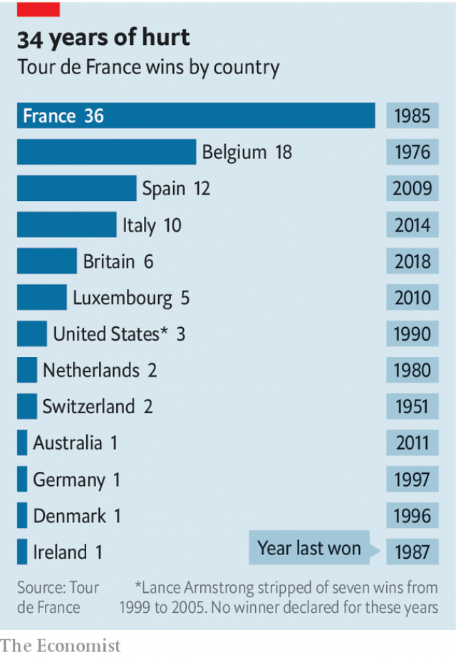

###### Cycling’s coming home

# A French cyclist may win the Tour de France 

 

> print-edition iconPrint edition | Europe | Jul 27th 2019 

AS FAR AS live spectator sports go, the Tour de France has to be one of the strangest. For hours, thousands of enthusiasts line the route under a baking sun. Aficionados bring parasols, folding chairs and picnics. At last, there is action on the road. But it is the long caravan of advertising vehicles which precedes the racers. And then suddenly, in a flash of lime green and yellow, the breakaway cyclists, followed by the peloton, or cycling pack, pass. It all lasts a matter of seconds. But then again the world’s most famous cycling race is as much about the geography and national identity of France as it is about the sport. 

The tour is thrilling the French this year. For the first time in 34 years, a Frenchman—either Thibaut Pinot or Julian Alaphilippe—has a chance of winning when the race finishes on the Champs-Elysées on July 28th. For decades, the French have watched with dismay as the Spanish, Americans and British have successively monopolised the trophy (see chart). French suspicions of cheating used to seem like sour grapes. But in 2012 Lance Armstrong, a seven-time American winner, was stripped of his titles after a doping scandal. 

Today, the tour has recovered its credibility as an extreme test of muscular endurance, and with it the country’s enthusiasm. The French airwaves have been filled with breathless live coverage of the race, with its 21 separate stages covering 3,480km (2,162 miles). This year is also the centenary of the maillot jaune, or yellow jersey, awarded daily to the race leader. To celebrate, on July 20th President Emmanuel Macron was at the Col du Tourmalet in the Pyrenees to congratulate maillot jaune-wearing Mr Alaphilippe as well as the day’s winner, who happened to be Mr Pinot. 

 

In 1903 Henri Desgrange, an early cycling enthusiast, devised the tour to help publicise his sports newspaper. Yet these days the tour also serves to promote France. On July 24th cyclists sped past the medieval village of Faucon, having started at the Roman aqueduct of the Pont du Gard, before ending in the foothills of the Alps. More of the French think of the race as an opportunity to admire the scenery than see it as a great sporting event, says a poll. This being France, existential musings are also in order. The tour, said Christian Prudhomme, its director, is “life, condensed… all the wonderful, exceptional, disconcerting, unfortunate things that can happen: it is life.” 

