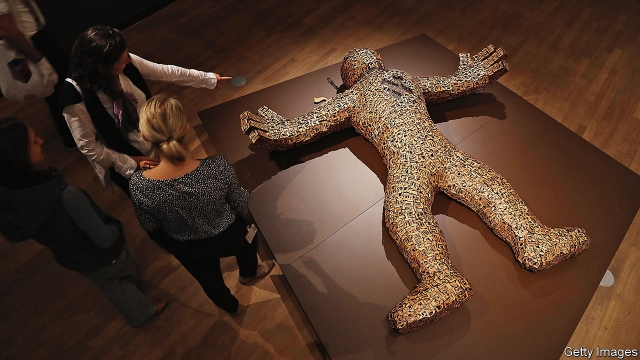

###### The role of Jewish museums

# How the Jewish Museum Berlin fell out with Jews 

 

> print-edition iconPrint edition | Europe | Jul 27th 2019 

RUNNING EUROPE’S largest Jewish museum in Germany, where the shadows of the past require a special sensitivity, is one of the most demanding jobs in the museum world. It requires outstanding scholarship, tact, managerial talent, fundraising savvy and the ability to deal with a wide range of interested parties, from the federal government (which provides most of the money), scholars of Judaism and the public at large to the German Jewish community and the Israeli government. Each group has its own strongly held idea about the role of the Jewish Museum Berlin (JMB). 

Peter Schäfer, an internationally renowned expert on ancient Jewish history, did remarkably on most of these fronts after taking over in 2014 as director of the JMB, but his leadership repeatedly came under fire from Binyamin Netanyahu’s government. At the end of June Mr Schäfer offered his resignation to Monika Grütters, Germany’s culture minister, “to prevent further damage” to the JMB. 

At the end of last year the Israeli prime minister asked Angela Merkel, the German chancellor, to cut the museum’s funding. He claimed its exhibition “Welcome to Jerusalem” (which was so popular that it was extended by a year) reflected “mainly the Muslim-Palestinian perspective” of the city. Mr Schäfer subsequently ruffled feathers when he met a cultural attaché from Iran at the museum. 

The final straw was a tweet promoted as a “must read” in early June from the museum’s Twitter account sharing an article from TAZ, a left-wing daily. The tweet appeared to criticise a resolution of the Bundestag, Germany’s lower house of parliament, which condemned the campaign for boycotts, divestments and sanctions (BDS) against Israel as anti-Semitic. In response, Charles Kaufman, president of B’nai B’rith International, a Jewish advocacy organisation, claimed the JMB ought to be “renamed the Insult to Injury Museum”. Josef Schuster, leader of the Central Council of Jews in Germany, wondered if the JMB could still call itself “Jewish”. 

Mr Schäfer was due to retire next May, just after opening the new permanent exhibition and the new children’s museum, which were conceived under his stewardship. By all accounts he took the museum’s mission statement literally and made it “a vibrant centre of reflection on Jewish history and culture as well as about migration and diversity in Germany”. Last year the museum had almost 700,000 visitors, who sometimes queued for hours to get in. The exhibition “Golem”, about the myth of artificial life, was his idea. Another of his original exhibitions was “Snip It!”, which explored circumcision and its controversy. 

Many of Mr Schäfer’s supporters believe that he should have weathered the storm. Fifty scholars of the Talmud signed a letter in his support. Another 322 international academics put their names to a statement demanding “a public apology to him from those who have spread lies about him”. (Mr Schäfer was falsely portrayed as a sympathiser of BDS). And 58 museum professionals from 14 countries penned a letter to express concerns about his treatment. 

Nearly everyone agrees that it would help for the next director to be a Jew. (Mr Schäfer is Catholic.) Candidates can apply until September 1st, explains Martin Michaelis, who is managing the museum until the new director is appointed. The appointment should happen by the spring. Whoever gets it will need all the talent Mr Schäfer had, with a little more diplomatic skill—and a much thicker skin. ■ 

