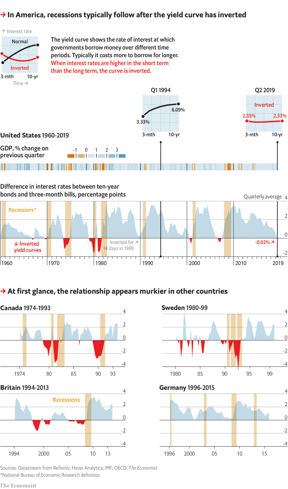

###### Economic forecasting

# Yield curves help predict economic growth across the rich world 

 

> print-edition iconPrint edition | Graphic detail | Jul 27th 2019 

MANY ECONOMISTS see the link between GDP growth and yield curves as a curious case of American exceptionalism. In general, interest rates rise as borrowing periods get longer, because the risks of default and rising inflation grow over time. But occasionally this pattern reverses, and short-term rates exceed long-term ones.  

 In America, such “inversions” have foreshadowed economic turmoil. For all eight recessions since 1960, three-month interest rates exceeded ten-year ones on at least one day during the previous year. The signal has sounded just one false alarm.  

 There are good reasons why yield-curve inversions tend to precede recessions. At the short end, when central banks raise rates, the curve flattens and the economy slows. On the long side, when a recession looms, investors expect that central banks will cut rates to soften the blow. That lowers long-term yields, flattening the curve.  

 This logic should apply everywhere. Yet only in America has the curve been a soothsayer. In a dataset of 16 other rich countries, reaching as far back as 1960, 51 of the 95 recessions were not preceded by an inversion during the previous two years. Moreover, the curve seems prone to crying wolf. On 63 occasions, these non-American economies kept growing despite inverted yield curves.  

 The yield curve’s failure to foresee recessions outside the United States has led some scholars to dismiss its predictive power as a fluke. With so few recessions in America, there is insufficient evidence to determine the strength of the relationship.  

 However, squashing yield curves and growth figures into a pair of binaries—inverted or not, and recession or not—leaves precious data on the cutting-room floor. A better test would check whether flattening curves foreshadow slowdowns, and steepening ones presage economic acceleration.  

 Seen through this lens, America is not an outlier. In 15 of 17 countries, changes in spreads correlated with changes in growth the next year. Overall, a one-percentage-point move in spreads predicted a 0.55-point change in growth in the same direction. The effect was strongest in Switzerland, at 1.1 points; America ranked third.  

 Economists do not appear to make full use of this well-known indicator. If they did, blending their predictions with yield-curve data would be no more accurate than using consensus projections alone. However, we found that consensus forecasts made a year in advance accounted for 57% of variance in GDP. In contrast, the blend explained 64%—a large improvement.  

 Changes in monetary-policy tools mean that the curve may lose some of its predictive power in future. Because central banks have bought long-dated bonds in quantitative-easing schemes, they now affect both sides of the yield curve directly. That makes long-term interest rates a less reliable proxy for market expectations.  

 But if history is any guide, America should expect a deceleration. Its curve has flattened by 1.1 points in the past year, implying growth will slow from 3% to 2%. ■ 

 Sources: Datastream from Refinitiv; Haver Analytics; IMF; OECD; The Economist 

 *National Bureau of Economic Research definition 

