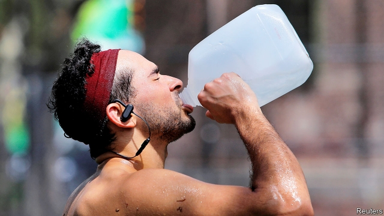

###### Hot is hell

# Heatwaves are killing people 

 

> print-edition iconPrint edition | Leaders | Jul 27th 2019 

IN RECENT DAYS heatwaves have turned swathes of America and Europe into furnaces. Despite the accompanying blast of headlines, the implications of such extreme heat are often overlooked or underplayed. Spectacular images of hurricanes or floods grab attention more readily, yet heatwaves can cause more deaths. Heat is one of climate change’s deadliest manifestations. Sometimes its impact is unmistakable—a heatwave in Europe in 2003 is estimated to have claimed 70,000 lives. More often, though, heatwaves are treated like the two in the Netherlands in 2018. In just over three weeks, around 300 more people died than would normally be expected at that time of year. This was dismissed as a “minor rise” by officials. But had those people died in a flood, it would have been front-page news. 

The havoc caused by extreme heat does not get the attention it merits for several reasons. The deaths tend to be more widely dispersed and do not involve the devastation of property as do the ravages of wind and water. Moreover, deaths are not usually directly attributable to heatstroke. Soaring temperatures just turn pre-existing conditions such as heart problems or lung disease lethal. 

Heatwaves will inevitably attract more attention as they become more frequent. As greenhouse gases continue to accumulate in the atmosphere, not only will temperatures rise overall but extremes of heat will occur more frequently (see article). Britain’s Met Office calculates that by the 2040s European summers as hot as that of 2003 could be commonplace, regardless of how fast emissions are reduced. Urbanisation intensifies the risk to health: cities are hotter places than the surrounding countryside, and more people are moving into them. 

The good news is that most fatalities are avoidable, if three sets of measures are put in place. First, people must be made aware that extreme heat can kill and warning systems established. Heatwaves can be predicted with reasonable accuracy, which means warnings can be given in advance advising people to stay indoors, seek cool areas and drink plenty of water. Smart use of social media can help. In 2017 a campaign on Facebook warning of the dangers of a heatwave in Dhaka, Bangladesh’s capital, reached 3.9m people, nearly half the city’s population. 

Second, cool shaded areas and fresh water should be made available. In poor places, air-conditioned community centres and schools can be kept open permanently (steamy nights that provide no relief from scorching days can also kill). In Cape Town, spray parks have been installed to help people cool down. Third, new buildings must be designed to be resilient to the threat of extreme heat and existing ones adapted. White walls, roofs or tarpaulins, and extra vegetation in cities, all of which help prevent heat from building up, can be provided fairly cheaply. A programme to install “cool roofs” and insulation in Philadelphia reduced maximum indoor temperatures by 1.3˚C. 

It is a cruel irony that, as with other effects of climate change, the places that are hardest hit by heatwaves can least afford to adapt. In poor countries, where climates are often hotter and more humid, public-health systems are weaker and preoccupied with other threats. Often, adaptation to extreme heat is done by charities if it is done at all. Particular attention should be paid to reaching both remote areas and densely populated urban ones, including slums where small dwellings with tin roofs packed together worsen the danger that uncomfortably high temperatures will become lethal. 

Adaptation is not an alternative to cutting emissions; both are necessary. But even if net emissions are reduced to zero this century, the persistence of greenhouse gases in the atmosphere means that heatwaves will continue to get worse for decades to come. As the mercury rises, governments in rich and poor countries alike must do more to protect their populations from this very real and quietly deadly aspect of climate change. ■ 
<<<<<<< HEAD

-- 

 单词注释:

1.heatwave[ˈhi:tweɪv]:n. 热浪[波], 酷暑期 

2.Jul[]:七月 

3.swathe[sweiθ]:vt. 绑, 裹, 包围 n. 带子, 绷带 

4.underplay[.ʌndә'plei]:vt. 表演不充分, 扣着大牌不出而出小牌, 对...轻描淡写 vi. 表演角色不充分 n. 秘密行动, 不充分的表演 

5.spectacular[spek'tækjulә]:a. 公开展示的, 惊人的, 壮观的 n. 奇观, 惊人之举, 展览物 

6.grab[græb]:n. 抓握, 掠夺, 强占, 东方沿岸帆船 vi. 抓取, 抢去 vt. 攫取, 捕获, 霸占 

7.manifestation[.mænifes'teiʃәn]:n. 显示, 证明, 示威运动 [医] 表现, 表示 

8.Netherlands['neðәlәndz]:n. 荷兰 

9.havoc['hævәk]:n. 大破坏, 蹂躏 vt. 严重破坏 

10.disperse[dis'pә:s]:vt. 分散, 传播, 散开 vi. 分散 a. 分散的 [计] 分散 

11.devastation[.devә'steiʃәn]:n. 毁坏 

12.ravage['rævidʒ]:n. 破坏, 蹂躏 v. 毁坏, 破坏, 掠夺 

13.attributable[ә'tribju:tәbl]:a. 可归于...的 

14.heatstroke['hi:tstrәuk]:n. 中暑 

15.soar[sɒ:]:n. 高扬, 翱翔 vi. 往上飞舞, 高耸, 翱翔 

16.lethal['li:θәl]:a. 致命的 n. 致死因子 

17.inevitably[in'evitәbli]:adv. 不可避免地 

18.commonplace['kɒmәnpleis]:n. 寻常事, 老生常谈, 普通的东西 a. 平凡的, 普通的 

19.emission[i'miʃәn]:n. 发射, 射出, 发行 [医] 发射, 遗精 

20.urbanisation[ˌɜ:bənaɪ'zeɪʃən]:n. 城市化（等于urbanization） 

21.intensify[in'tensifai]:vt. 加强 vi. 强化 

22.fatality[fә'tæliti]:n. 不幸, 厄运, 致命性, 死亡者, 厄运, 天命 

23.avoidable[ә'vɒidәbl]:a. 可避免的 [法] 可作为无效的, 可回避的, 可避免的 

24.facebook[]:n. 脸谱网 

25.DHAKA['dækә]:达卡[孟加拉国首都] 

26.steamy['sti:mi]:a. 蒸汽的, 充满蒸汽的 

27.scorch[skɒ:tʃ]:n. 烧焦, 枯萎 v. 烧焦, 拷焦, (使)枯萎, 讽刺 

28.cape[keip]:n. 岬, 海角, 披肩, 斗蓬 

29.resilient[ri'ziliәnt]:a. 弹回的, 有弹力的 [医] 回弹的, 回能的 

30.tarpaulin[tɑ:'pɒ:lin]:n. 柏油帆布, 油布衣, 防水帽 [医] 帆布 

31.vegetation[.vedʒi'teiʃәn]:n. 植物 [医] 贽生物, 贽疣, 增殖体; 生长, 增殖 

32.cheaply['tʃipli]:adv. 便宜地 

33.insulation[.insju'leiʃәn. 'insә-]:n. 绝缘；隔离, 孤立 

34.Philadelphia[.filә'delfjә]:n. 费城 

35.irony['aiәrәni]:n. 反语, 讽刺, 具有讽刺意味的事 

36.preoccupy[pri:'ɒkjupai]:vt. 抢先占领, 使全神贯注 

37.densely['densli]:adv. 浓密地, 浓厚地 

38.populate['pɔpjuleit]:vt. 使人口聚居在...中, 殖民于, 移民于, 居住于, 定居于 

39.worsen['wә:sn]:vt. 使更坏, 使恶化 vi. 变得更坏, 恶化 

40.uncomfortably[ʌnˈkʌmftəbli]:adv. 不舒适地, 不自在地, 令人不快地 

41.persistence[pә'sistәns]:n. 固执, 坚持不懈, 持续(性), 存留(状态) [电] 持久 

42.quietly['kwaiәtli]:adv. 安静地, 沉着地, 秘密地 
=======
>>>>>>> 50f1fbac684ef65c788c2c3b1cb359dd2a904378

