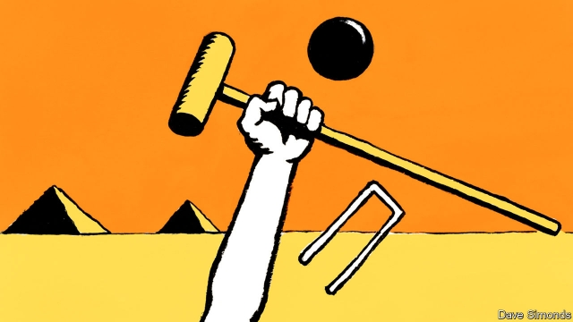

###### Masters of the mallet

# How Egypt conquered croquet 

 

> print-edition iconPrint edition | Middle East and Africa | Jul 27th 2019 

AS EGYPT WAS buffeted by revolution and political unrest early this decade, members of the sporting club in Heliopolis, a neighbourhood in Cairo, faced a mild form of hardship. The club is located across the street from a presidential palace that was occasionally besieged by protesters. Members wanting to play croquet first had to pick tear-gas canisters off the grass. 

Yet neither upheaval nor Egypt’s hot desert climate deters local croquet players. When the game’s world championship is held on July 27th in Sussex, a county in south-east England, it will have more Egyptian than English competitors. The former dominate the version of the game called golf croquet. Egyptian men have won nine of the past 12 world championships; Egyptian women have won three of the past six. 

Croquet was introduced to Egypt by its British occupiers in the early 20th century. (So was squash, at which Egyptians also excel.) After the British left in 1956 many assumed the game had withered. But in 1985 a British Airways pilot called Geoff Roy, who was also a tournament croquet player, discovered the packed courts of the Gezira club in central Cairo. “He spent the rest of the day being thrashed by the locals,” says Stephen Mulliner, the secretary-general of the World Croquet Federation. Mr Roy returned to England with his story, bringing Egypt to the attention of the wider croquet-playing world. 

Golf croquet is simpler than the more traditional form, called association croquet. Old-timers scoff that it is like comparing checkers with chess. But the Egyptians made their version faster and more exciting to watch. Boundary barriers are needed to keep all of the action on the court. (The airborne Egyptian jump shot is particularly audacious.) Egyptian rules have been adopted by croquet’s bigwigs. Today golf croquet is the most popular form of the game. 

Mostafa Eissa, winner of the Egyptian Open in 2015, attributes Egypt’s success at golf croquet to an aggressive style, weather that allows for year-round play and exuberant fans. But the competition has caught up. Reg Bamford, a South African, has won two of the past three world championships. This month Mr Eissa will try to bring the trophy back to Egypt. For inspiration he can look to Soha Mostafa, an Egyptian who won the women’s world championship in New Zealand earlier this year.■ 

