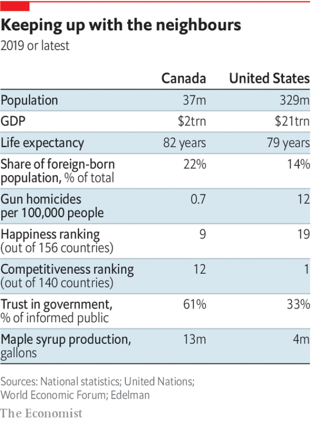
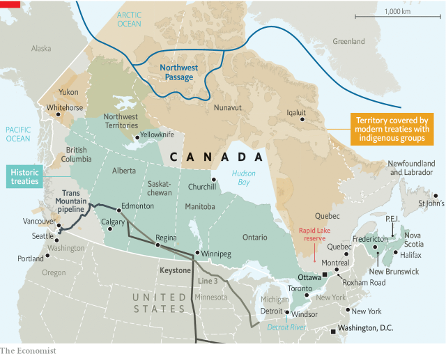

###### Canada

# Canadians must decide if they want to remain a liberal beacon 

 

> print-edition iconPrint edition | Special report | Jul 27th 2019 

THE PEACE ARCH at the border between the Canadian province of British Columbia and America’s Washington state bears two inscriptions. Drivers heading south read that Canadians and Americans are “brethren dwelling together in unity”. On the way back the message is that they are “children of a common mother”. Built in 1921, the reinforced-concrete monument is said to be among the first earthquake-resistant structures in North America. It commemorates a century-old peace treaty between the United States and Britain, one of Canada’s former colonial powers. But those feelings of brotherhood have long been evident between America and Canada itself—as neighbours, friends and allies who share the world’s longest undefended border. 

The current question facing Canadians is whether they can withstand the political earthquakes originating south of the border. Donald Trump, America’s president since 2017, imposed tariffs on Canadian steel and aluminium, supposedly to protect national security. He called the North American Free Trade Agreement (NAFTA) “perhaps the worst trade deal ever made” and forced Canada and Mexico to renegotiate it. After a G7 summit in Quebec last year Mr Trump blasted Justin Trudeau, Canada’s prime minister, as “very dishonest and weak”. In May America’s secretary of state, Mike Pompeo, called Canada’s claim to the Northwest Passage, which links the Arctic and Pacific oceans, “illegitimate”, questioning the two governments’ agreement to disagree on it. 

Mr Trump has lashed out at many countries, but none is more stunned to be on the receiving end than Canada. The neighbours are, indeed, fraternal twins. Ninety per cent of Canadians live within 100 miles of the border. America buys 74% of Canada’s exports of goods and provides 64% of its imports. It holds nearly half the stock of foreign investment in Canada. Canadians winter in Florida. The country’s sports teams compete in American leagues. This year the Toronto Raptors became the first Canadian team to win the National Basketball Association finals. In English-speaking Canada most of the top 30 television shows are American. 

Yet, despite their shared roots and culture, the two countries have always been distinctive, and never more so than today. Just as the first rumbles of the Trump earthquake were being felt in America, in 2015 Canada, after ten years of rule by the Conservative Party, elected the Liberal Party, led by Mr Trudeau, a telegenic former snowboard instructor, who has set about implementing one of the most liberal social, economic and environmental agendas in the Western world. He promised to restore Canadian values that he said his Conservative predecessor, Stephen Harper, had abandoned. To Canadians who had feared that the country had “lost its compassionate and constructive voice in the world”, the victorious Mr Trudeau proclaimed, “We’re back.” 

As Canada turned leftwards, much of the rest of the rich world was turning the other way. America elected Mr Trump. Britons voted for Brexit. European countries such as Poland and Hungary have moved to the populist right. Centrists have been punished: Angela Merkel for inviting in too many refugees, Emmanuel Macron for his climate-friendly policies. Vladimir Putin boasts that the liberal idea has “outlived its purpose”. In December 2016, after Mr Trump’s victory, Joe Biden, the outgoing American vice-president, told Mr Trudeau that the “world is going to spend a lot of time looking to you, Mr Prime Minister”. 

 

Mr Trudeau has tried to live up to that prophecy. His parliament legalised assisted suicide, and cannabis for recreational use. His government has let people identify themselves as neither male nor female on their passports. It has moved efforts to fight global warming from the periphery of policy to the centre, compelling provinces to put a price on carbon emissions or submit to a federal scheme. It has continued Mr Harper’s policy of liberalising trade, but tilted leftwards by redistributing income and tolerating budget deficits. In a general election in October, Canadians will decide whether they want four more years of Mr Trudeau’s liberal policies. 

The prime minister has been a prominent figure internationally, too. Like his father, Pierre, who held the job in the 1960s, 1970s and 1980s, befriending Fidel Castro and recognising communist China before America did, he has been willing to stand apart from American foreign policy. While Mr Trump seeks to undermine international institutions and alliances, Canadian diplomats are striving to shore them up. As its neighbour to the south retreats into a more insular mindset, less willing to take on responsibilities in the world, Canada continues to push its liberal international agenda. It has taken a lead in defending the World Trade Organisation and co-chaired the Equal Rights Coalition that defends gay rights. 

While Mr Trump has repelled refugees, Mr Trudeau has welcomed them, notably Syrians and gay people from Chechnya. The world has seen him defy political fashion for four years. With the election approaching, it will be watching “in order to determine whether doing the right thing ends up with the right results”, says Bill Morneau, the finance minister. 

At home, Mr Trudeau is not getting an easy ride. A conservative backlash has gathered. On the environment, the recently elected premiers of Ontario and Alberta reject his carbon tax. In June Quebec, the French-speaking province which often goes its own way, passed a law banning some public servants, including teachers and police, from wearing religious symbols. This Francophone challenge to Mr Trudeau’s cuddly multiculturalism may be echoed in the national election campaign. 

 

Many liberal Canadians are concerned that the angry politics which put Mr Trump in office could come to Canada. Michael Adams, a pollster, published a book in 2017 called “Could It Happen Here?”. The title appears on a red “Make America Great Again” baseball cap. Last year Ontario elected as its premier Doug Ford, an elite-bashing, tax-slashing conservative who is the closest Canada has to Mr Trump. The country is not exempt from “the backlash among white men about cultural and economic changes that are diminishing their power”, says David Herle, who managed the losing campaign of Mr Ford’s Liberal Party opponent, Kathleen Wynne. Mr Trump’s trade tantrums have also added to a sense of economic insecurity, even though unemployment in Canada is near its lowest level since the 1970s. 

Some Canadians object to Mr Trudeau’s relentless political correctness, and worry that his liberalism has an illiberal side (see article). The prime minister has not been helped by a couple of scandals, notably one in which his office has been accused of trying to press the attorney-general to drop a corruption investigation against a large engineering firm. 

All of this has helped the federal Conservative Party, led by Andrew Scheer, to match the Liberals in opinion polls. Mr Scheer is not Mr Trump. Yet the views of his political base on issues such as climate change, immigration, gun control and foreign policy can seem closer to those of the American president than to those of Mr Trudeau. Under Mr Scheer, Canada would certainly present a different face to the world. 

Mr Trump has given Canada a wake-up call, which reverberates beyond trade. Different parts of the country are responding differently. Among business people it has stirred ambitions to match America beyond the basketball court. Policymakers have scrambled to counter America-first economic policies. Many Canadians have renewed appreciation for what makes their country distinctive. The challenge facing Canada is “how do we preserve what’s essential about our country in the face of an unpredictable and hostile environment?”, says Robert Bothwell, a historian. 

Faced with a Trumpian reality to the south, Canada is asking questions about its own identity. Has Mr Trudeau succeeded in selling his liberal vision of the nation? And can it continue to be a liberal beacon to the world? The answer will partly depend on whether, economically, the model works for its people. ■ 
<<<<<<< HEAD

-- 

 单词注释:

1.beacon['bi:kn]:n. 烽火, 灯塔 v. 照亮 

2.Jul[]:七月 

3.Columbia[kә'lʌmbiә]:n. 哥伦比亚 

4.Washington['wɒʃiŋtn]:n. 华盛顿 

5.inscription[in'skripʃәn]:n. 题字, 碑铭 [医] 划, 药量记载 

6.commemorate[kә'memәreit]:vt. 纪念 

7.colonial[kә'lәunjәl]:a. 殖民的, 殖民地的 [法] 殖民地居民 

8.ally['ælai. ә'lai]:n. 同盟者, 同盟国, 助手 vt. 使联盟, 使联合, 使有关系 vi. 结盟 

9.undefended[.ʌndi'fendid]:a. 无防御的, 无论据证实的, 无辩护人的 

10.tariff['tærif]:n. 关税, 关税表, 价格表, 收费表 vt. 课以关税 [计] 价目表 

11.supposedly[sә'pәuzidli]:adv. 想象上, 看上去像, 被认为是, 恐怕, 按照推测 

12.NAFTA['næftə]:abbr. 北美自由贸易协定（North American Free Trade Agreement） 

13.renegotiate[.ri:ni'gәuʃieit]:vt. 重新谈判 

14.quebec[kwi'bek]:n. 魁北克（加拿大港市省名） 

15.justin['dʒʌstin]:n. 贾斯廷（男子名） 

16.trudeau[]:n. (Trudeau)人名；(英、法)特鲁多 特鲁多 

17.dishonest[dis'ɒnist]:a. 不诚实的 [法] 不忠实的, 不诚实的, 欺诈的 

18.mike[maik]:vi. 偷懒, 游手好闲 n. 休息, 游手好闲, 扩音器, 话筒 

19.pompeo[]:n. (Pompeo)人名；(意)蓬佩奥 

20.illegitimate[.ili'dʒitimәt]:a. 不法的, 私生的, 不合规则的, 不合理的, 不符合习惯的 n. 无合法身份的人 vt. 宣告...为非法, 证明...为私生 

21.lash[læʃ]:n. 鞭子, 鞭打, 睫毛, 责骂, 讽刺 vt. 鞭打, 摆动, 扎捆, 冲击, 讽刺, 煽动 vi. 冲洗, 鞭打, 责骂 

22.stun[stʌn]:vt. 使昏迷, 使震惊, 打昏 n. 昏迷, 猛击 

23.fraternal[frә'tә:nl]:a. 兄弟的, 兄弟似的, 友爱的 

24.Florida['flɒridә]:n. 佛罗里达州 

25.toronto[tә'rɔntәu]:n. 多伦多（加拿大城市） 

26.raptor['ræptә(r)]:n. 猛禽 

27.alway['ɔ:lwei]:adv. 永远；总是（等于always） 

28.distinctive[di'stiŋktiv]:a. 有特色的, 出众的 

29.rumble['rʌmbl]:n. 隆隆声, 辘辘声 vi. 发隆隆声, 辘辘响 vt. 使隆隆响, 低沉地说 

30.telegenic[teli'dʒenik]:a. 适于拍摄电视的, 适于上镜头的 [电] 物体或模型对电视传送的适合度 

31.snowboard['snәubɔ:d]:n. 滑雪板 

32.instructor[in'strʌktә]:n. 教员, 讲师 [法] 指导者, 教员, 讲师 

33.environmental[in.vaiәrәn'mentәl]:a. 周围的, 环境的 [经] 环境的, 环保的 

34.predecessor[.predi'sesә]:n. 前任, 先辈, 前身 [医] 初牙, 前辈, 祖先 

35.stephen['sti:vn]:n. 斯蒂芬（男子名） 

36.Harper['hɑ:pә]:n. 哈珀（英语姓氏） 

37.compassionate[kәm'pæʃәnit]:a. 慈悲的, 富于同情心的, 照顾性的 vt. 怜悯, 同情 

38.constructive[kәn'strʌktiv]:a. 建设性的, 构造上的 [医] 构成的 

39.leftwards['leftwәdz]:adv. 在左边, 向左边 [计] 向左的 

40.Briton['britәn]:n. 大不列颠人, 英国人 

41.Brexit[]:[网络] 英国退出欧盟 

42.Poland['pәulәnd]:n. 波兰 

43.Hungary['hʌŋgәri]:n. 匈牙利 

44.Populist['pɔpjulist]:n. 民粹派的成员 

45.centrist['sentrist]:n. 中间党派的成员, 温和主义者 [法] 中间派议员, 中立派议员 

46.angela['ændʒilә]:n. 安吉拉（女子名） 

47.merkel[]: [人名] 默克尔; [地名] [美国] 默克尔 

48.refugee[.refju'dʒi:]:n. 难民, 流亡者 [法] 避难者, 流亡者, 难民 

49.emmanuel[i'mænjuәl]:n. 以马内利（耶稣基督的别称）；伊曼纽尔（男子名, 等于Immanuel） 

50.macron['mækrәn]:n. 长音符号 

51.Vladimir[vlɑ'dimɪr]:n. 弗拉基米尔（古罗斯弗拉基米尔-苏兹达里公国的古都） 

52.putin['putin]:n. 普京（人名） 

53.outlive[aut'liv]:vt. 比...经久, 比...活得长, 度过(风暴)而健在 

54.joe[dʒәu]:n. 乔（男子名） 

55.biden[baidən]: [人名] 拜登 

56.prophecy['prɒfәsi]:n. 预言, 预言能力 

57.legalise['li:^әlaiz]:vt. 使合法化, 使成为法定, 法律上认可 

58.suicide['sjuisaid]:n. 自杀, 自杀者 v. 自杀 a. 自杀的 

59.cannabis['kænәbis]:n. 大麻 [化] 大麻 

60.recreational[.rekri'eiʃәnәl]:a. 消遣的, 娱乐的 

61.periphery[pә'rifәri]:n. 外围, 边缘地区, 圆周 [医] 外周, 周围 

62.emission[i'miʃәn]:n. 发射, 射出, 发行 [医] 发射, 遗精 

63.liberalise['lɪbərəlaɪz]:vt. 使自由化 

64.tilt[tilt]:n. 倾斜, 倾向, 船篷, 车篷 vt. 使倾斜, 使倾侧, 用帆布篷遮盖 vi. 倾斜, 翘起, 冲, 评击 [计] 倾斜 

65.redistribute[.ri:di'stribjut]:vt. 重新分配, 再分发 [经] 再分配, 重新分配 

66.deficit['defisit]:n. 赤字, 不足额 [医] 短缺 

67.internationally[.intә'næʃәnәli]:adv. 国际性地, 在国际间 

68.pierre[pi(:)'eә, peә]:n. 皮埃尔（男子名） 

69.befriend[bi'frend]:vt. 待人如友, 扶助 

70.fidel[fi'del]:n. 卡斯特罗（男子名） 

71.Castro['kæstrəu]:n. 卡斯特罗（古巴领导人, 1976-2006年在任） 

72.undermine[.ʌndә'main]:vt. 在...下面挖, 渐渐破坏, 暗地里破坏 [法] 暗中破坏, 以阴谋中伤伤害 

73.alliance[ә'laiәns]:n. 联盟, 联合 [法] 同盟, 联盟, 联姻 

74.diplomat['diplәmæt]:n. 外交官, 有外交手腕的人 [法] 外交家, 外交官, 有权谋的人 

75.strive[straiv]:vi. 努力, 奋斗, 斗争 

76.insular['insjulә]:a. 岛的, 岛民的, 与世隔绝的, 孤立的, 保守的 [医] 岛的, 胰岛的, 脑岛的 

77.mindset[]:n. 心态；倾向；习惯；精神状态 

78.les[lei]:abbr. 发射脱离系统（Launch Escape System） 

79.organisation[,ɔ: ^әnaizeiʃən; - ni'z-]:n. 组织, 团体, 体制, 编制 

80.coalition[.kәuә'liʃәn]:n. 结合体, 结合, 联合 [经] 联合, 联盟 

81.repel[ri'pel]:vt. 逐退, 抵制, 使厌恶, 抗御 vi. 使厌恶, 相互排斥 

82.notably['nәjtbәli]:adv. 显著地, 著名地, 尤其, 特别 

83.Syrian['siriәn]:n. 叙利亚人, 叙利亚语 a. 叙利亚语的, 叙利亚人的 

84.chechnya[]:n. 车臣（地名） 

85.defy[di'fai]:vt. 藐视, 挑衅, 使落空 n. 挑战 

86.morneau[]:[网络] 莫勒 

87.backlash['bæklæʃ]:n. 后冲, 强烈反对 [电] 反撞, 逆栅流 

88.ontario[ɔn'teәriәu]:n. 安大略湖（北美五大湖之一） 

89.alberta[]:n. 亚伯达（加拿大西部的一个省） 

90.francophone['fræŋkәufәun]:n. (尤指在使用两种或多种语言国度里的)操法语者,讲法语的(当地)人 

91.cuddly['kʌdli]:a. 可爱的, 适于搂抱的, 喜欢拥抱的, 可拥抱的 

92.multiculturalism[ˌmʌltiˈkʌltʃərəlɪzəm]:n. 多元文化 

93.politic['pɒlitik]:a. 精明的, 明智的, 策略的 

94.michael['maikl]:n. 迈克尔（男子名） 

95.Adam['ædәm]:n. 亚当 [计] 自动直接存取管理 

96.pollster['pәulstә]:n. 民意调查人, 民意测验经办人 

97.doug[]:n. 道格 

98.ford[fɒ:d]:n. 浅滩, 福特汽车 v. 涉过, 涉水 

99.exempt[ig'zempt]:n. 免税者, 被免除义务者 a. 免除的 vt. 使免除, 豁免 

100.cultural['kʌltʃәrәl]:a. 文化的, 教养的, 修养的 [医] 培养的 

101.diminish[di'miniʃ]:v. (使)减少, (使)变小 

102.david['deivid]:n. 大卫；戴维（男子名） 

103.herle[]:[网络] 赫尔勒；赫拉克剌斯；英雄赫拉克勒斯 

104.kathleen['kæθli:n]:n. 凯思琳（女子名, 等于Kathryn） 

105.Wynne[]:n. 魏恩（男子名）；云茵（女子名） 

106.tantrum['tæntrәm]:n. 发脾气, 发怒 [医] 暴怒, 发脾气 

107.insecurity[.insi'kjuәrәti]:n. 不安全, 不安全感 [医] 不安全感, 无保障 

108.relentless[ri'lentlis]:a. 无情的, 冷酷的, 残酷的 

109.correctness[]:[计] 正确性 [经] 正确性 

110.liberalism['libәrәlizm]:n. 自由主义 

111.illiberal[i'libәrәl]:a. 狭隘的, 无教养的, 吝啬的 

112.corruption[kә'rʌpʃәn]:n. 腐败, 堕落, 贪污 [计] 论误 

113.andrew['ændru:]:n. 安德鲁（男子名） 

114.scheer[]: [人名] 希尔; [地名] [德国] 谢尔 

115.reverberate[ri'vә:bәreit]:vi. 回响, 反响, 被反射 vt. 使反响, 使回响, 反射 a. 回响的, 反射的 

116.differently['difrentli]:adv. 差异, 不同, 各别, 各种 

117.policymaker['pɔlisi.meikә]:n. 政策制定者；决策人 

118.scramble['skræmbl]:n. 攀缘, 爬行, 抢夺, 混乱, 紧急起飞 vi. 攀缘, 杂乱蔓延, 争夺, 拼凑, 匆忙 vt. 攀登, 扰乱, 使混杂 

119.unpredictable[.ʌnpri'diktәbl]:a. 不可预知的 

120.Robert['rɔbәt]:[法] 警察 

121.Bothwell[]:博斯韦尔（地名） 柏纬（公司名） 

122.historian[hi'stɒ:riәn]:n. 历史学家, 记事者 

123.Trumpian[]:特朗普的 

124.economically[i:kә'nɔmikәli]:adv. 节约地, 不浪费地, 节省地, 节俭地, 在经济上, 在经济学上 
=======
>>>>>>> 50f1fbac684ef65c788c2c3b1cb359dd2a904378

