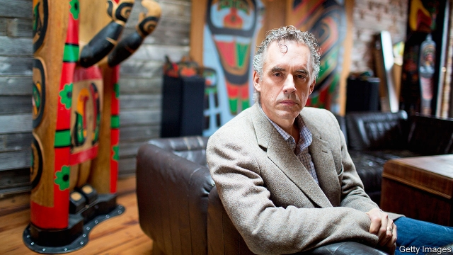

###### Social liberalism

# Culture wars, Canadian-style 

 

> print-edition iconPrint edition | Special report | Jul 27th 2019 

THIS YEAR British Columbia’s human-rights tribunal ordered Bill Whatcott, a conservative agitator, to pay Morgane Oger C$55,000 for inflicting on her and other trans people “detestation and vilification based on their gender identity”. In 2017 Mr Whatcott had distributed a flyer calling Ms Oger, who was then running for the provincial legislature as a member of the left-leaning New Democratic Party, a “biological male who has renamed himself”. That and other assertions, the tribunal ruled, constituted “hate speech” and “discrimination”. 

Mr Whatcott is not the only Canadian to have been punished recently for an act of conscience. Last year the federal government denied subsidies for summer jobs to groups that did not tick a box endorsing a woman’s right to have an abortion. In March, Vancouver said it would cut funding to the city’s Rape Relief and Women’s Shelter because the group said it would offer some services only to “women who are born female”. 

These decisions are an outgrowth of Canada’s precocity in recognising rights and protecting minorities. It was the fourth country in the world to legalise same-sex marriage, in 2005. Under Mr Trudeau the pace of liberal legislation has picked up. His government legalised doctor-assisted suicide in 2016. The following year Bill C-16 outlawed discrimination on grounds of gender identity and made it a crime to promote hatred against transgender people. Last year Canada became the first big country to legalise cannabis for recreational use. 

The adoption of Canada’s charter of rights and freedoms in 1982 was the “most important galvanising force” behind its pioneering role in recognising rights, says Beverley McLachlin, a former chief justice of the Supreme Court. Often, the process starts in the courts. But charter rights are not absolute. Tribunals can limit some rights, such as freedom of speech and religion, to enforce others, like protecting transgender people from discrimination. 

Some Canadians have revelled in the new freedoms. In 2017 a baby born in British Columbia became the first in the world to be issued a health card that records its sex as neither male nor female. The non-binary transgender parent wants the child to work out later which sex it is. Since last year, Canadians have been able to record their sex as “X” on their passports. 

But when new rights collide with old ones, the consequences can be contentious. Ontario’s highest court has said that doctors who object to abortion and euthanasia must, against their conscience, refer patients to doctors willing to perform them. This will force many such doctors out of the profession, warned Ryan Wilson, president of Canadian Physicians for Life. British Columbia’s human rights tribunal is considering several complaints by someone who identifies as a woman against female beauticians who refused to wax her scrotum. She claims they are discriminating on the basis of gender identity. 

In 2016, as parliament was debating Bill C-16, Jordan Peterson (pictured), then a little-known psychology professor at the University of Toronto, warned that it could make criminals of people who use a pronoun that a transgender person does not like. Authoritarianism, he said, is “started by people’s attempts to control the ideological and linguistic territory”. The fining of Mr Whatcott, who went beyond using an unwanted pronoun but was not deemed a criminal, does not vindicate Mr Peterson, but it suggests he has a point. 

Meghan Murphy, who founded Feminist Current, a website, argues that Bill C-16 was “rushed through with no discussion…about how it would affect women and girls”. It probably encouraged Vancouver to cut off funding for the rape centre. “Canada likes to consider itself very liberal and accepting,” she says. But “we can’t just accept and include when it’s harming other groups”. Having discovered lots of new rights, Canada is grappling with how to honour them all.■ 
<<<<<<< HEAD

-- 

 单词注释:

1.liberalism['libәrәlizm]:n. 自由主义 

2.Jul[]:七月 

3.tribunal[trai'bju:nl]:n. 法庭, 法官席, 裁决 [法] 法庭, 裁判所, 裁判 

4.agitator['ædʒiteitә]:n. 煽动者 [化] 搅拌器; 搅拌机; 搅抖装置 

5.oger[]:n. 奥格（姓氏） 

6.inflict[in'flikt]:vt. 施以, 加害, 使承受 [法] 处, 加, 予以 

7.Tran[]:n. (Tran)人名；(柬)德兰 

8.detestation[.di:te'steiʃәn]:n. 憎恶, 嫌恶, 令人厌恶的人 

9.vilification[.vilifi'keiʃәn]:n. 诽谤 [法] 诋毁, 诽谤, 损害名誉 

10.gender['dʒendә]:n. 性 vt. 产生 

11.flyer['flaiә]:n. 飞鸟, 飞行物, 飞行员, 快车, 传单, 飞跳 [经] 投机买卖, 孤注一掷, (广告)传单 

12.provincial[prә'vinʃәl]:n. 外地人, 粗野的人 a. 省的, 外地的, 偏狭的 

13.legislature['ledʒisleitʃә]:n. 立法机关, 议会, 立法院 [法] 立法机构, 立法机关 

14.biological[.baiәu'lɒdʒikәl]:a. 生物学的 [医] 生物学的 

15.rename[.ri:'neim]:vt. 重新命名, 再命名, 给...改名 [计] 重命名; DOS内部命令:更改文件名 

16.assertion[ә'sә:ʃәn]:n. 断言, 主张 [法] 宣称, 断言, 维护 

17.constitute[kәn'stitjut]:vt. 构成, 组成, 任命 [建] 构造, 组成 

18.endorse[in'dɒ:s]:vt. 支持, 赞同, 背书于, 签署 [经] 赞成, 背书 

19.vancouver[væn'ku:vә]:n. 温哥华（加拿大主要港市） 

20.rape[reip]:n. 抢夺, 掠夺, 强奸, 葡萄渣, 芸苔 vt. 掠夺, 抢夺, 强奸 

21.outgrowth['autgrәuθ]:n. 自然的发展, 结果, 副产物, 分枝 [医] 赘疣 

22.precocity[pri'kɒsiti]:n. 早熟 [医] 早熟 

23.legalise['li:^әlaiz]:vt. 使合法化, 使成为法定, 法律上认可 

24.trudeau[]:n. (Trudeau)人名；(英、法)特鲁多 特鲁多 

25.suicide['sjuisaid]:n. 自杀, 自杀者 v. 自杀 a. 自杀的 

26.outlaw['autlɒ:]:n. 被剥夺法律保护的人, 罪犯 vt. 使...失去法律保护, 将...逐出社会, 宣告非法, 取缔 

27.transgender[trænzˈdʒendə(r)]:n. 变性人 

28.cannabis['kænәbis]:n. 大麻 [化] 大麻 

29.recreational[.rekri'eiʃәnәl]:a. 消遣的, 娱乐的 

30.adoption[ә'dɒpʃәn]:n. 采用, 采纳, 收养 [法] 收养, 采纳, 采用 

31.charter['tʃɑ:tә]:n. 特许状, 执照, 宪章 vt. 特许, 发给特许执照 

32.galvanise['^ælvәnaiz]:vt. 通电流于, 给...镀锌, 电镀, 刺激, 使兴奋, 激动, 激励, 惊起 

33.Beverley['bevәli]:n. 贝弗利(m.) 

34.mclachlin[]: [人名] 麦克拉克林 

35.revel['revl]:n. 作乐, 狂欢 vi. 狂欢作乐, 陶醉, 着迷 vt. 耗费 

36.Columbia[kә'lʌmbiә]:n. 哥伦比亚 

37.x[eks]:n. 未知数 [计] 交换, 变址, 索引, 传输 

38.collide[kә'laid]:vi. 碰撞, 互撞, 抵触 

39.contentious[kәn'tenʃәs]:a. 好争吵的, 爱争论的, 有异议的 [法] 诉讼的, 争执的, 引起争论的 

40.euthanasia[.ju:θә'neizjә]:n. 安乐死 [医] 安死术 

41.ryan['raiәn]:n. 赖安（男子名） 

42.wilson['wilsn]:n. 威尔逊（姓氏） 

43.beautician[bju:'tiʃәn]:n. 美容师 

44.scrotum['skrәutәm]:n. 阴囊 [医] 阴囊 

45.discriminate[dis'krimineit]:v. 区别, 差别待遇 

46.jordan['dʒɒ:dәn]:n. 约旦, 约旦河, 尿壶 

47.Peterson[]:n. 彼得森（男子名） 

48.toronto[tә'rɔntәu]:n. 多伦多（加拿大城市） 

49.authoritarianism[ə,θɔrə'tɛrɪənɪzəm]:n. 独裁主义；权力主义 

50.ideological[.aidiә'lɒdʒikәl]:a. 意识形态的, 空想的 [法] 思想的, 思想上的, 意识形态的 

51.linguistic[liŋ'^wistik]:a. 语言的, 语言学的 [计] 语言的, 语言学的 

52.unwanted[.ʌn'wɒntid]:a. 没人要的, 不需要的, 多余的 

53.deem[di:m]:v. 认为, 相信 

54.vindicate['vindikeit]:vt. 辩护, 证明...无辜, 维护 [法] 辩护, 辩解, 辩明 

55.meghan[]:梅根（人名） 

56.murphy['mә:fi]:n. 马铃薯 

57.feminist['feminist]:n. 男女平等主义者 

58.rape[reip]:n. 抢夺, 掠夺, 强奸, 葡萄渣, 芸苔 vt. 掠夺, 抢夺, 强奸 

59.grapple[græpl]:v. 抓住, 掌握 n. 抓住, 系紧, 掌握, 与...扭打 
=======
>>>>>>> 50f1fbac684ef65c788c2c3b1cb359dd2a904378

