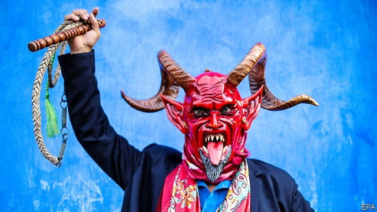

###### Pobre, pero sexy

# Can tourism boost one of Mexico’s poorest states? 

 

> print-edition iconPrint edition | The Americas | Jul 27th 2019 

IT IS A tricky time to be in the tourism business in Mexico. A record murder rate, and travel warnings, have put some foreigners off. The number of visitors to Quintana Roo, the jewel of the tourism industry, is expected to drop by 30% this year, due to pile-ups of seaweed on beaches so big that the navy is helping to clean them up. Last year the number of visitors to Mexico rose by 2.2m, its lowest increase since 2013. Just as the bad news mounts, Andrés Manuel López Obrador, the president, has disbanded the tourism-promotion body. 

Oaxaca, Mexico’s second-poorest state, is a bright exception. The number of foreigners flying into the capital, a colonial gem also called Oaxaca, soared by 49% in the year to March, a bigger rise than anywhere else. The fame of Yalitza Aparicio, the indigenous star of “Roma”, a film released last year, is likely to make the state still more popular. She is the face of this year’s Guelaguetza, a festival of indigenous culture, which ends on July 29th. 

The southern state is not for everyone. D.H. Lawrence, who spent three months there in the 1920s, thought it “queer and forlorn”. It is still queer. Teachers spend more time on strike than in classrooms. Roads are unpaved and the poverty rate is 70%. But many tourists are undaunted. Oaxaca’s Pacific coast is ideal for surfers (and seaweed-free). Mezcal, a globally popular spirit, can be quaffed in the villages where it is made. Mexico’s most indigenous state, Oaxaca prides itself on its creativity, which takes the form of vivid hand-spun textiles and carved wooden beasts, called alebrijes. 

In the town of San José del Pacifico, located in the chilly southern mountains, coffee shops with European breakfast menus cater to hippie hordes which arrive in June, when psychedelic mushrooms sprout on the hills nearby. A three-storey hotel, the first in this one-street village of 500 people, is under construction. Folk from nearby villages bring crafts to sell. 

The state government wants to lure richer travellers. A convention centre opened in the capital in 2017. People who attend business conferences there spend twice as many nights as do typical tourists and five times as much money per day, says Juan Carlos Rivera, the state’s tourism secretary. Unlike leisure travel, which spikes in winter, conferences are not seasonal. Mr Rivera expects more five-star chains to open alongside boutique hotels. 

Tourism is unlikely to enrich the poorest citizens. They live in villages far away from resorts and cities. San José del Pacifico is an exception. Nor do tourists help the state budget much. Value-added tax flows to the federal government. A tax on hotels will bring in only 50m pesos ($2.6m) this year, says Alejandro Murat, the governor. 

Still, Oaxaca is planning for more visitors. The airport is adding more gates and a second floor, enabling more flights. A motorway from the capital to Puerto Escondido, planned since 2006, will open by 2022. That will cut the journey between the state’s two tourist hotspots from seven hours to 90 minutes, says Mr Murat. Tourists will no longer need to take the winding, forested road on which San José del Pacifico sits. For some, the magic mushrooms will still make the trip worthwhile. ■ 
<<<<<<< HEAD

-- 

 单词注释:

1.pobre[]:n. (Pobre)人名；(西)波夫雷 

2.pero[]:[医] 嗅球外层 

3.sexy['seksi]:a. 有性感的, 色情的 

4.Jul[]:七月 

5.tricky['triki]:a. 狡猾的, 机敏的 

6.quintana[]: [人名] 昆塔纳; [地名] [巴拉圭、巴西、古巴、尼加拉瓜、委内瑞拉、智利] 金塔纳 

7.roo[ru:]:n. [动]袋鼠 

8.manuel['mænjuel]:n. 曼纽尔（男子名）；曼努埃尔二世（拜占庭皇帝约翰五世的次子） 

9.López[]:[地名] 洛佩斯 ( 阿根、厄 ) 

10.obrador[]:[网络] 布拉多 

11.disband[dis'bænd]:vt. 解散, 遣散 vi. 被解散 

12.oaxaca[]: [地名] [墨西哥] 瓦哈卡 

13.colonial[kә'lәunjәl]:a. 殖民的, 殖民地的 [法] 殖民地居民 

14.gem[dʒem]:n. 珠宝, 宝石, 珍贵之物 vt. 饰以宝石 

15.soar[sɒ:]:n. 高扬, 翱翔 vi. 往上飞舞, 高耸, 翱翔 

16.aparicio[]:[网络] 阿帕里西奥；西班牙；阿帕里希奥 

17.indigenous[in'didʒinәs]:a. 本土的, 国产的, 固有的 [医] 原产的, 本土的 

18.roma['rɔmә. 'rәu-]:n. 罗马, 罗马帝国 

19.DH[]:[计] 设计手册, 设备处理程序 

20.lawrence['lɔrәns]:n. 劳伦斯（男子名） 

21.forlorn[fә'lɒ:n]:a. 孤独的, 悲惨的, 凄凉的 

22.unpaved[.ʌn'peivd]:a. 没有铺砌的 

23.undaunted[.ʌn'dɒ:ntid]:a. 大无畏的, 勇敢的 

24.surfer['sә:fә]:n. 冲浪运动员 

25.mezcal[]:[医] 威廉斯仙人球, 龙舌兰酵汁 

26.globally[]:[计] 全局地 

27.quaff[kwæf]:v. 狂饮, 大口地喝 n. 大口喝下的酒, 痛饮 

28.creativity[.kri:ei'tiviti]:n. 创造力, 创造性 

29.alebrijes[]:[网络] 阿莱布里赫斯；爱波瑞吉 

30.san[sɑ:n]:abbr. 存储区域网（Storage Area Networking） 

31.DEL[del]:[计] 数据输入语言, 作废; DOS内部命令:从磁盘上删除一个或多个文件 

32.pacifico[]:n. (Pacifico)人名；(意)帕奇菲科；(葡)帕西菲科 

33.chilly['tʃili]:a. 寒冷的, 冷淡的, 不友好的 [建] 番椒, 冷 

34.hippie['hipi:]:n. 嬉皮士 

35.horde[hɒ:d]:n. (一)群, 游牧部落, 移动群 vi. 成群结队 

36.psychedelic[.saikә'delik]:a. 引起幻觉的, 荧光的 n. 迷幻剂 

37.sprout[spraut]:n. 芽, 萌芽 vt. 使发芽, 摘去芽 vi. 长芽, 抽条 

38.lure[luә]:n. 饵, 诱惑 vt. 引诱, 诱惑 

39.traveller['trævlә]:n. 旅行者 [经] 旅行商 

40.juan[hwɑ:n]:n. 胡安（男子名） 

41.carlo[]:n. 卡洛（男子名） 

42.Rivera[]:n. 里韦拉（乌拉圭北部最重要的边境城市, 里韦拉省首府） 

43.spike[spaik]:n. 长钉, 鞋钉, 钉状物, 尖峰状物, 穗 vt. 以大钉钉牢, 用尖物刺穿, 阻止, 弃置不用 [计] 尖峰信号 

44.seasonal['si:znәl]:a. 季节的, 依照季节的, 周期性的 [经] 季节性的, 季节的 

45.boutique[bu:'ti:k]:n. 专卖流行衣服的小商店 

46.enrich[in'ritʃ]:vt. 使富足, 使肥沃 

47.peso['peisәu]:n. 比索 [经] 比索 

48.Alejandro[]:n. 亚历杭德罗（男子名） 

49.murat[]:n. 缪拉/穆拉特（男子名） 

50.motorway['mәutәwei]:n. 高速公路 

51.Puerto[]:n. 垭口, 港口, 山口 n. (Puerto)人名；(西)普埃尔托 

52.escondido[,eskən'di:dəu]:n. 埃斯孔迪多（美国加利福尼亚州圣迭戈县中西部的一个城市） 

53.hotspot[]:n. 热区；热点 
=======
>>>>>>> 50f1fbac684ef65c788c2c3b1cb359dd2a904378

