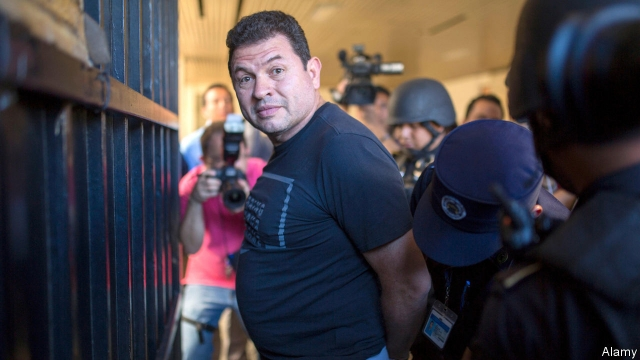

###### Buy any deans necessary

# Letting academics pick magistrates has not worked in Guatemala 

 

> print-edition iconPrint edition | The Americas | Jul 27th 2019 

JUDGES WIELD more power than almost anyone else in Guatemala. This year the supreme court disqualified one of the front-runners for the presidency. It allowed the candidacy of another, Sandra Torres, after prosecutors declined to open a corruption case against her until the day after her immunity, to which she is entitled as a candidate, took effect. The current president, Jimmy Morales, is at odds with the constitutional court because it blocked a proposed agreement under which migrants bound for the United States would have to apply for asylum in Guatemala. The selection this summer of a new bench for the supreme court, plus scores of judges for appellate courts, matters as much as whether Ms Torres wins the election on August 11th. 

The selection process is an unusual one. Deans of university law faculties are entitled to a third of the seats on “postulation commissions”, which draw up shortlists of potential judges. The rest of the membership is composed of serving judges, representatives of bar associations and the rector of a university. Congress makes the final choice. The constitutional court is chosen differently. The president, congress, the supreme court, the bar association and the University of San Carlos, Guatemala’s only public one, each pick a judge. 

The system became part of the constitution in 1985 and was extended in 1993. It was a way to lessen corruption by reducing the influence over the judiciary of politicians and their friends. It has not worked as intended. 

In 2001 the dean of San Carlos’s law school persuaded the university to name him to the constitutional court. One of his successors realised that he could expand his influence by conferring lots of degrees. The grateful graduates would man the bar associations, giving them a say over who sits on the commissions. 

These incentives have led to a proliferation of law schools. In the past 25 years their number has risen from four to 12. Wheeler-dealers bankroll the campaigns of professors competing to become deans, for example by throwing parties for students, who in some cases have a role in choosing them. Some law schools are almost phantoms. Da Vinci University, whose former dean, Fredy Cabrera, was a presidential candidate, has a skeleton staff but graduates hundreds of students. The judges who emerge from this complicated selection process are expected to issue rulings favourable to the people who manipulate it, for example on tax cases. 

Until a few years ago the most powerful judge-picker was Roberto López Villatoro, an importer of knock-off shoes known as “the sneaker king”. In 2009 he allegedly bought the votes of bar-association representatives by sending them to Spain to study for master’s degrees. In 2014 he bought a flat for a magistrate. Mr López is in jail pending trial, but the professorial patronage continues. 

