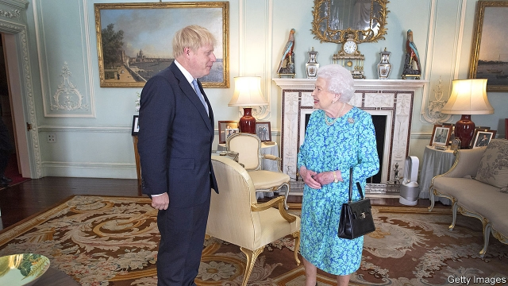

###### Britain finds its BoJo

# Politics this week 

 

> Jul 25th 2019 

Boris Johnson took over as Britain’s prime minister from Theresa May after winning the Conservative Party’s leadership contest. Mr Johnson was the favourite from the outset and won comfortably, taking 66% of the vote from the 160,000 party members on an 87% turnout. Some wonder how long he will last. Brexit has already claimed two British prime ministers. When Parliament scrutinises his Brexit proposals Mr Johnson is likely to struggle as much as Mrs May did. See article. 

Mr Johnson started naming his new ministers, aiming to move away from the pale, male and stale image of previous cabinets. Sajid Javid was appointed chancellor of the exchequer, Dominic Raab took charge at the Foreign Office and Priti Patel became home secretary. There were two other themes in his picks: the new cabinet is packed with pro-Brexiteers and those who backed Mr Johnson in the leadership race. See article. 

The response in Europe to Mr Johnson’s victory was muted. Ursula von der Leyen, the president-elect of the European Commission, politely noted that he “faces challenging times”. Others were more direct. Guy Verhofstadt, who leads the liberal bloc in the European Parliament, called him “irresponsible”. 

In one of her first big decisions as she prepares to take over the presidency of the European Commission, Mrs von der Leyen decided to move Martin Selmayr, the EU’s most senior civil servant, to a new job running the EU’s operations in Austria. The demotion comes less than 18 months after his controversial appointment amid claims of cronyism. 

Ukraine’s parliamentary election was won by President Volodymyr Zelensky’s new Servant of the People party, which won the first overall majority in the country since the fall of communism. Mr Zelensky, a former comedian, called the snap poll after winning the presidency on an anti-corruption ticket in April. See article. 

Kenya’s finance minister, Henry Rotich, was arrested on corruption charges. He denies wrongdoing. The case has raised fears of political instability in Kenya as Mr Rotich is an ally of the deputy president, William Ruto, who plans to run for president in 2022. Mr Ruto’s supporters claim the police and prosecutors are using corruption charges to undermine his chances of winning office. 

The health minister of the Democratic Republic of Congo, Oly Ilunga, resigned amid a dispute over Ebola. Mr Ilunga had resisted the introduction of an experimental vaccine that experts believe could have helped contain the current outbreak, in which about 2,500 people have been infected. 

Iran seized a British tanker passing through the Strait of Hormuz, an important choke- point for international shipping. The capture of the tanker came two weeks after Britain seized an Iranian tanker allegedly bound for Syria. See article. 

Robert Mueller gave eagerly awaited testimony to America’s Congress at a public hearing. The man who investigated links between Donald Trump’s election campaign and Russian officials did not stray far from the findings of his report, published in April, but he rejected the president’s claim that it completely exonerated him. See article. 

The Senate confirmed Mark Esper as America’s new defence secretary, following the derailment of Patrick Shanahan’s nomination last month. Mr Esper received broad bipartisan support in the Senate, though a smattering of Democrats raised concerns about his former job as a lobbyist for a weapons company. 

A resolution opposing an attempt to boycott Israel picked up huge Democratic support and passed the House of Representatives by 398 to 17. That marked a stinging defeat for the movement to boycott Israel, advanced by newly elected progressives. 

 

Ricardo Rosselló became the first governor of Puerto Rico to resign, after two weeks of ever-larger protests triggered by the leak of sexist, homophobic and violent text messages that he exchanged with government officials. One of the offending texts mocked victims of Hurricane Maria, making reference to cadavers and crows. 

South Korea accused Russian aircraft of violating its airspace during a joint military exercise with China. The alleged incursion happened near disputed islands in the Sea of Japan, which are claimed by both Japan and South Korea. Russia denied the incursion. See article. 

Pakistan’s prime minister, Imran Khan, visited the White House. Donald Trump boasted that he could wipe out Afghanistan, an American ally, and, to India’s horror, offered to mediate in the long-standing dispute over Kashmir. See article. 

Japan’s ruling Liberal Democrats won a majority of seats in the upper house of parliament at an election, but failed to secure the supermajority required to change the country’s pacifist constitution, a long-held goal of Shinzo Abe, the prime minister.  

Li Peng, a former prime minister of China, died aged 90. Mr Peng was known as the “Butcher of Beijing” for his role in the crackdown on pro-democracy protesters in Tiananmen Square in 1989. See article. 

Tensions were high in Hong Kong after protesters vandalised the Chinese government’s liaison office in the territory. A mob of men armed with sticks and metal bars later attacked passengers at a railway station. China hinted that it was ready to intervene in Hong Kong if protesters threatened the central government’s authority. See article. 

A Venezuelan fighter jet “aggressively shadowed” an American navy reconnaissance plane over the Caribbean Sea, according to Southern Command, which runs American military operations in Latin America. Venezuela claimed the navy plane had strayed into its airspace. 

The power went off again in 16 of Venezuela’s 23 states. In the capital, Caracas, the blackout caused huge traffic jams. The government blamed an “electromagnetic attack”. 

Brazil’s president, Jair Bolsonaro, chose Marcelo Xavier da Silva, a federal police officer, to lead the government’s Indian affairs department, Funai. Indigenous groups criticised the appointment. As Funai’s ombudsman in 2017 Mr da Silva had asked the police to take “persecutory measures” against activists. Separately, Mr Bolsonaro said he would review data on the deforestation of the Amazon before their release, because the figures could hurt Brazil’s image. 

