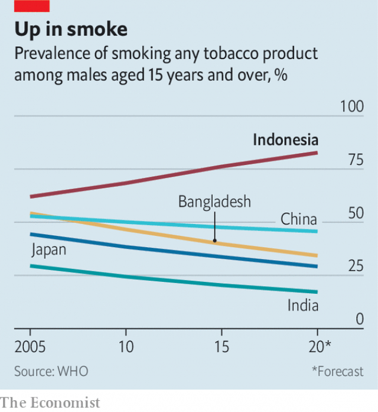

###### No smoking without a fire

# Indonesia seeks to curb e-cigarettes, but not the normal sort 

 

> print-edition iconPrint edition | Asia | Aug 3rd 2019 

SOUNDING MORE like an anguished health worker than a profit-seeking businessman, James Monsees delivers his pitch to a crowded ballroom in Jakarta. The e-cigarettes made by his company, Juul Labs, can save smokers from an early death, he insists. Pointing to government-backed studies from Britain and elsewhere, Mr Monsees argues that e-cigarettes, which heat a liquid laced with nicotine into a vapour that can be inhaled without actually burning anything, are far less harmful than normal cigarettes. “We can have one of the largest positive public-health impacts in history,” he enthuses. 

Indonesia could certainly do with a boost to public health. Around 75m of its 189m adults smoke, according to the World Bank, a higher number than in any other country bar China and India. Smoking rates among men (76%) are the second-highest in the world after Timor-Leste, which itself used to be part of Indonesia. What is more, they are rising, unlike in most Asian countries (see chart). Euromonitor, a research firm, reckons Indonesians spend a hefty $25bn or so a year on cigarettes, including kretek, local favourites which contain cloves as well as tobacco and are especially unhealthy. 

Needless to say, Indonesia’s tobacco companies do not share Mr Monsees’s dream of a smoke-free Indonesia. The big ones—Sampoerna (owned by Philip Morris), Gudang Garam, Djarum and Bentoel (owned by British American Tobacco)—form a weighty lobby. The industry pays a big chunk of the country’s taxes and employs around 6m people. 

 

That may help explain the authorities’ apparent reluctance to stub out smoking, even though the World Health Organisation says smoking-related diseases claim around 225,000 lives across the archipelago each year. Indonesia is one of fewer than ten countries to refuse to sign the WHO’s convention on regulating tobacco. Around 21% of 13-15-year-old boys smoke and there are no penalties for selling tobacco to minors. Cigarettes are cheap (a pack of 20 costs around $2). Tobacco firms promote their wares in slick television advertisements showing manly pursuits. They sponsor sports tournaments and other events where scantily clad marketing girls hand out free samples. Smokers are allowed to light up in many public spaces. 

Despite the widely accepted benefits of switching to e-cigarettes, the government sought to ban the first ones to arrive in the country on health grounds. The trade minister, Enggartiasto Lukita, memorably told people using e-cigarettes to smoke conventional cigarettes instead to preserve jobs for tobacco-growers. In the end the government backed away from a complete ban, but it has imposed onerous restrictions. Distributors have to secure lots of government approvals, a big hurdle for the small firms that dominate the market. Worse, last year the government slapped a 57% excise tax on e-cigarettes and liquids. That leaves Juul and other e-cigarette-makers chasing a relatively small number of rich smokers. The total market for e-cigarettes remains trifling in comparison with sales of the normal sort, at about $200m a year, according to Euromonitor. In fact, none of the big tobacco firms bothers to sell e-cigarettes in Indonesia, even though Sampoerna’s American parent offers “heated tobacco” products in other markets. ■ 

-- 

 单词注释:

1.Indonesia[.indәu'ni:ʒә]:n. 印尼 

2.curb[kә:b]:n. 抑制, 勒马绳, 边石 vt. 抑制, 束缚, 勒住 

3.Aug[]:abbr. 八月（August） 

4.anguish['æŋgwiʃ]:n. 剧痛, 痛苦 vt. 使极痛苦 vi. 感到痛苦 

5.jame[]: 灰岩井 

6.ballroom['bɒ:lrum]:n. 舞厅, 跳舞场 

7.jakarta[dʒә'kɑ:tә]:n. 雅加达（印尼首都, 等于Djakarta） 

8.juul[]:[网络] 佛戴格斯先生 

9.nicotine['nikәti:n]:n. 烟碱, 尼古丁 [化] 烟碱; 尼古丁 

10.inhale[in'heil]:vt. 吸入 vi. 吸气 

11.les[lei]:abbr. 发射脱离系统（Launch Escape System） 

12.enthuse[in'θju:z]:vt. 使充满热情, 使感兴趣, 使热心 vi. 热心 

13.Euromonitor['juərəu'mɔnitə]:n. (英国)欧洲商情市场调研公司 

14.reckon['rekәn]:vt. 计算, 总计, 估计, 认为, 猜想 vi. 数, 计算, 估计, 依赖, 料想 

15.Indonesian[.indәu'ni:ʒәn]:a. 印尼的 n. 印尼人, 印尼语群 

16.hefty['hefti]:a. 重的, 肌肉发达的 

17.kretek['kretek]:<印尼>n.丁香香烟(用烟叶和丁香混合卷制) 

18.clove[klәuv]:n. 丁香 cleave的过去式 

19.needles[]:n. 针数, 千针本；折页顶针（needle复数形式） 

20.philip['filip]:n. 菲利普（男子名） 

21.morris['mɒ:ris]:n. 莫里斯舞 

22.garam[]:n. (Garam)人名；(匈)高劳姆；(芬)加拉姆 

23.weighty['weiti]:a. 重的, 有份量的, 沉重的, 重大的, 严肃的 [法] 有影响力的, 重要的, 重的 

24.lobby['lɒbi]:n. 大厅, 休息室, 游说议员者 vi. 游说议员, 游说 vt. 游说 

25.chunk[tʃʌŋk]:n. 大块, 矮胖的人(或物) [经] 定样 

26.reluctance[ri'lʌktәns]:n. 不情愿, 勉强 [电] 磁阻 

27.stub[stʌb]:n. 断肢, 烟蒂, 树桩, 残余, 存根 vt. 连根拔除, 踩熄 [计] 存根 

28.organisation[,ɔ: ^әnaizeiʃən; - ni'z-]:n. 组织, 团体, 体制, 编制 

29.archipelago[.ɑ:ki'pelәgәu]:n. 群岛, 多岛屿的海 

30.penalty['penәlti]:n. 处罚, 刑罚, 罚款, 罚球, 报应, 不利结果, 妨碍 [经] 罚金(款), 违约金 

31.ware[wєә]:n. 物品, 器具, 货物, 商品, 陶器 vt. 留心, 小心 a. 知道的, 意识到的, 留神的 

32.slick[slik]:a. 光滑的, 熟练的, 聪明的, 华而不实的, 老套的, 陈腐的 adv. 灵活地, 聪明地 vt. 使光滑, 使漂亮 vi. 打扮整洁 n. 光滑平面, 平滑器, 修光工具 

33.scantily[ˈskæntɪlɪ]:adv. 缺乏地; 不充足地; 吝啬地; 狭窄地 

34.clad[klæd]:vt. 在金属外包上另一种金属 a. 包层金属的 clothe的过去式和过去分词 

35.marketing['mɑ:kitiŋ]:n. 行销, 买卖 [经] 推销, 在市场买卖, 销售 

36.memorably['memәrәbli]:adv. 留在记忆中地, 显著地, 明确地 

37.onerous['ɒnәrәs]:a. 繁重的, 负有法律责任的 [法] 负有义务的, 艰巨的, 繁重的 

38.distributor[dis'tribjutә]:n. 分发者, 分布者, 散布者, 分配者, 销售者, 分配器, 配电盘, 自动拆版机 [计] 分配器 

39.hurdle['hә:dl]:n. 障碍, 跳栏, 临时活动篱笆 vt. 用篱笆围, 越过, 克服 

40.slap[slæp]:n. 掴, 掌击, 侮辱, 拍击声 v. 拍击, 惩罚 adv. 正面地, 直接地, 突然地 

41.excise[ek'saiz]:n. (烟、酒等)消费税, 货物税, 国产税 vt. 切除 

42.bother['bɒðә]:vt. 烦扰, 迷惑 vi. 烦恼, 操心 n. 麻烦, 纠纷, 讨厌的人 

