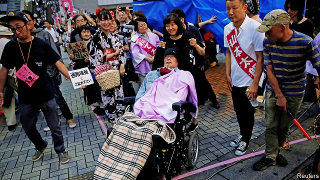

###### Breaking barriers

# Japanese voters elect two politicians in wheelchairs 

 

> print-edition iconPrint edition | Asia | Aug 3rd 2019 

WHEN YASUHIKO FUNAGO was diagnosed in 2000 with amyotrophic lateral sclerosis (ALS), better known as Lou Gehrig’s disease, a degenerative illness with no cure, he went through a period of complete despair. In late July, nearly two decades later, crowds cheered as he became the first ALS patient to be elected to Japan’s parliament, the Diet. “I am full of emotions that this moment has arrived,” Mr Funago said in a speech read out by his helper. “I may appear weak, but I have more guts than others as it has been a matter of life and death for me.” 

Mr Funago, a member of the opposition group Reiwa Shinsengumi, is one of two wheelchair-bound lawmakers to win seats in the upper house in elections on July 21st, along with Eiko Kimura, who is paralysed from the neck down. Disabled people are 7.4% of Japan’s population, but Mr Funago and Ms Kimura will be the only two of the Diet’s 713 members in wheelchairs. Only a handful of disabled people have ever won seats. (The 535 members of America’s current Congress, by contrast, include at least four people who have lost arms, legs or an eye, among other disabilities.) 

“Japanese politics is still centred around able-bodied men,” says Jun Ishikawa, head of a government commission on disabilities. Political parties do not field many disabled candidates. The authorities tend to hide people with disabilities away in institutions, secluded from the rest of society. Students with special needs usually attend special schools. “Japan has focused more on creating segregated institutions than integrating the disabled into local communities,” says Mr Ishikawa. This has bred stigma and isolation. 

The government has been slow to admit the problem. It took seven years to ratify the UN Convention on the Rights of Persons with Disabilities, making it the 140th country to do so. It did not agree until this year to pay compensation to thousands of people with disabilities who were forcibly sterilised under a eugenics law that was only repealed in 1996. Last year several government agencies were found to have falsified the number of disabled people they employ, in some cases for decades, to meet official targets, instead of just hiring more. Prejudice against the disabled has also turned violent. Nineteen people at a care facility in Sagamihara, south of Tokyo, were fatally stabbed in 2016 by a man who “wanted disabled people to disappear”. 

With the election of Mr Funago and Ms Kimura, many are hopeful for change. “It’s definitely a step up from before,” says Mr Koji Oyama of the Japan ALS Association. The two new lawmakers have vowed to push for more inclusive education and better health care for the disabled. At the very least, they are changing the Diet, where alterations under way will improve wheelchair access and rules are being amended to allow carers into closed meetings.■ 

-- 

 单词注释:

1.voter['vәutә]:n. 选民, 投票人 [法] 选民, 选举人, 投票人 

2.wheelchair['hwi:l.tʃєә]:n. 轮椅 

3.Aug[]:abbr. 八月（August） 

4.yasuhiko[]:[网络] 弥寿彦 

5.diagnose['daiәgnәuz]:v. 诊断 

6.amyotrophic[]:[医] 肌萎缩的 

7.lateral['lætәrәl]:n. 侧部, 支线, 边音 a. 侧面的, 旁边的 

8.sclerosis[skliә'rәusis]:n. 硬化症, 硬化, 僵化 [医] 硬化 

9.AL[]:[计] 算法语言, 字母, 汇编语言 [医] 铝(13号元素) 

10.lou[lu:]:n. 卢（女子名, 等于Louise或Lu） 

11.degenerative[di'dʒenәrәtiv]:a. 退步的, 退化的, 变质的 [医] 变性的, 退化的, 变质的 

12.helper['helpә]:n. 帮忙者, 有益的东西 [机] 助手 

13.gut[gʌt]:n. 剧情, 内容, 内脏, 肚子, 海峡, 勇气 vt. 取出内脏, 毁坏...的内部 

14.opposition[.ɒpә'ziʃәn]:n. 反对, 敌对, 相反, 在野党 [医] 对生, 对向, 反抗, 反对症 

15.lawmaker[lɒ:'meikә]:n. 立法者 

16.eiko[]:[网络] 荣工舍；栄子；荣光 

17.kimura[]:n. (Kimura)人名；(塞)基穆拉 

18.paralyse['pærәlais]:vt. 使麻痹, 使瘫痪, 使无力, 使气馁, 终止 [医] 使麻痹, 使瘫痪 

19.politic['pɒlitik]:a. 精明的, 明智的, 策略的 

20.Jun[dʒʌn]:六月 

21.ishikawa[]: [地名] [日本] 石川 

22.seclude[si'klu:d]:vt. 使隔离, 使孤立, 隔开 

23.segregate['segrigeit]:a. 分离的, 被隔离的 vi. 分离, 隔离, 分凝 vt. 使分离, 使隔离 

24.stigma['stigmә]:n. 耻辱, 污名, 烙印 [医] 柱头; 小孔, 眼点; 气孔; 小斑; 特征 

25.isolation[.aisә'leiʃәn]:n. 隔绝, 孤立, 隔离 [化] 分离; 生物分离 

26.ratify['rætifai]:vt. 批准, 认可 [经] 证实, 肯定, 确认 

27.UN[ʌn]:pron. 家伙, 东西 [经] 联合国 

28.compensation[.kɒmpen'seiʃәn]:n. 补偿, 赔偿金, 工资 [医] 代偿(机能), 补偿 

29.forcibly['fɒ:sәbli]:adv. 强制地, 用力地 

30.sterilise['sterɪlaɪz]:vt. 使无用; 使无菌; 使绝育; 使贫瘠化 

31.eugenics[ju:'dʒeniks]:n. 优生学 [医] 优生学 

32.repeal[ri'pi:l]:n. 废止, 撤消 vt. 废止, 撤消, 放弃 

33.falsify['fɒ:lsifai]:vt. 伪造, 歪曲 vi. 说谎 

34.Sagamihara[]:[地名] 相模原 ( 日 ) 

35.fatally['feitәli]:adv. 致命地, 不幸地, 宿命地 

36.koji['kәudʒi]:n. 日本酒曲；清酒曲 

37.oyama[]:小山（日本地名） 欧亚马（自行车品牌名） 

38.vow[vau]:n. 誓约, 誓言, 许愿 vi. 起誓, 发誓, 郑重宣言 vt. 立誓, 起誓要, 郑重地宣布 

39.inclusive[in'klu:siv]:a. 包含的, 包括的 

40.alteration[.ɒ:ltә'reiʃәn]:n. 变更, 改动 [医] 变更 

41.amend[ә'mend]:vt. 修改, 改善, 改良 vi. 改过自新 

42.carer['kεәrә]:n. 负责照顾（老人, 病人, 小孩）的人 

