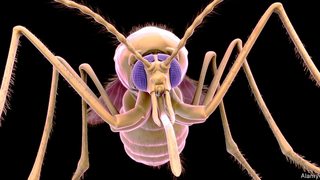

###### The itch of fate

# A history of humankind’s enemy number one 

 

> print-edition iconPrint edition | Books and arts | Aug 3rd 2019 

The Mosquito. By Timothy Winegard. Dutton Books; 496 pages; $28. Text Publishing; £12.99. 

DURING THE second world war, American troops in the Far East were said to have two foes. The first was Japanese. One propaganda poster depicted an enemy’s sabre, slick with blood. The second adversary had no sword but was terrifying all the same. Malaria-carrying mosquitoes infected around 60% of Americans stationed in the Pacific at least once. Drugs such as Atabrine could help, but nasty side-effects meant that some GIs shunned their daily dose—with predictable consequences. “These Men Didn’t Take Their Atabrine” warned a sign propped below a pair of human skulls in Papua New Guinea. 

At least decent treatment was available. For most of human existence, says Timothy Winegard in his lively history of mosquitoes, “we did not stand a chance” against the insect and its diseases. That was partly because of ignorance. Earlier humans blamed malaria and its mosquito-borne cousins on “bad air” from swamps, even as the years passed and death kept whining at their ears. Malaria once killed over 20% of people in the Fens of eastern England. Yellow fever ravaged Memphis, Tennessee, deep into the 1800s. No wonder Mr Winegard calls the mosquito a “destroyer of worlds”, which may have dispatched around half of all humans ever born. 

But his book is more than a litany of victims. Mr Winegard convincingly argues that the insect has shaped human life as well as delivering death. Mosquitoes helped save the Romans from Hannibal and Europe from the Mongols. And if malaria has changed history, so has resistance to it. Europeans believed that the relative immunity enjoyed by some Africans made them ideal slaves in the New World. Later, the tables were turned. “They will fight well at first, but soon they will fall sick and die like flies,” predicted Toussaint Louverture of the Frenchmen sent to end his slave revolution in Haiti. He was right. About 85% of the 65,000 soldiers deployed to the colony died of mosquito-borne illnesses, and Haiti won its independence. 

These dashes across time and distance could become exhausting, but Mr Winegard is an engaging guide, especially when he combines analysis with anecdote. One highlight relays a bizarre plot by a Confederate zealot to infect Abraham Lincoln with yellow fever; another passage explains the ancient Egyptian habit of fighting malarial fevers by bathing in urine. (A few of the witticisms fall flat. Calling the 18th-century Caribbean a “dinner-party buffet” for mosquitoes seems glib, for example; anthropomorphising the pests as a “guerrilla force” is a metaphor too far.) 

But much of Mr Winegard’s narrative is thrilling—above all the concluding chapters in which he tackles the modern mosquito. Drugs and insecticides have helped slash malaria rates, but mosquitoes can quickly develop immunity themselves. In total, the insects still kill over 800,000 people every year. And though gene-editing might one day render them harmless, or even obliterate them altogether, mosquito-borne illnesses such as Zika have recently been spreading to new regions. The destroyer of worlds has not finished yet. ■ 
<<<<<<< HEAD

-- 

 单词注释:

1.itch[itʃ]:n. 痒, 渴望, 疥疮 vi. 发痒, 渴望 

2.Aug[]:abbr. 八月（August） 

3.timothy['timәθi]:n. 梯牧草 [医] 梯牧草, 牛草 

4.Dutton[]:达顿（人名） 达顿（地名） 

5.foe[fou]:n. 仇敌, 反对者, 敌人, 对手 

6.propaganda[.prɒpә'gændә]:n. 宣传, 宣传活动 [医] 宣传 

7.depict[di'pikt]:vt. 描述, 描写 

8.sabre['seibә]:n. 军刀, 骑兵 vt. 用马刀砍 

9.slick[slik]:a. 光滑的, 熟练的, 聪明的, 华而不实的, 老套的, 陈腐的 adv. 灵活地, 聪明地 vt. 使光滑, 使漂亮 vi. 打扮整洁 n. 光滑平面, 平滑器, 修光工具 

10.adversary['ædvәsәri]:n. 敌手, 对手 a. 敌手的, 敌对的 

11.atabrine['ætәbrin]:n. 阿的平 [医] 阿的平, 盐酸奎纳克林 

12.gi[dʒi: 'ai]:a. 军用的；美国军人的 

13.shun[ʃʌn]:vt. 避开, 规避, 避免 

14.predictable[pri'diktәbl]:a. 可预言的 

15.prop[prɒp]:n. 支柱, 支持者, 倚靠人, 道具, 螺旋桨 vt. 支撑, 维持 

16.skull[skʌl]:n. 头盖骨, 头脑, 好学生 [医] 头颅 

17.Papua['pæpjuә]:n. 巴布亚岛 

18.guinea['gini]:n. 几内亚 

19.ignorance['ignәrәns]:n. 无知, 愚味 [法] 无知, 不知情, 愚昧 

20.malaria[mә'lєәriә]:n. 疟疾, 瘴气 [医] 疟[疾] 

21.whine[hwain]:n. 哀叫声, 嘎嘎声, 哀鸣 vi. 哭诉, 嘎嘎响, 发呜呜声 vt. 哀诉 

22.malaria[mә'lєәriә]:n. 疟疾, 瘴气 [医] 疟[疾] 

23.fen[fen]:n. 沼泽, 沼池 

24.ravage['rævidʒ]:n. 破坏, 蹂躏 v. 毁坏, 破坏, 掠夺 

25.Memphis['memfis]:n. 孟菲斯 

26.Tennessee[.teni'si:]:n. 田纳西州 

27.destroyer[di'strɒiә]:n. 破坏者, 消灭者, 起破坏作用的东西, 驱逐舰 

28.dispatch[dis'pætʃ]:vt. 派遣 n. 派遣, 急件 [计] 调度 

29.litany['litәni]:n. 连祷, 连续 

30.convincingly[]:adv. 有说服力, 使人信服, 令人信服 

31.hannibal['hænibәl]:n. 汉尼巴尔（男子名）；汉尼拔（公元前247～前183, 迦太基名将、统帅） 

32.mongol['mɔŋ^ɔl]:n. 先天愚型病患者 

33.immunity[i'mju:niti]:n. 免疫, 免疫性, 免除 [化] 免疫性 

34.toussaint[]:图森特（人名） 

35.louverture[]:[网络] 百叶窗 

36.Haiti['heiti]:n. 海地 

37.deploy[di'plɒi]:v. 展开, 配置 

38.bizarre[bi'zɑ:]:a. 奇异的 

39.confederate[kәn'fedәrit]:n. 同盟者, 同盟国 a. 同盟的, 联合的 v. (使)联盟, (使)联合 

40.zealot['zelәt]:n. 热心者, 狂热者, 犹太教狂热信徒 [法] 狂热分子, 激烈分子 

41.abraham['eibrәhæm, -hәm]:n. 亚伯拉罕（男子名） 

42.Lincoln['liŋkәn]:n. 林肯 

43.malarial[mә'leәriәl]:[医] 疟疾的 

44.BThE[]:[网络] 实际热效率 

45.urine['juәrin]:n. 小便, 尿 [医] 尿 

46.witticism['witisizm]:n. 妙语, 俏皮话 

47.Caribbean[.kæri'bi:әn]:n. 加勒比海 a. 加勒比海的, 加勒比人的 

48.glib[glib]:a. 能说善道的, 流畅的 

49.anthropomorphising[,ænθrəpə'mɔ:faiz]:anthropomorphising vt.,vi. anthropomorphise的变形 anthropomorphise [,ænθrəpə'mɔ:faiz] vt.,vi. [主英国英语] = anthropomorphize 变形： vt.,vi. anthropomorphised . anthropomorphising 

50.guerrilla[gә'rilә]:n. 游击队 

51.metaphor['metәfә]:n. 隐喻 

52.narrative['nærәtiv]:n. 叙述, 故事 a. 叙述的, 叙事的, 故事体的 

53.tackle['tækl]:n. 工具, 复滑车, 滑车, 装备, 扭倒 vt. 固定, 处理, 抓住 vi. 扭倒 

54.insecticide[in'sektisaid]:n. 杀虫剂 [化] 杀虫剂 

55.slash[slæʃ]:v. 猛砍, 乱砍 n. 猛砍, 乱砍, 删减 [计] 斜线 

56.quickly['kwikli]:adv. 很快地 

57.obliterate[ә'blitәreit]:vt. 擦去, 冲刷(掉), 消灭, 忘掉, 盖销(邮票等) [法] 灭迹, 消灭, 涂抹 

58.zika[]:[网络] 齐卡；齐卡兔；齐卡肉兔配套系 
=======
>>>>>>> 50f1fbac684ef65c788c2c3b1cb359dd2a904378

