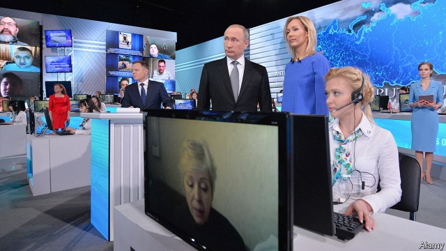

###### A world of lies

# Dispatches from “the war against reality” 

 

> print-edition iconPrint edition | Books and arts | Aug 3rd 2019 

This is Not Propaganda. By Peter Pomerantsev. PublicAffairs; 256 pages; $28. Faber & Faber; £14.99. 

REREAD PETER POMERANTSEV’S first book today and you experience a sense of vertigo. Published in 2014, “Nothing is True and Everything is Possible” is a memoir of working in Russia’s television industry in the 2000s. During his first meeting in Moscow in 2006, Mr Pomerantsev, then a producer-director, now a fellow at the London School of Economics, listens to one of the country’s top TV presenters declare: “We all know there will be no real politics. But we still have to give our viewers the sense that something is happening.” The question is, “Who’s the enemy this week?” Politics should feel “like a movie!” 

That book was acclaimed as a searing insight into the semiotics of Vladimir Putin’s Russia. But in the era of Brexit, Donald Trump and Cambridge Analytica, of Rodrigo Duterte and Jair Bolsonaro, the ruses it depicts are eerily recognisable: the spurious storylines and made-up enemies, the redefinition of what constitutes a fact, the wholesale manipulation of the citizenry. Even the title (adapted from Hannah Arendt) seems as applicable to today’s social-media-inflected Western world as to the Russia of a decade ago. 

Now the author has updated his analysis for the current moment. In “This is Not Propaganda”, Mr Pomerantsev asks: what if Russia “had been a pre-echo of what was to come”? In answering that question he ranges from identity politics to the disavowal of objectivity in much of the media; from the distressingly familiar online harassment of Filipino journalists to the “information war blitzkrieg” that accompanied the Russian invasion of Ukraine. This time his beat extends across Europe to China, the Americas and the Middle East, letting him draw helpful connections between dispersed but similar battles in “the war against reality”. 

“Nothing is True” was the account of an insider. Here, Mr Pomerantsev plays the more traditional role of a researcher and reporter. He meets information-age mountebanks and the idealists attempting to resist or expose them. He describes in detail how social media have been weaponised by the bad guys, though he neglects to tease out the influence of would-be good guys: optimistic tech types keen on making the world a better place. He shows how the digital tools used to mobilise peaceful revolutions have been co-opted by autocrats. 

The personal experience on which Mr Pomerantsev draws for this book is partly vicarious, as he movingly weaves the story of his parents, Igor and Lina, into his narrative. As dissidents in Soviet Ukraine, they lived under claustrophobic censorship and the constant fear of arrest and interrogation; eventually they were exiled for possessing and circulating samizdat. They moved to London (via Austria and Germany), where Igor worked for the BBC’s Russian service, revelling in the freedom to say and think what he wanted. 

The contrast between the tight regulation of information by repressive regimes in the 20th century, and the free-for-all of today’s media environment, gives the book its disconcerting force. Once authoritarian states concentrated on suppressing unwelcome news and opinions; now some also flood the zone with a million different takes. Once they pushed a monolithic ideology; now they shape-shift, so nobody knows what they stand for. In the past, propaganda often complemented military action; now fighting may be necessary only to provide images for propaganda. 

“If you can’t convince them, confuse them,” is an old political motto. But the means for doing that so cheaply and widely are new. If politics in the television age had to feel like a movie, the trick now is to make it seem like an account of real life. ■ 

