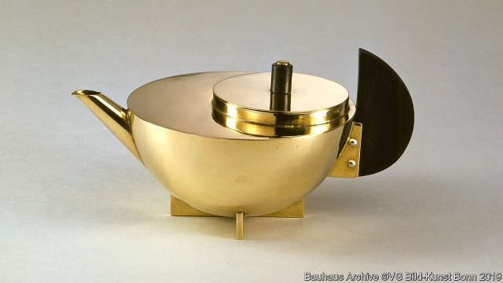

###### Thinking outside the box

# Kinks in the clean lines of the Bauhaus 

 

> print-edition iconPrint edition | Books and arts | Aug 3rd 2019 

SINCE IT WAS built in 1924, the Landhaus Ilse, or Ilse country house, has been an incongruous presence on the edge of Burbach, a provincial town in wooded hills halfway between Frankfurt and Cologne. Not only does the yellow single-storey box, with its illuminated central shaft, stand in contrast to the region’s traditional timber-framed and slate-clad homes. The house itself seems paradoxical. Its confident, modernist lines are complemented by a less austere chorus of sloping roof, small lattice windows, curvaceous chimney-tops and a weather vane. 

Inside, the house—which has not been renovated since the 1920s—is a riot of colour. One room is pink, another blue; a third is criss-crossed by gold lines. The central family room gives, on one side, onto the parlour (painted red), which leads to a conservatory. In the cellar, a big kitchen includes a dumbwaiter that once sent meals up to the green dining room. Improbable as it seems, this contradictory place, which fell into disuse and might have been demolished, sheds light on the evolution and nuances of the Bauhaus school of architecture and design, which was founded a century ago, in 1919. 

For most enthusiasts, the school’s legacy is embodied in iconic designs such as Walter Gropius’s Bauhaus building in Dessau (pictured), Marcel Breuer’s tubular chairs or Wilhelm Wagenfeld’s glass-domed table lamp. Although it closed in 1933, the Bauhaus posthumously became the high church of novelty, simplicity and functionalism, a reformation of an architectural past of stale ornament and tradition. White-cubed houses across the world are today liable to be tagged with the label “Bauhaus-style”, as if that designation could mean only one thing. 

Three major exhibitions are being held in Germany to mark the centenary, one in each of the school’s successive home towns: Weimar, where it was established by Gropius; Dessau, which it moved to in 1925; and Berlin, where it was run by Mies van der Rohe in 1932-33 before closing under pressure from the Nazis. The last, put on by the Bauhaus Archive, a museum, will open in September, as will the one in Dessau (Weimar’s is already up and running). The Ilse house will feature prominently in Berlin. It is likely to disconcert devotees of clean lines—and simple histories. 

Willi Grobleben, the father of the woman who gave the house its name, moved to Burbach in 1924, says Katrin Mehlich, who runs the town’s cultural office. The new technical director of a local quarry, Grobleben had the house built as a company guesthouse; he was given the property as a pay-off in 1927. His daughter, Ilse, lived there until she died in 2000. The house was bought and saved from oblivion by Erika Wirtz, a local entrepreneur. Not long afterwards she came across a familiar-looking floor-plan in a book about the Bauhaus. “That is my Ilse,” Wirtz exclaimed. 

Actually, the plan was for the white-cubed, flat-roofed Haus am Horn in Weimar—the Bauhaus’s earliest foray into architecture, which had been the main exhibit in the school’s first big show, in 1923. All the rooms in the Haus am Horn were—like those of the Ilse house—organised around a central, sky-lit family room. The layout was socially progressive (there was no provision for servants) and aesthetically controversial (the big windows were placed as the interiors demanded, making the exterior asymmetrical). The Haus am Horn was long thought to be unique. 

For the show in Berlin, Anna Henckel-Donnersmarck, a video artist, has interviewed experts and Burbach locals about the curious history of the run-down Ilse house. Her video installation will explore how Grobleben came to mimic the Haus am Horn. Did he visit the Bauhaus exhibition in 1923? Was he among those who inquired about buying a plan? Did he see one in a magazine? Did he and Gropius, born in the same year, meet as students? “The similarities are so strong we can’t really talk about a coincidence,” Annemarie Jaeggi, the head of the Bauhaus Archive, told the video artist in the house’s dining room. The floor plans are Exhibit A, she said. 

“Grobleben was a bit of a nut,” confides Albert Schöllchen in the house’s red parlour. “He certainly didn’t fit in here.” Albert and his older brother Jürgen moved in across the road in the 1950s. Albert says he always found the house “spooky” and gave it no thought. Jürgen says he often wondered: “How did it get here?” He regrets not having asked the Groblebens that question when he could. 

“Part of the fascination about the Ilse house is that we don’t know everything,” says Christoph Ewers, the town’s mayor. What seems clear is that, in Burbach, the newfangled Haus am Horn was turned into what the mayor calls “a representative, traditional upper-middle-class house”. The town declared the building a landmark in 2001 and took it over in 2017 after Wirtz, the entrepreneur, died. Ms Jaeggi was the first bigwig from one of the latter-day Bauhaus institutions to pay a visit. 

In Berlin, the Ilse house and the Haus am Horn will be explained side by side. Nina Wiedemeyer, the exhibition’s curator, wants to tease out the complexities of the Bauhaus story beyond the clean-lined narrative that Gropius and others propagated. In the approved version, which dates to a show at the Museum of Modern Art in New York in 1938, the school was a fount of elegant yet accessible modernism. The Bauhaus proved as avant-garde in marketing itself as it was in art: Gropius gave dozens of speeches about it, and his successor as the school’s director, Adolf Meyer, put on a state-of-the-art touring showcase. 

 

Yet there were always kinks. The retrospective in Berlin will document the school’s close links to other artistic movements, such as the anti-establishment provocations of Dadaism. It will expose the bickering and glitches beneath the myth, noting, for instance, that one design now widely considered a Bauhaus classic, Maria Brandt’s geometrical tea-infuser of 1924 (pictured*), never made it beyond the prototype stage. For its part, the Ilse house demonstrates that the Bauhaus could inspire mash-ups as well as doctrinal purity. 

After all, short-lived as it was, the school involved 1,400 people. Like most human endeavours of that size, and most artistic trends, “it was not a monolith,” Ms Wiedemeyer says. Her exhibition will include some of the Bauhaus’s greatest hits; “but it will also say, ‘Wait, there’s more…’” ■  

*Bauhaus Archive Berlin © VG Bild-Kunst Bonn 2019 

