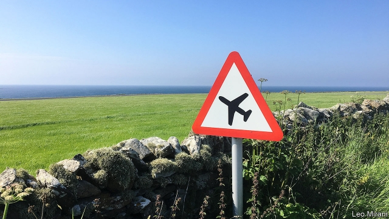
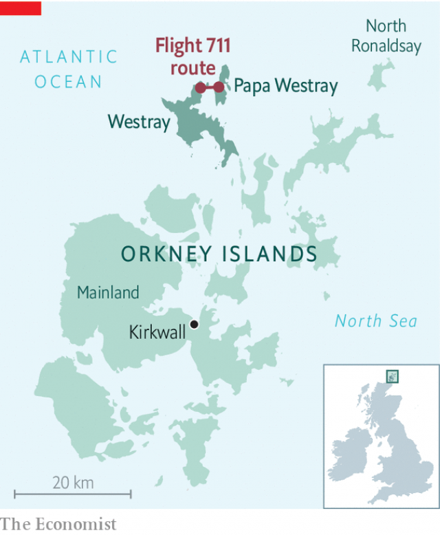

###### Orcadian rhythm

# The world’s shortest flight may soon be its greenest, too 

 

> print-edition iconPrint edition | Britain | Aug 3rd 2019 

IF YOU STARTED reading this article as Loganair Flight 711 lifted off from the compacted-gravel runway at Papa Westray (airport code PPW), a tiny island at the northern end of Orkney, it would have landed by the time you finished. Its first destination, the neighbouring island of Westray (WRY), is all of 2.7km away—a distance shorter than Heathrow airport’s runways. Lasting less than two minutes, the route holds the record for the shortest scheduled flight in the world. 

Some 75-odd weekly inter-island services connect Kirkwall, the main settlement and primary airport in Orkney, with six islands on the archipelago. Last year, around 21,000 passengers flew between the islands on Loganair’s three Britten-Norman Islander aircraft, which can carry up to eight passengers in a minivan-style arrangement. North Ronaldsay (population 72) and Papa Westray (population 90) received the most traffic. Neither island has a pier, and ferry crossings are infrequent or, depending on weather, non-existent. “So we try to compensate” with the air service, says James Stockan, the council leader. 

The Papa Westray-Westray trip is cheap for passengers—£17 one way, and £1 more to fly all the way back to Kirkwall—but costlier for taxpayers. The Orkney Islands Council throws in another £46 (€50), adding up to an annual subsidy bill of just under £1m. The subsidy—paid for largely by the Scottish government—is exempt from strict European Union rules on state aid because it is a “lifeline” route. This is no exaggeration: between October and April, all North Ronaldsay’s supplies, including food, come by air every Tuesday. 

 

The route is in contention for another record: the first commercial electric flight. In the world of commercial aviation, electric aircraft are likely to be taking off shortly. An Israeli model, expected to be operating by 2022, was unveiled at the Paris Air Show this year. Cranfield University, which specialises in aeronautics, is working on something simpler for the Islander—retrofitting it with electric power. 

Jonathan Hinkles, Loganair’s boss, says he is sceptical of attempts to put electric engines on big planes, but “with the Islander we are confident and comfortable that it does work, that this is a technically feasible solution.” Moreover, Orkney’s inter-island flights are short enough for range anxiety to not be a big concern. The longest trip, from Kirkwall to North Ronaldsay, is no more than 20 minutes. Indeed, electric planes could make small, short routes such as these more economically viable, and therefore more common. 

Orkney is already a leader in green energy. It generates more wind power than it consumes—it sells electricity to the national grid—has the highest rate of electric-vehicle ownership in Scotland and is experimenting with batteries to store excess energy. The council is working on a scheme to introduce hydrogen-powered ferries in 2021. If all goes according to plan, Loganair’s e-planes should take off the following year. ■ 
<<<<<<< HEAD

-- 

 单词注释:

1.orcadian[ɔ:'keidiәn, -djәn]:a. 英国奥尼克郡(Orkney) 群岛的 

2.Aug[]:abbr. 八月（August） 

3.loganair[]:[网络] 洛根航空；洛根航空公司；洛甘航空公司 

4.runway['rʌnwei]:n. 跑道, 河床, 过道 [化] 单轨架空道; 吊车道 

5.papa[pә'pɑ:]:n. 爸爸 

6.Westray[]:[地名] 韦斯特雷 ( 加 ) 

7.PPW[]:外围处理机字 

8.orkney['ɔ:kni]:n. 奥克尼群岛；奥克尼（苏格兰东北方群岛） 

9.wry[rai]:a. 扭歪的, 歪曲的, 歪斜的 v. 扭曲, 扭歪 

10.heathrow['hi:θrәj]:n. 希思罗机场（位于英国伦敦） 

11.les[lei]:abbr. 发射脱离系统（Launch Escape System） 

12.kirkwall[]: [地名] [英国] 柯克沃尔 

13.archipelago[.ɑ:ki'pelәgәu]:n. 群岛, 多岛屿的海 

14.islander['ailәndә]:n. 岛民 

15.pier[piә]:n. 码头, 桥墩, 支框, 防波堤 [医] 桥基, 基牙 

16.infrequent[in'fri:kwәnt]:a. 稀少的, 珍贵的, 罕见的 

17.jame[]: 灰岩井 

18.taxpayer['tækspeiә]:n. 纳税人 [法] 纳税人, 纳税义务人 

19.exempt[ig'zempt]:n. 免税者, 被免除义务者 a. 免除的 vt. 使免除, 豁免 

20.lifeline['laiflain]:n. 救生索, 生命线 

21.contention[kәn'teinʃәn]:n. 争论, 争辩, 所持的论点 [计] 争用 

22.Israeli[iz'reili]:a. 以色列的, 以色列人(语)的 n. 以色列人 

23.unveil[.ʌn'veil]:vt. 揭开, 揭幕, 除去...的面纱 vi. 显露, 除去面纱 

24.Cranfield[]:n. (Cranfield)人名；(英)克兰菲尔德 

25.specialise['speʃә,laiz]:vt. 特加指明, 列举, 使专门化, 限定...的范围 vt.vi. (使)特化, (使)专化 vi. 成为专家, 专务, 专攻, 专门研究, 逐条详述 

26.aeronautics[.єәrә'nɒ:tiks]:n. 航空学, 飞行术 [机] 航空学 

27.jonathan['dʒɔnәθәn]:n. 乔纳森（男子名） 

28.technically['teknikli]:adv. 技术上, 学术上, 专门地 

29.economically[i:kә'nɔmikәli]:adv. 节约地, 不浪费地, 节省地, 节俭地, 在经济上, 在经济学上 

30.viable['vaiәbl]:a. 能养活的, 能生长发育的 [医] 有活力的, 有生机的 
=======
>>>>>>> 50f1fbac684ef65c788c2c3b1cb359dd2a904378

