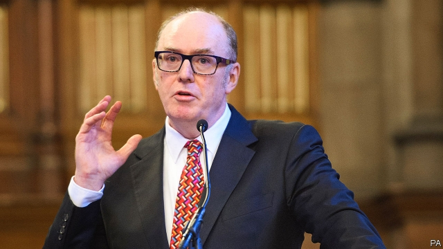

###### In the Lyons den

# What makes Boris Johnson’s favourite economist tick? 

 

> print-edition iconPrint edition | Britain | Aug 3rd 2019 

BREXITEERS, by and large, have nothing but contempt for the Bank of England. They think it behaved as a hired gun of the Remain campaign in 2016. Its repeated warnings since then of the dangers of a no-deal Brexit have created further ill will. So the government’s capture last week by Brexiteers has injected an interesting element of unpredictability into the race to replace Mark Carney, who vacates the governorship in January. 

Insiders such as Andrew Bailey, head of the Financial Conduct Authority, and Dame Minouche Shafik, the director of the London School of Economics, have been leading the field. But Boris Johnson is thought to want his own person. That’s why Gerard Lyons, a pro-Brexit economist who advised Mr Johnson when he was mayor of London, is now the fancied outsider. The pro-Johnson Daily Telegraph newspaper reports that he “has already been promised it”. Mr Lyons declines to comment on the rumour. But even if he doesn’t get the bank job, he’s likely to get a big advisory role. 

Mr Lyons’s euroscepticism goes back a long way. At a recent event at the London School of Economics he spoke glowingly of politicians in the 1960s and 1970s who campaigned against Britain’s membership of the common market. Mr Lyons was an early critic of the “exchange-rate mechanism” (ERM) of the early 1990s, in which the pound was pegged to the Deutschmark. “[S]omething will have to give: either the government’s exchange-rate commitment or the economy,” he wrote in the Observer in 1992. He has called the euro “probably the worst economic idea ever thought up by anyone anywhere at any time”. 

His language about Brexit is equally passionate. Though he has shied away from some of the Leave campaign’s wilder claims—including Mr Johnson’s misleading statement that the NHS would get £350m ($428m) a week of extra funding after Brexit—he has compared the EU to the Titanic. Theresa May’s withdrawal agreement with the EU, meanwhile, is akin to “allowing someone to put their hands around your throat and to squeeze the life out of your economy”, he told attendees at an event organised by the Bruges Group, a conservative outfit. 

In “Clean Brexit”, a book written in 2017 with Liam Halligan, a journalist, Mr Lyons explains how Britain can do much better. A no-deal Brexit might cause some short-term disruption, he concedes, but not much. Tariffs imposed by the EU on Britain “will be a manageable business cost” for most firms because the depreciation of sterling would make exports more competitive internationally. Problems surrounding the Irish border are waved away. 

Mr Lyons likes to use the metaphor of the Nike “swoosh” to describe what would happen next. Disruption would cause a dip in growth, but once outside the EU’s “regulatory stranglehold” Britain could latch on to the coat-tails of fast-growing emerging markets. Brexit would also allow the British economy to look, in effect, more Chinese, through stronger export performance and more investment. But the book does not convincingly pin the blame for Britain’s failings on its EU membership, rather than British government policy. 

The big question—whether a hard Brexit would cause permanent economic damage—gets to the heart of Mr Lyons’s identity. He regards himself as an outsider. As he sees it, the “economics establishment” was proved wrong about the ERM and wrong about the euro. He was proved right. Why shouldn’t he also be right about Brexit? And, like Mr Johnson, he believes that if only the country could muster up some vim, Brexit would be great. “Britain’s biggest export is its pessimism,” he says. 

Many Brexiteers would love Mr Lyons to get the bank job (if he does not, expect accusations of an establishment stitch-up). Whether it would be good for Britain as a whole is less clear. Mr Lyons has little experience of central banking. What would be widely construed as a political appointment would hurt the bank’s credibility among investors. Yet Mr Johnson’s cabinet is stuffed with radicals; one more would be no great surprise. ■ 

