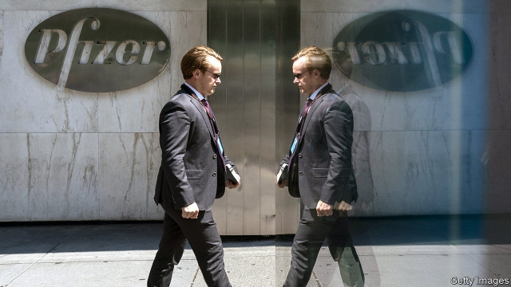

###### Generic script

# Pfizer and Mylan want to create a generic-drug giant 

 

> print-edition iconPrint edition | Business | Aug 3rd 2019 

GREATER THAN the sum of its parts. That, in a nutshell, is how Albert Bourla, the newish chief executive of Pfizer, described the merger of the giant drugmaker’s stodgy but profitable off-patent division, Upjohn, and Mylan, a big but struggling generic-drug firm. The all-stock transaction, announced on July 29th, would create the world’s largest generics firm by revenue, with an enterprise value of $50bn. 

All bosses promise that spin-offs they mastermind create value for shareholders. And there are reasons to take Mr Bourla seriously, says David Risinger of Morgan Stanley, an investment bank. If the management is to be believed, the as-yet-unnamed company will have revenues of $19bn-20bn and gross operating margins of 40%. It has pledged to pay a dividend equal to roughly a quarter of free cashflow. The incoming boss, Michael Goettler, who runs Upjohn, plans to chip away at the combined company’s $25bn in debt, by cutting $1bn in annual costs by 2023. 

It should be able to expand quickly outside America’s fiercely competitive generics market, where consolidation among wholesalers has allowed buyers to demand lower prices and faster regulatory approval of generic drugs has flooded the market with low-cost medicines. The shares of big generics firms exposed to America have performed miserably in recent years. The market share of the ten biggest declined from 53% to 44% between 2014 and 2018. 

On the surface, the transaction also makes sense for Pfizer. The drugmaker has been shedding assets to refocus on high-growth areas. In December it spun off its consumer-health division, which was combined with that of GSK, a British rival. It previously got rid of its animal-health business. By sticking to lucrative areas like cancer treatments, Mr Bourla hopes to persuade investors that Pfizer shares deserve a higher price. 

So far Wall Street seems unconvinced. Tim van Biesen of Bain, a consultancy, points out that it is unclear if Pfizer can come up with enough blockbusters to sustainably offset earnings from the divestment of peripheral but profitable businesses like Upjohn. Standard & Poor’s, a credit-rating agency, downgraded Pfizer’s debt on the news. Pfizer’s share price fell by 6.4% on June 30th, the biggest one-day slide in a decade. Mylan’s long-suffering stock edged up only slightly. 

The merged company, for its part, inherits lawsuits about Mylan’s alleged price fixing and its role in America’s opioid crisis. Mylan denies all wrongdoing. Mylan’s shareholders are still fuming over the firm’s move in 2015 to the Netherlands, where it adopted an opaque corporate structure, and practices like offering to pay Robert Coury, its chairman, about $1m a year for not using a company plane. 

Observers worry that Mr Goettler may be in over his head. They fear the firm will in fact be controlled by the controversial Mr Coury, who is to be its executive chairman, and Rajiv Malik, his long-serving lieutenant, who is embroiled in the price-fixing complaints. Pressed by analysts this week on corporate governance, Mr Coury was evasive. He vowed to return capital to shareholders “from day one”. “I don’t make shit up. You know that,” he promised. Investors may need more reassurance.■ 

