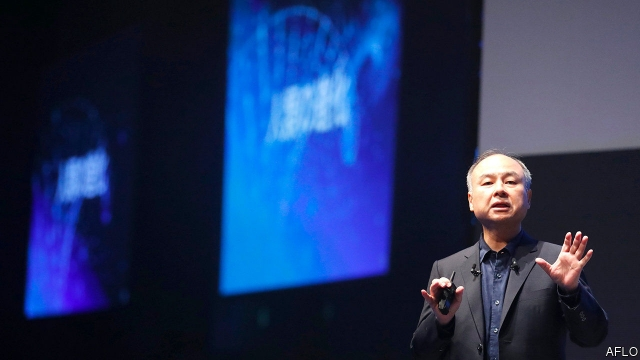

###### Double vision

# SoftBank’s transformation into an investment powerhouse continues 

 

> print-edition iconPrint edition | Business | Aug 1st 2019 

MASAYOSHI SON, the founder of SoftBank, a Japanese telecoms firm turned tech investor, will not have had many more momentous days than July 26th. First came the announcement of plans for a second Vision Fund, whose expected capital contributions of $108bn will make it the largest private technology fund ever, surpassing even the almost $100bn ploughed into its predecessor. Later came news that America’s Department of Justice will not block the merger of T-Mobile and Sprint, the country’s third- and fourth-largest mobile operators. SoftBank owns 84% of Sprint; it would still own 27% of the combined entity, but the deal nonetheless promises to spruce up its balance-sheet. 

Start with news of the second fund. The first one has already upended the assumptions of early-stage investing. Its scale is unprecedented: the next-largest venture-capital vehicles marshal pots in the mere single-digit billions. Its speed has been striking; the Vision Fund has splurged $70bn in under three years on stakes in Uber, WeWork, Arm and others. Investors have done well enough thus far: Mr Son claimed returns of 29% as of March 2019. 

That record now seems set to unlock another gargantuan pile of capital. Giants of the technology industry such as Microsoft, Apple and Foxconn will chip in, joining a string of Japanese financial institutions and Kazakhstan’s sovereign-wealth fund. One notable absentee is the sovereign-wealth fund of Saudi Arabia, whose $45bn stake made it the largest investor in the first fund but became a huge source of controversy following the murder of Jamal Khashoggi, a dissident Saudi journalist. 

SoftBank itself will be the biggest contributor: it promises to put in $38bn. That is where the Sprint deal comes in. The merger is unwelcome news for American consumers, notwithstanding requirements for the two firms to divest assets and share spectrum with Dish, a satellite-TV provider. It still faces antitrust challenges from state attorneys-general. But if the deal goes through, it would reduce the amount of debt on SoftBank’s consolidated balance-sheet by around $40bn, potentially lower the discount that the stockmarket currently applies to the firm and sharpen its focus on tech investment. 

Sceptics of the megafund model still have plenty of arguments. It is too early to judge the success of the first fund, which runs until 2029. Those who think that SoftBank has been inflating tech valuations will be closely watching WeWork, which many see as a property company masquerading as a tech firm. Its initial public offering is expected in September. The governance worries that surround the first fund are unlikely to be quelled by SoftBank’s still-larger stake in the second. Even if one $100bn fund can be put to work, how many other tech startups are there able to absorb such huge investments? But simply by raising a second gargantuan pot of money, Mr Son has given the doubters a big black eye and himself a day to remember.■ 

