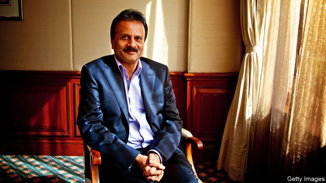

###### Death of an entrepreneur

# V.G. Siddhartha, boss of Coffee Day, is found dead 

 

> print-edition iconPrint edition | Business | Aug 3rd 2019 

“I HAVE FAILED” and “I gave up” were the six most wrenching words in a letter believed to be written by V.G. Siddhartha, an Indian entrepreneur whose body was fished out of the Netravati River on July 31st. The signed suicide note was released by his company, Coffee Day Enterprises. It described unrelenting pressure from investors and creditors, as well as harassment from tax authorities. 

Café Coffee Day, the chain Mr Siddhartha founded in 1996, has 1,700 outlets in India—ten times the number of Starbucks shops in the country. They serve as a second home to many thanks to reasonable prices and comfortable, if worn, seats. Their ubiquity made Mr Siddhartha one of India’s most recognisable bosses. He was liked and respected in business circles, having amassed a fortune of hundreds of millions of dollars. 

Earlier this year he scored a coup by offloading a long-term holding in Mindtree, a technology company, to Larsen & Toubro, a conglomerate. Mindtree’s founders felt betrayed by his willingness to sell out to an unwanted buyer. In hindsight, it appears he had little choice. 

Coffee Day sat atop a pile of debt, much of which Mr Siddhartha personally guaranteed. Six months ago he took out a loan from a friend, to help repay lenders. “I could not take any more pressure from one of the private-equity partners forcing me to buy back shares,” he wrote, without naming the partner. As pressure to return money to investors and creditors mounted, actions by tax authorities, which the letter describes as “unfair”, barred him from selling shares in Mindtree and Coffee Day. 

In a carefully worded statement responding to Mr Siddhartha’s note, KKR, an American private-equity firm, said it had sold a 4.25% stake in the company (out of a holding of 10.3%) on the stock exchange last year and was “deeply saddened by the developments”, adding that “We have not sold any shares before or after February 2018.” Three other foreign vehicles held stakes in the firm. 

Tax authorities for the state of Karnataka acknowledged they had blocked Mr Siddhartha’s shares. They said this was in order to cover potential tax liabilities stemming from a concealed transaction which Mr Siddhartha was involved in and which was unearthed during an investigation into a prominent Karnataka political leader. This has led to speculation about whether ties of Mr Siddhartha’s family to politicians may have played a role in his death. Coffee Day announced that it would launch its own investigation. 

The impact of the tycoon’s death will linger—and not only because of its mysterious circumstances and his high profile. The factors that apparently pushed him over the edge—dodgy political ties, tax investigations, high debts—are all too common in Indian business. What happened was tragic. Perhaps it should not have been a surprise.■ 

