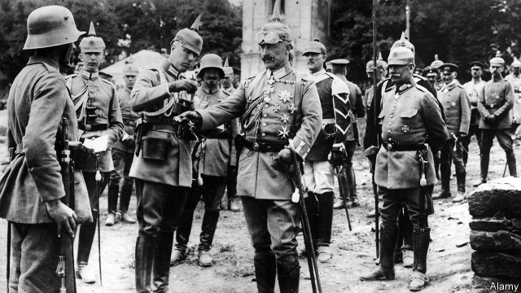

###### Hohenzollerns in hot water

# The Kaiser’s family’s claims for restitution provoke a backlash 

 

> print-edition iconPrint edition | Europe | Aug 3rd 2019 

PRINCE GEORG FRIEDRICH of Prussia is getting a lesson on how not to get the public on his side. The great-great-grandson of the last Kaiser has been in talks for years with the federal government, as well as the state governments of Berlin and Brandenburg, about the return of possessions expropriated by the Russians at the end of the second world war. A letter from his lawyer to the authorities has now been leaked to the press, provoking a vehement backlash against Wilhelm II’s Hohenzollern dynasty and its alleged support for the Nazis. 

The document reveals that the prince wants compensation of at least €1.2m ($1.3m), the right to live rent-free at Cecilienhof (the palace where American, British and Russian leaders held the 1945 Potsdam conference that settled the post-war order), as well as paintings, sculptures, books, letters, photographs and medals from various Hohenzollern houses. The requested inventory includes Cranach paintings and the armchair in which Frederick the Great died. 

The prince was perhaps naive in thinking the letter would remain confidential in Brandenburg, a state ruled by a coalition of Social Democrats and Die Linke, an ex-communist party, which is preparing for hotly contested state elections. The public reacted with Jacobin fury. “The aristocracy is not noble, but evil,” fumed Tomas Fitzel of Rundfunk Berlin-Brandenburg, a local radio station. The aristocracy robbed and extorted for centuries, tweeted Kathrin Vogler, an MP for Die Linke, adding that aristocrats are lucky Germany is not France. 

Like all families whose property was confiscated by the Russians and eastern Germany’s communist regime, the Hohenzollerns cannot claim their houses back. Yet according to legislation passed in 1994, they are entitled to restitution of mobile property, as well as the payment of compensation. The only exceptions are families that actively supported the Nazi regime. This is the sticking-point. 

If the case goes to the courts it will not be pretty. Prince Wilhelm, the son of the last Kaiser, has been called a mouthpiece for Nazi propaganda. His brother August Wilhelm was a fervent Nazi. All parties are still hoping for a settlement out of court. It is very much in the prince’s interest to make it happen.■ 

-- 

 单词注释:

1.hohenzollern['hәuәntsәlәn]:霍亨索伦王室(德国普鲁士王室, 1701-1918) 

2.restitution[.resti'tju:ʃәn]:n. 归还, 偿还, 赔偿 [医] 整复, 恢复, 转回(胎头) 

3.provoke[prә'vәuk]:vt. 激怒, 惹起, 诱导 [法] 刺激, 煽动, 激怒 

4.backlash['bæklæʃ]:n. 后冲, 强烈反对 [电] 反撞, 逆栅流 

5.Aug[]:abbr. 八月（August） 

6.georg[]:n. 格奥尔格（人名） 

7.Friedrich[]:n. 弗里德里希（人名） 

8.Prussia['prʌʃә]:n. 普鲁士 

9.kaiser['kaizә]:n. 皇帝 

10.Berlin[bә:'lin]:n. 柏林, (软质)柏林毛线 

11.Brandenburg['brændənbə:ɡ]:n. 勃兰登堡（德国城市） 

12.expropriate[eks'prәuprieit]:vt. 剥夺, 没收, 征用 [法] 征用, 没收, 剥夺...的所有权 

13.vehement['vi:imәnt]:a. 热烈的, 激烈的 

14.wilhelm['vilhelm,'wil-]:n. 威廉（William的德语形式, 男子名） 

15.hohenzollern['hәuәntsәlәn]:霍亨索伦王室(德国普鲁士王室, 1701-1918) 

16.allege[ә'ledʒ]:vt. 宣称, 主张, 提出, 断言 [法] 断言, 指称, 指证 

17.Nazi['nɑ:tsi]:n. 纳粹党人 a. 纳粹党的 

18.compensation[.kɒmpen'seiʃәn]:n. 补偿, 赔偿金, 工资 [医] 代偿(机能), 补偿 

19.cecilienhof[]:[网络] 西林霍夫；塞琪琳霍夫宫；琳宫 

20.Potsdam['pɒtsdæm]:n. 波茨坦 

21.inventory['invәntәri]:n. 详细目录, 存货清单 vt. 列入详细目录, 清点存货 [计] 存货清单 

22.cranach[]: 人名；(德)克拉纳赫 

23.frederick[]:n. 弗雷德里克（男子名） 

24.naive[nɑ:'i:v]:a. 天真的, 纯真的, 幼稚的 

25.coalition[.kәuә'liʃәn]:n. 结合体, 结合, 联合 [经] 联合, 联盟 

26.democrat['demәkræt]:n. 民主人士, 民主主义者, 民主党党员 [经] 民主党 

27.linke[]: [地名] [缅甸] 林盖 

28.hotly['hɒtli]:adv. 暑热地, 激烈地, 热心地 

29.jacobin['dʒækәbin]:n. 激进派成员 

30.fury['fjuri]:n. 愤怒, 狂暴, 狂怒的人 [医] 狂乱, 狂暴, 狂怒 

31.aristocracy[.æri'stɒkrәsi]:n. 贵族, 上层社会, 知识界杰出分子 [法] 贵族政治, 贵族统治 

32.fume[fju:m]:n. 臭气, 烟, 激怒 vt. 熏 vi. 冒烟 

33.toma[]:n. 生田斗真（日本艺人） 

34.rundfunk[]:[网络] 广播电视 

35.extort[ik'stɒ:t]:vt. 勒索, 敲诈, 强要 [医] 外旋 

36.tweet[twi:t]:vi. 啁啾 n. 小鸟叫声 

37.kathrin[]:n. 【女名】女子名 [网络] 凯思琳；卡特琳 

38.vogler[]:n. (Vogler)人名；(英)沃格勒；(德、捷、波、法)福格勒 

39.MP[]:国会议员, 下院议员 [计] 宏处理程序, 维护程序, 线性规划, 微程序, 多处理器 

40.aristocrat['æristәkræt]:n. 贵族 

41.confiscate['kɒnfiskeit]:vt. 没收, 把...充公, 查抄 a. 被没收的 

42.regime[rei'ʒi:m]:n. 政权, 当权期间, 政体, 社会制度, 体制, 情态 [医] 制度, 生活制度 

43.cannot['kænɒt]:aux. 无法, 不能 

44.actively['æktivli]:adv. 活跃地, 积极地 

45.Nazi['nɑ:tsi]:n. 纳粹党人 a. 纳粹党的 

46.mouthpiece['mauθpi:s]:n. 发话筒, 代言人, (电话)送话口 [机] 钳口垫片 

47.propaganda[.prɒpә'gændә]:n. 宣传, 宣传活动 [医] 宣传 

48.fervent['fә:vәnt]:a. 热的, 炎热的, 热心的 

