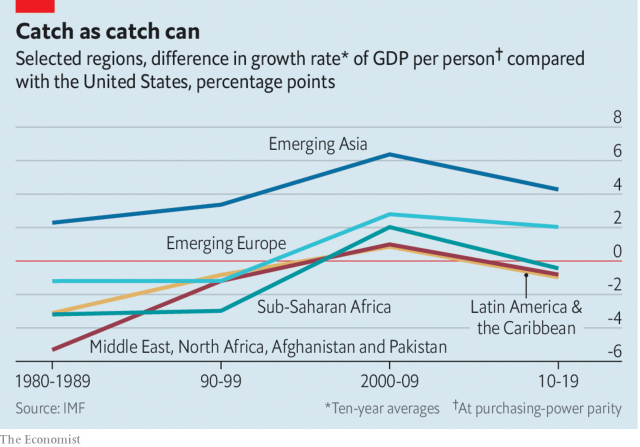

###### Free exchange

# Emerging-market dreams of rich-world incomes meet reality 

 

> print-edition iconPrint edition | Finance and economics | Aug 3rd 2019 

FOR A RICH economy, a growth rate beginning with a five would be cause for ecstasy. For India, it is a huge disappointment. Its most recent quarterly growth figure translates into an annualised rate of only 5.8%, the fourth consecutive quarterly slowdown. That is slower than China (a 6.2% annualised rate in the second quarter of 2019, down from 6.4% in the first) and substantially slower than India believes itself capable of. Recent data suggest the swoon has since deepened (and an analysis published in June by a former adviser to the Indian government also suggests that the China-like growth rates posted in the recent past may reflect dodgy statistics). India is hardly doomed; if it might reasonably have expected to do better, experience elsewhere shows it could very easily have done worse. But the slowdown is yet another sign that the emerging-market narratives to which the world has grown accustomed are in need of serious revision. 

During most of the 20th century advanced economies outgrew poorer ones. But around the turn of the millennium a dramatic shift occurred. In terms of real GDP per person, adjusted for purchasing-power parity, just 24% of the countries now classified as emerging markets by the IMF grew faster than America did across the 1980s as a whole. In the decade starting in 2000, by contrast, 76% did so. Then the BRICs—Brazil, Russia, India and China—were in their pomp. Poverty rates tumbled across developing countries and the world economic order was rewritten. 

 

Convergence continues: over the past ten years about 60% of emerging economies have grown faster than America. But the geographic scope of catch-up growth is narrowing. Real output per person as a share of that in America has fallen since 2011 in the Middle East and north Africa, since 2013 in Latin America, and since 2014 in sub-Saharan Africa. Estimates suggest decline this year in the emerging economies of Europe, leaving Asia as a last outpost of convergence—admittedly a big and important one. A wobble in India thus represents more than a blow to Indian pride. 

There are two competing explanations for the slowing of convergence. One is that the good times were never going to last. Development is hard, which is why so few poor countries became rich during the 20th century. But around 2000 an unlikely combination of tailwinds temporarily suspended this age-old truism. The emerging world found itself swept along by the most astonishing experience of economic development in history: four decades of near-double-digit annual growth in the world’s most populous country. Simultaneously, the world enjoyed an unprecedented expansion in global trade, boosted by technological changes that enabled firms to forge supply chains across dozens of national borders. And governments in the emerging world learned from past crises how best to manage foreign capital. That meant they were well placed when investors sought out better returns than the paltry ones on offer across the rich world. 

But China could perform its miraculous rise only once. Supply chains are as disaggregated as they are likely to get. And it was only a matter of time before rich economies perked up and the post-crisis period of extraordinarily easy monetary conditions came to an end. Convergence is ending, yes, but in this story there is little for countries like India to do as growth rates fall, other than wish they had made more of the moment while it lasted. 

The second theory offers the possibility that emerging markets still have room to grow. Poor countries catch up with rich ones when productivity rates and the amount of capital per worker rise towards levels in the rich world. Increasing productivity is partly about moving workers from sectors where it is low to those where it is high (from subsistence farming to textile manufacturing, say), and partly about achieving steady growth in productivity within sectors. The second of these—sustained productivity growth—is the difference between a short-lived bout of catch-up that peters out and sustained progress towards high incomes. 

During the growth spurt of the past two decades, many countries saw their stock of capital increase. Quite a few experienced periods of urbanisation and economic reform that helped pull workers into factory and office employment, at higher productivity levels. And in some economies the groundwork for sustained growth was also laid during the boom. The dense supply chains that grew up around China served as conduits for technological know-how, transmitting the elements of sustained innovation to underdeveloped economies. For India, exports of commercial services played something of the same role. India is the world’s biggest exporter of information-technology services bar Ireland, where the figures are skewed by the tax-avoiding accounting antics of American tech firms. 

If convergence is not dead, slowing rates of growth are nonetheless cause for concern. Governments may have become complacent, abandoning needed reforms and skimping on investments in productivity-enhancing things like education. India would like to overtake China, but its literacy rate, at about 70%, is lower than China managed 30 years ago. Worse, the decades-long march towards greater global openness may be ending. Amid rising economic belligerence, in particular from America, rich-world companies will naturally think twice before investing abroad. A serious breakdown in global trade, were it to occur, could harm emerging markets’ prospects for a decade or more. Such delay would be made even more devastatingly costly by climate change, which poorer countries will find harder to manage than rich ones. 

Still, there is hope. The obstacles that have sprung up in the way of development might yet be cleared. President Donald Trump could be gone in 18 months. Governments unsettled by visions of economic mortality could discover a renewed zeal for reform, investment and liberalisation. But whichever theory is right, emerging-market dominance has been exposed as anything but inevitable. To put the developing world’s billions back on the path to rich-world incomes will take heroic efforts by governments, firms and workers around the world—and a hefty dose of luck. ■ 

-- 

 单词注释:

1.Aug[]:abbr. 八月（August） 

2.ecstasy['ekstәsi]:n. 狂喜, 心醉神迷, 忘形 [医] 入迷 

3.annualised['ænjuəlaizd]:a. 年度的 v. 按年计算（annualise的过去式和过去分词） 

4.consecutive[kәn'sekjutiv]:a. 连续的, 联贯的 [计] 连续的; 连接的 

5.slowdown['slәudaun]:n. 降低速度, 减速 

6.substantially[sәb'stænʃәli]:adv. 实质上, 本质上, 大体上 

7.datum['deitәm]:n. 论据, 材料, 资料, 已知数 [医] 材料, 资料, 论据 

8.swoon[swu:n]:n. 昏晕, 晕厥 vi. 昏晕, 着迷, 渐渐消失 

9.adviser[әd'vaizә]:n. 顾问, 劝告者, 指导教师 [法] 顾问, 劝告者 

10.dodgy['dɒdʒi]:a. 狡猾的, 逃避的, 难弄的 

11.statistic[stә'tistik]:n. 统计量 a. 统计的, 统计学的 

12.doom[du:m]:n. 厄运, 不幸, 法律, 宣告, 判决, 死亡 vt. 命中注定, 判决 

13.reasonably['ri:znәbli]:adv. 适度地, 相当地 

14.narrative['nærәtiv]:n. 叙述, 故事 a. 叙述的, 叙事的, 故事体的 

15.outgrow[.aut'grәu]:vt. 过大而不适于, 长得比...高(或大、快), 成长得不再具有... 

16.millennium[mi'leniәm]:n. 千禧年, 一千年 

17.parity['pærәti]:n. 同等, 同位, 平价, 奇偶性 [计] 奇偶性 

18.IMF[]:国际货币基金组织 [经] 国际货币基金 

19.pomp[pɒmp]:n. 壮丽, 盛观, 夸耀 

20.convergence[kәn'vә:dʒәns]:n. 集中, 收敛 [计] 收敛, 会聚 

21.geographic[,dʒiә'^ræfik]:a. 地理(学)的, 地区(性)的 

22.outpost['autpәust]:n. 前哨, 前哨部队, 前哨基地 

23.wobble['wɒbl]:n. 摆动, 摇晃, 不稳定, 抖动 vi. 摇晃, 摇摆, 游移不定 vt. 使摇摆, 使颤动 

24.convergence[kәn'vә:dʒәns]:n. 集中, 收敛 [计] 收敛, 会聚 

25.tailwind[ˈteɪlwɪnd]:n. （从后面吹来的）顺风 

26.temporarily['tempәrәrәli]:adv. 暂时, 一时, 临时 

27.truism['tru:izm]:n. 自明之理, 众所周知, 老生常谈 [法] 老生常谈, 陈词滥调 

28.populous['pɒpjulәs]:a. 人口多的, 人口稠密的 

29.simultaneously[simәl'teiniәsly; (?@) saim-]:adv. 同时发生, 一齐, 同时, 同时存在 

30.unprecedented[.ʌn'presidentid]:a. 空前的 [经] 空前的, 无前例的 

31.technological[.teknә'lɒdʒikl]:a. 技术的 [经] 工艺的, 技术的 

32.forge[fɒ:dʒ]:n. 熔炉, 铁工厂 vt. 打制, 锻造, 伪造 vi. 锻造, 伪造 

33.investor[in'vestә]:n. 投资者 [经] 投资者 

34.paltry['pɒ:ltri]:a. 不足取的, 琐碎的, 可鄙的 

35.miraculous[mi'rækjulәs]:a. 奇迹的, 不可思议的 

36.disaggregate[dis'æɡriɡeit. -ɡәt. -ɡeit]:vt. 分解；使…崩溃；解开聚集 

37.perk[pә:k]:vi. 昂首, 振作, 举止高傲, 神气活现, 滤煮 vt. 竖起, 打扮, 使振作, 滤煮 n. 小费 

38.extraordinarily[ik'strɔ:dθnәrili]:adv. 非凡, 破例, 特别, 非常, 离奇, 使人惊奇, 惊人, 特命, 特派 

39.monetary['mʌnitәri]:a. 货币的, 金钱的 [经] 货币的, 金融的 

40.productivity[.prәudʌk'tiviti]:n. 生产力 [经] 生产率, 生产能力 

41.sector['sektә]:n. 扇形, 部门, 部分, 函数尺, 象限仪, 段, 区段 vt. 把...分成扇形 [计] 扇面; 扇区; 段; 区段 

42.subsistence[sәb'sistәns]:n. 生存, 生活 [医] 生存 

43.manufacturing[.mænju'fæktʃәriŋ]:n. 制造业 a. 制造业的 

44.bout[baut]:n. 一回, 回合, 较量 [医] 发作 

45.peter['pi:tә]:vi. 逐渐消失, 逐渐减少 

46.spurt[spә:t]:n. 喷射, 冲刺 vt. 喷射 vi. 喷出, 迸发, 冲刺 

47.urbanisation[ˌɜ:bənaɪ'zeɪʃən]:n. 城市化（等于urbanization） 

48.groundwork['graundwә:k]:n. 地基, 基础, 根据 

49.conduit['kɒndit]:n. 导管, 水管, 沟渠 [电] 导管 

50.innovation[.inәu'veiʃәn]:n. 改革, 创新 [法] 创新, 改革, 刷新 

51.underdevelop[.ʌndәdi'velәp]:v. (使)发展不完全, (使)显影不足 

52.exporter[ik'spɒ:tә]:n. 出口商, 输出者, 出口公司 [经] 出口商, 输出者 

53.skew[skju:]:a. 斜的, 歪的 n. 歪斜, 偏态家庭关系 vi. 歪斜, 侧转 vt. 使歪斜, 曲解 [计] 扭斜; 歪斜; 偏斜 

54.antic['æntik]:n. 滑稽动作 a. 古怪的 

55.tech[tek]:n. 技术学院或学校 

56.nonetheless[,nʌnðә'les]:conj. 然而, 尽管, 不过 adv. 不过, 仍然, 尽管如此, 然而 

57.complacent[kәm'pleisnt]:a. 满足的, 自满的, 得意的 

58.skimp[skimp]:vt. 少给, 克扣 vi. 吝啬 a. 少的, 不足的 

59.literacy['litәrәsi]:n. 读写能力, 识字, 精通文学 

60.openness['әupәnnis]:n. 公开；宽阔；率真 

61.amid[ә'mid]:prep. 在其间, 在其中 [经] 在...中 

62.belligerence[bi'lidʒәrәns]:n. 交战, 好战性, 斗争性 

63.breakdown['breikdaun]:n. 崩溃, 故障 [化] 事故; 击穿 

64.devastatingly['devəsteɪtɪŋlɪ]:adv. 破坏性地, 讥讽地 

65.unsettle[.ʌn'setl]:vt. 使移动, 搅乱, 使动摇, 使不安宁 vi. 动荡不定, 离开固定位置 

66.mortality[mɒ:'tælәti]:n. 必死的命运, 死亡数目, 死亡率 [医] 必死性, 死亡率 

67.liberalisation[,libərəlai'zeiʃən, -li'z-]:n. 自由化；开放 

68.dominance['dɔminәns]:n. 优势, 显性, 统治, 控制, 支配 [计] 控制, 扰势 

69.hefty['hefti]:a. 重的, 肌肉发达的 

