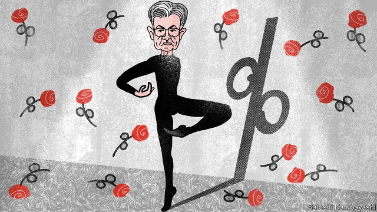

###### Turning point

# The Fed cuts rates for the first time in over a decade 

 

> print-edition iconPrint edition | Finance and economics | Aug 1st 2019 

INTEREST RATES set by the Federal Reserve have been rising since 2015. The gradual approach, explained the Fed’s chairman, Jerome Powell, last September, was intended to leave time to see how well the economy could absorb each raise. “So far the economy has performed very well, and very much in keeping with our expectations,” he said back then. 

Now America is being treated to what some are calling “Powell’s pirouette”. On July 31st Mr Powell announced America’s first interest-rate cut in over a decade, of 0.25 percentage points (see chart). At the press conference after the announcement he blamed weak global growth, trade policy uncertainty and muted inflation. “We’re trying to sustain the expansion,” he said. 

 

The move was widely expected, though not universally understood. By many measures America’s economy still seems buoyant. After dipping a little, earlier in the year, consumer confidence is almost back to its post-recovery peak. Figures published on July 26th revealed that Americans are still spending enthusiastically. Some recent risks have subsided, notably those to do with the public finances. On July 22nd politicians agreed on a deal to raise America’s debt limit, and to avoid steep spending cuts. According to Oxford Economics, a consultancy, had they failed, the squeeze could have knocked 0.4 percentage points off real GDP growth. 

But businesses do not appear to share consumers’ confidence. Non-residential investment shrank in the second quarter of the year. Residential investment has fallen for six consecutive quarters. According to the Federal Reserve Bank of New York, investors are pricing government debt at a level that has historically been associated with a one-in-three chance of a recession within 12 months. 

President Donald Trump’s trade war shows no signs of abating. The effects of the latest increase in tariffs, in mid-June, will take a few more months to become fully apparent in the data. On July 18th the IMF updated its World Economic Outlook, citing “subdued” global growth and a “precarious” projected pickup in 2020. Moreover, some of the economy’s recent resilience may have been in the expectation of the cut to come. Financial conditions have become looser since January, when Fed officials first signalled that they would be pausing interest-rate increases. Mortgage rates have also fallen since then. 

Finally, as Mr Powell emphasised on July 31st, inflation is uncomfortably weak. On a measure that excludes volatile food and energy prices, it sagged to 1.6% in June, well below the Fed’s 2% target. That has paved the way for members of the Fed’s rate-setting committee to adjust the path of interest rates downwards and to implement an “insurance cut”—a tactical reduction intended to keep the expansion alive. With interest rates so low, there is little room for an aggressive move. Rate-setters hope that a small and speedy cut will mean one will not be needed. 

As Mr Powell finished speaking on July 31st, market prices reflected a 73% chance of a further cut of 0.25 percentage points this year. But he studiously avoided committing to anything more, saying that any further cuts would depend on both incoming data and “evolving risks to the outlook”. 

A further cut would not be universally welcome. Catherine Mann of Citigroup, a bank, is sceptical that the latest round of monetary easing will boost business confidence enough to rekindle investment. The Trump administration’s trade policy, not the cost of capital, is holding businesses back, she thinks. She fears that the Fed may be causing asset prices and the broader economy to move apart, generating risks to financial stability. 

Nonetheless investors could react badly if Mr Powell fails to meet their expectations, warns Neil Shearing of Capital Economics, a consultancy. A strengthening dollar, wobbling equity markets or tightening credit conditions could then bounce the Fed into a further burst of loosening. 

America’s monetary-policymakers also need to consider the actions of other countries’ central banks, which have already started to ease. Julia Coronado of MacroPolicy Perspectives, a consultancy, points out that there are limits to how much the Fed can depart from the global trend before it starts causing problems in capital markets. Too much divergence and the dollar will strengthen, tightening supplies of dollar credit and further crimping global trade. Mr Powell has executed a fine pirouette. But he is going to need even more fancy footwork in the coming year. ■ 

