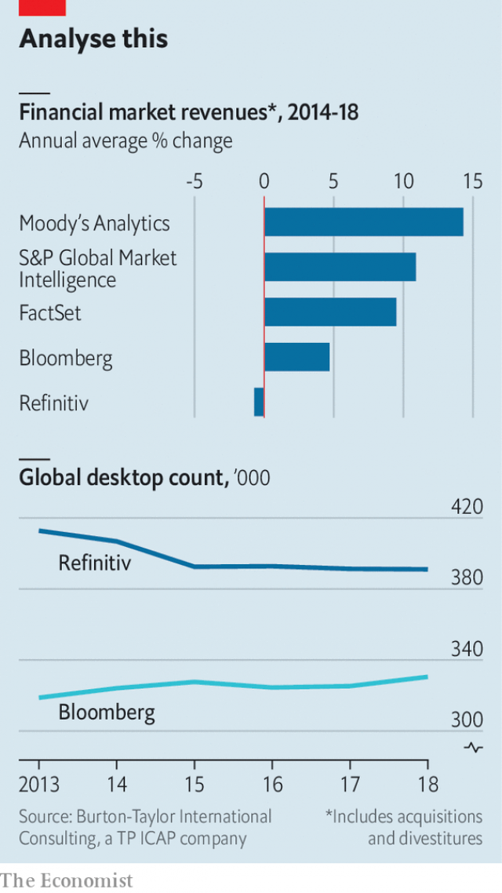

###### Terminal value

# The London Stock Exchange buys Refinitiv 

 

> print-edition iconPrint edition | Finance and economics | Aug 1st 2019 

AROUND 2AM, as the London Stock Exchange Group (LSE) hammered out an agreement with Blackstone to buy Refinitiv, a data-provider, mice scurried out of the corners. Unfair tactics, quipped the Blackstone side. But the American private-equity firm still struck a superb deal. On July 27th the LSE said it would buy Refinitiv (including its debt) for $27bn in shares. Blackstone has doubled its money in ten months after buying 55% of the data firm in a consortium last year. 

The prospect of a 321-year-old British champion shaking off the Brexit gloom to buy a big international firm caused much glee in London. On July 29th the LSE’s shares closed up 15% on the day. Refinitiv’s sales span most asset classes, with three-fifths coming from North America and Asia. “The London Stock Exchange is turning away from Europe and endorsing Global Britain,” crowed one commentator. 

Truth be told, the LSE might still have snapped up Refinitiv had the referendum of 2016 gone the other way. The rationale is clear. Several years ago it pivoted from listings towards selling financial-markets data and analytics, for which demand is voracious. And Refinitiv is the owner of Eikon data terminals, used by traders and fund managers, and Elektron, a data-feed business. Other stock exchanges have seen the same opportunity: in 2015, for example, ICE, the owner of the New York Stock Exchange, bought Interactive Data for $5.2bn. 

Yet the LSE’s purchase is bigger and therefore riskier. It is buying a complex conglomerate with earnings before interest, tax and depreciation of $1.6bn last year, against the LSE’s $1.4bn. Refinitiv’s headcount of 18,500 far exceeds the LSE’s 4,600. According to Keefe, Bruyette & Woods (KBW), an investment bank, in 2018 Refinitiv would have contributed 70% of the combined firm’s revenues and 55% of operating profit, based on pro forma numbers. 

The deal will ensure that the LSE is “well positioned for future growth”, said David Schwimmer, its boss since last August. It was broadly well received, but analysts will have questions about the price, the quality of the asset and what the LSE will do with it. Last year Blackstone and two partners bought the 55% of Refinitiv (as they renamed it) from Thomson Reuters at a value of $20bn. They paid mostly with debt. The $4bn of equity and preferred debt they put in is now worth around $8bn on paper. The LSE is assuming about $12bn of net debt, pushing its leverage much higher. 

Blackstone gave Refinitiv a new brand and took out $350m a year of costs. It used its clout as a big fee-payer to investment banks to secure the flotation of Refinitiv’s Tradeweb platform, which those banks part-owned, and twisted arms to help Eikon. “Complex carve-outs are one of the things Blackstone private equity does really well,” says Martin Brand, the Blackstone executive who did the deals. 

 

It also tried to revive growth at Refinitiv, which has been stagnant (see chart). In 2018, notes KBW, its revenues were 7% lower than in 2012, at $6.3bn. Although some divisions, including compliance and Elektron, are doing decently, the desktop business is shrinking. Traders complain that Eikon terminals are clunky compared with those of the market leader, Bloomberg. 

So Mr Schwimmer’s bold move will slow down what has been one of the world’s fastest-growing stock-exchange groups in recent years. Investors hope that as well as cutting more costs at its new acquisition, LSE can increase revenues by exchanging data between Refinitiv and its index and other business. If it keeps the desktop business it will need to say how it will fix it, says Kyle Voigt of KBW. 

Competition authorities in both Europe and America are sure to look hard at the deal. European market watchdogs are already investigating the rising price of financial data, which is partly caused by industry consolidation. If they intervene, expect much breast-beating about a cruel continent blocking a bold British deal. ■ 

-- 

 单词注释:

1.Aug[]:abbr. 八月（August） 

2.lse[]:abbr. 伦敦证券交易所（London Stock Exchange）；伦敦大学经济政治学系（ 	London School of Economics and Political Science）；伦敦政经学院（London School of Economics） 

3.Blackstone[]:n. 百仕通集团（即黑石集团, 全球最大私募基金公司）；布莱克斯通（英国前文化部长）；黑石镇（美国马萨诸塞州的一个镇） 

4.scurry['skʌri]:vi. 急赶, 急跑, 急转 n. 急赶, 急跑, 急转, 阵雪, 阵雨 

5.tactic['tæktik]:n. 一项战术, 一条策略 a. 战术的, 顺序的, 排列的 

6.quip[kwip]:n. 妙语, 遁辞, 讽刺 v. 说讽刺话, 嘲弄 

7.datum['deitәm]:n. 论据, 材料, 资料, 已知数 [医] 材料, 资料, 论据 

8.consortium[kәn'sɒ:tjәm]:n. 协会, 合伙, (国际性)财团 [经] 合作, 联合, 财团 

9.Brexit[]:[网络] 英国退出欧盟 

10.gloom[glu:m]:n. 忧郁, 暗处, 幽暗 vi. 变忧沉, 变黑暗 vt. 使忧郁, 使黑暗 

11.glee[gli:]:n. 欢乐, 高兴 

12.asset['æset]:n. 资产, 有益的东西 

13.endorse[in'dɒ:s]:vt. 支持, 赞同, 背书于, 签署 [经] 赞成, 背书 

14.commentator['kɔmenteitә]:n. 评论员, 实况广播员, 注释者, 时事评论员 

15.referendum[.refә'rendәm]:n. （就重大政治或社会问题进行的）全民公决，全民投票 

16.rationale[.ræʃә'nɑ:li]:n. 基本原理 [医] 原理, 理论 

17.pivote[]:[网络] 在枢轴上转动 

18.listing['listiŋ]:[计] 列表, 清单, 编目 [经] 挂牌, 上市, 编表 

19.analytic[.ænә'litik]:a. 分析的, 善于分析的, 解析的 [医] 分析的 

20.voracious[vә'reiʃәs]:a. 贪吃的, 狼吞虎咽的, 贪婪的 

21.eikon['aikɔn]:n. 圣像, 画像 

22.trader['treidә]:n. 商人, 商船 [经] 交易者, 商船 

23.elektron[i'lektrɔn]:n. 电子 

24.york[jɔ:k]:n. 约克郡；约克王朝 

25.interactive[,intәr'æktiv]:a. 相互作用的, 相互影响的 [计] 交互, 人机对话的 

26.risky['riski]:a. 危险的 

27.conglomerate[kәn'glɒmәrit]:a. 聚成球形的, 砾岩性的 n. 集成物, 混合体, 砾岩 v. (使)凝聚成团 

28.earning['ә:niŋ]:n. 收入（earn的现在分词） 

29.depreciation[di.pri:ʃi'eiʃәn]:n. 价值减低, 减价, 跌落, 贬低, 折旧 [化] 折旧; 减值 

30.headcount[ˈhedkaʊnt]:n. 点人头数总人数, 职员总数 

31.keefe[]: [人名] [爱尔兰姓氏] 基夫盖尔语姓氏的英语形式，来源于别名，含义是“温柔的，亲切的”(gentle,kind) 

32.bruyette[]:[网络] 布鲁伊特 

33.kbw[]:abbr. Klan Border Watch (along the Mexican border) 三K党边境警戒（沿墨西哥边境）; knowledge based warfare 基于知识的战争，知识化战争 

34.pro[prәu]:adv. 正面地 [计] 可编程远程操作 

35.forma[]:n. 福马（环境科技公司名） 

36.david['deivid]:n. 大卫；戴维（男子名） 

37.schwimmer[]: [人名] 施维默 

38.broadly['brɒ:dli]:adv. 宽广地, 明白地, 无礼貌地 

39.analyst['ænәlist]:n. 分析者, 精神分析学家 [化] 分析员; 化验员 

40.rename[.ri:'neim]:vt. 重新命名, 再命名, 给...改名 [计] 重命名; DOS内部命令:更改文件名 

41.thomson['tɔmsn]:n. 汤姆森（①姓氏 ②Sir George Paget, 1892-1975, 英国物理学家, 曾获1937年诺贝尔物理学奖 ③Sir Joseph John, 1856-1940, 英国物理学家, 曾获1906年诺贝尔物理学奖） 

42.Reuter['rɔitә]:n. 路透社, 路透通讯社 

43.equity['ekwiti]:n. 公平, 公正 [经] 权益, 产权 

44.clout[klaut]:n. 敲击, 破布 vt. 打补钉 

45.flotation[flәu'teiʃәn]:[化] 浮; 浮游选矿 [医] 浮集(法), 浮选(法) 

46.Martin['mɑ:tin]:n. 马丁, 圣马丁鸟 

47.revive[ri'vaiv]:vt. 使苏醒, 使复兴, 使振奋, 回想起, 重播 vi. 苏醒, 复活, 复兴, 恢复精神 

48.stagnant['stægnәnt]:a. 不流动的, 停滞的, 不景气的, 萧条的, 污浊的, 迟钝的 [经] 萧条的 

49.compliance[kәm'plaiәns]:n. 遵从, 顺从, 屈从 [化] 柔顺; 顺应 

50.decently[]:adv. 合适地；高雅地；正派地；亲切地 

51.desktop['desktɔp]:n. 桌面 [计] 桌面 

52.clunky[ˈklʌŋki]:a. 粗笨的；笨重的 

53.bloomberg[]: [人名] 布隆伯格 

54.investor[in'vestә]:n. 投资者 [经] 投资者 

55.kyle[kail]:n. （苏）狭海峡, 海峡 

56.voigt[]: [人名] 沃伊特 

57.watchdog['wɒtʃdɒg]:n. 看门狗, 监察人 [化] 监控设备; 监视器 

58.consolidation[kәn.sɒli'deiʃәn]:n. 巩固, 团结, 合并, 加强 [医] 实变 

59.intervene[.intә'vi:n]:vi. 插入, 调停, 干涉 [经] 进场干预 

