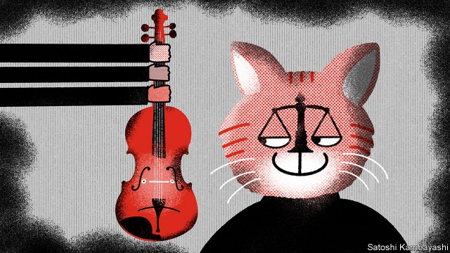

###### The CAT and the (alleged) fiddle

# The currency-trading scandal continues to dog the banks 

 

> print-edition iconPrint edition | Finance and economics | Aug 3rd 2019 

THE LAUGHING stopped long ago. Between 2007 and 2013, in online chatrooms called “Three Way Banana Split”, “Essex Express ’n the Jimmy” and other rib-ticklers, currency traders yapped about all sorts of things—including market tactics. The banter has cost their employers dear. Banks have been fined over $10bn for market-rigging by American and European regulators, including €1.1bn ($1.2bn) by the European Commission in May. An American class action cost 15 banks $2.3bn. But a lawyer’s work is never done. On July 29th Scott+Scott, an American law firm, filed a collective-action case at the Competition Appeal Tribunal (CAT), an antitrust forum in London. 

Cases like this are still a novelty in Britain, despite a theoretically helpful change in competition law in 2015. Collective claims may now be brought to the CAT on an “opt-out” basis, in which members of a specified class are included in the claim unless they choose not to be. If a monopolist rips off its customers, it may do lot of harm in total, but the damage to each may be small. Given the cost of going to court, many may not bother suing. But the easier a collective-action case is to bring, the likelier they are to gain redress. 

The expense of bringing a case to the CAT—and the risk of defeat—are borne by a newish breed of firms specialising in financing litigation. If an action succeeds, claimants (if they are traced) get their awards in full. The financiers are paid out of undistributed damages. 

Therium Capital Management, established in 2009, is backing the foreign-exchange case. British-domiciled companies, pension funds and other investors are included automatically, unless they opt out (foreign claimants must opt in). Cases are led by a representative who may or may not belong to the class. The forex suit is fronted by Michael O’Higgins, a former head of Britain’s Pensions Regulator. Mr O’Higgins estimates the damages to be at least £1bn ($1.2bn). 

Few collective cases have yet reached the CAT. One, against a maker of mobility scooters, was withdrawn in 2017. Two involve claims by hauliers against lorry manufacturers. In another, a consumer champion argues that railways are, in effect, charging commuters into London twice for the part of their journey that overlaps with Transport for London’s network. 

By far the biggest case is heading to Britain’s highest court. The representative, Walter Merricks, an ex-head of the Financial Ombudsman Service, a dispute-settlement body, claims that between 1992 and 2008 some “interchange” fees set by Mastercard, though paid by merchants accepting its cards, harmed consumers because they were passed on in higher prices. (The European Commission banned the fees in December 2007.) Mr Merricks puts the damage at a whopping £14bn. In July 2017 the CAT ruled the claim ineligible, saying that the damage to consumers, in aggregate or individually, could not be accurately assessed. In April the Court of Appeal declared that the CAT had been too hasty. On July 24th the Supreme Court said it would hear an appeal by Mastercard against the Court of Appeal’s judgment. 

The busy Supreme Court will not hear the case before February and possibly not for a year. Because it concerns the criteria for the CAT even to consider damages, its verdict will be eagerly awaited by lawyers, litigation financiers and consumer watchdogs. Whatever the outcome of the foreign-exchange case, banks will face more bills. Several big investors are suing on both sides of the Atlantic, reckoning they will win more in conventional damages claims than from American class actions or their British imitators.■ 
<<<<<<< HEAD

-- 

 单词注释:

1.allege[ә'ledʒ]:vt. 宣称, 主张, 提出, 断言 [法] 断言, 指称, 指证 

2.fiddle['fidl]:n. 小提琴, 提琴类乐器 vt. 虚度时光, 拉小提琴 vi. 拉小提琴, (无目的地)拨弄, 瞎搞 

3.Aug[]:abbr. 八月（August） 

4.online[]:[计] 联机 

5.chatroom['tʃætˌru:m]: （电脑网络上的）聊天室，交谈室 

6.Essex['esiks]:n. 艾塞克斯郡(英格兰郡名) 

7.jimmy['dʒimi]:n. 铁撬 vt. 撬 

8.trader['treidә]:n. 商人, 商船 [经] 交易者, 商船 

9.yap[jæp]:vi. 狂吠, 瞎扯, 责骂 n. 狂吠, 狂吠声, 废话, 乖戾的人 

10.tactic['tæktik]:n. 一项战术, 一条策略 a. 战术的, 顺序的, 排列的 

11.bant[bænt]:vi. 做减肥治疗法 [医] 忌食减瘦 

12.regulator['regjuleitә]:n. 调整者, 校准者, 校准器, 调整器, 标准钟 [化] 调节剂; 调节器 

13.tribunal[trai'bju:nl]:n. 法庭, 法官席, 裁决 [法] 法庭, 裁判所, 裁判 

14.antitrust[.ænti'trʌst]:a. 反托拉斯的 [法] 反托拉斯的 

15.forum['fɒ:rәm]:n. 论坛, 公开讨论的广场, 法庭, 讨论会 [法] 讨论会, 专题讨论, 公共论坛 

16.novelty['nɒvәlti]:n. 新奇, 新鲜, 新奇的事物 

17.theoretically[.θi:ә'retikli]:adv. 理论上, 理论地 

18.monopolist[mɒ'nɒpәlist]:n. 垄断者, 专卖者, 垄断论者 [经] 垄断者, 专利者 

19.rip[rip]:n. 裂痕, 破绽, 拉裂, 浪子, 巨浪 vi. 被拉开, 裂开, 猛冲 vt. 撕, 扯, 劈 

20.bother['bɒðә]:vt. 烦扰, 迷惑 vi. 烦恼, 操心 n. 麻烦, 纠纷, 讨厌的人 

21.sue[su:]:vt. 控告, 起诉, 请求 vi. 提出诉讼, 提出请求 

22.redress[ri'dres]:n. 赔偿, 补救, 矫正 vt. 纠正, 赔偿, 救济 

23.newish['nju:iʃ]:a. 尚新的 

24.specialise['speʃә,laiz]:vt. 特加指明, 列举, 使专门化, 限定...的范围 vt.vi. (使)特化, (使)专化 vi. 成为专家, 专务, 专攻, 专门研究, 逐条详述 

25.litigation[.liti'geiʃәn]:n. 诉讼, 起诉 [经] 诉讼, 纠葛 

26.claimant['kleimәnt]:n. 提出要求者, 原告 [经] 索赔人, 债权人 

27.financier[fai'nænsiә]:n. 财政家, 金融家 vi. 从事欺骗性金融活动, 欺骗 

28.undistributed[,ʌndi'stribjjtid]:a. 未分发的,未分配的 

29.therium[]:动物起因的演替 

30.investor[in'vestә]:n. 投资者 [经] 投资者 

31.opt[ɒpt]:vi. 选择 

32.forex[]:[经] 外汇 

33.michael['maikl]:n. 迈克尔（男子名） 

34.regulator['regjuleitә]:n. 调整者, 校准者, 校准器, 调整器, 标准钟 [化] 调节剂; 调节器 

35.maker['meikә]:n. 制造者, 上帝 [经] 制造者, 出票人 

36.mobility[mәu'biliti]:n. 可动性, 流动性, 机动性 [化] 迁移率 

37.scooter['sku:tә]:n. 小型摩托车, 踏板车 [机] 机车 

38.haulier['hɔ:ljә, -liә]:[经] 承运人, 接运人 

39.commuter[kә'mju:tә]:n. 乘公共车辆上下班者, 月季票乘客 [经] 非(当地)居民 

40.overlap[.әuvә'læp]:n. 重叠, 重复, 部分的同时发生 vt. 重叠, 重复, 与...同时发生 vi. 迭盖, 部分的同时发生 [计] 重叠 

41.Walter['wɔ:ltә(r)]:n. 沃尔特（男子名） 

42.Merrick[]:n. (Merrick)人名；(英、西、葡)梅里克 

43.ombudsman['ɒmbudzmæn]:n. (专查官员舞弊的)调查官 [法] 调查专员, 监察专员, 司法专员 

44.interchange[.intә'tʃeindʒ]:n. 立体交叉道, 互换 vt. 交换, 互换 vi. 交替发生 

45.mastercard['mɑ:stə,kɑ:d]:n. 万事达信用卡 

46.whop[hwɒp]:v. 打, 抽出, 打败, 征服 n. 重击, 打击声 

47.ineligible[in'elidʒәbl]:a. 无被选任资格的, 不适任的, 无益的 n. 无被选任资格的人, 不合录用资格的人 

48.aggregate['ægrigәt]:n. 合计, 总计, 聚集体 a. 合计的, 聚集的 v. 聚集, 集合, 合计达 [计] 聚合体; 聚集 

49.individually[.indi'vidʒuәli]:adv. 以个人身分, 各个地, 独特地 

50.accurately['ækjurәtli]:adv. 正确地, 精确地 

51.judgment['dʒʌdʒmәnt]:n. 裁判, 宣告, 判决书 [医] 判断 

52.verdict['vә:dikt]:n. 裁决, 判决, 判断性意见, 定论, 结论 [法] 定论, 判断, 意见 

53.eagerly[]:adv. 渴望, 热衷于, 热切 

54.watchdog['wɒtʃdɒg]:n. 看门狗, 监察人 [化] 监控设备; 监视器 

55.reckon['rekәn]:vt. 计算, 总计, 估计, 认为, 猜想 vi. 数, 计算, 估计, 依赖, 料想 
=======
>>>>>>> 50f1fbac684ef65c788c2c3b1cb359dd2a904378

