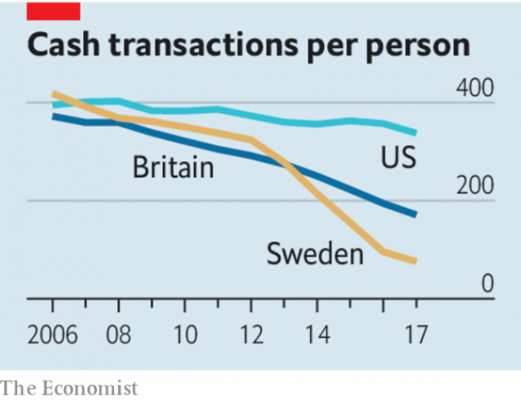

###### The dash off cash

# Rich countries must start planning for a cashless future 

 

> print-edition iconPrint edition | Leaders | Aug 3rd 2019 

FOR THE past 3,000 years, when people thought of money they thought of cash. From buying food to settling bar tabs, day-to-day dealings involved creased paper or clinking bits of metal. Over the past decade, however, digital payments have taken off—tapping your plastic on a terminal or swiping a smartphone has become normal. Now this revolution is about to turn cash into an endangered species in some rich economies. That will make the economy more efficient—but it also poses new problems that could hold the transition hostage. 

Countries are eliminating cash at varying speeds (see Graphic detail). But the direction of travel is clear, and in some cases the journey is nearly complete. In Sweden the number of retail cash transactions per person has fallen by 80% in the past ten years. Cash accounts for just 6% of purchases by value in Norway. Britain is probably four or six years behind the Nordic countries. America is perhaps a decade behind. Outside the rich world, cash is still king. But even there its dominance is being eroded. In China digital payments rose from 4% of all payments in 2012 to 34% in 2017. 

Cash is dying out because of two forces. One is demand—younger consumers want payment systems that plug seamlessly into their digital lives. But equally important is that suppliers such as banks and tech firms (in developed markets) and telecoms companies (in emerging ones) are developing fast, easy-to-use payment technologies from which they can pull data and pocket fees. There is a high cost to running the infrastructure behind the cash economy—ATMs, vans carrying notes, tellers who accept coins. Most financial firms are keen to abandon it, or deter old-fashioned customers with hefty fees. 

 

In the main the prospect of a cashless economy is excellent news. Cash is inefficient. In rich countries, minting, sorting, storing and distributing it is estimated to cost about 0.5% of GDP. But that does not begin to capture the gains. When payments dematerialise, people and shops are less vulnerable to theft. Governments can keep closer tabs on fraud or tax evasion. Digitalisation vastly expands the playground of small businesses and sole traders by enabling them to sell beyond their borders. It also creates a credit history, helping consumers borrow. 

Yet set against these benefits are a bundle of worries. Electronic payment systems may be vulnerable to technical failures, power blackouts and cyber-attacks—this week Capital One, an American bank, became the latest firm to be hacked. In a cashless economy the poor, the elderly and country folk may be left behind. And eradicating cash, an anonymous payment method, for a digital system could let governments snoop on people’s shopping habits and private titans exploit their personal data. 

These problems have three remedies. First, governments need to ensure that central banks’ monopoly over coins and notes is not replaced by private monopolies over digital money. Rather than letting a few credit-card firms have a stranglehold on the electronic pipes for digital payments, as America may yet allow, governments must ensure the payments plumbing is open to a range of digital firms which can build services on top of it. They should urge banks to offer cheap, instant, bank-to-bank digital transfers between deposit accounts, as in Sweden and the Netherlands. Competition should keep prices low so that the poor can afford most services, and it should also mean that if one firm stumbles others can step in, making the system resilient. 

Second, governments should maintain banks’ obligation to keep customer information private, so that the plumbing remains anonymous. Digital firms that use this plumbing to offer services should be free to monetise transaction data, through, for example, advertising, so long as their business model is made explicit to users. Some customers will favour free services that track their purchases; others will want to pay to be left alone. 

Last, the phase-out of cash should be gradual. For a period of ten years, banks should be obliged to accept and distribute cash in populated areas. This will buy governments time to help the poor open bank accounts, educate the elderly and beef up internet access in rural areas. The rush towards digital money is the result of spontaneous demand and innovation. To pocket all the rewards, governments need to prepare for the day when crumpled bank notes change hands for the last time.■ 

