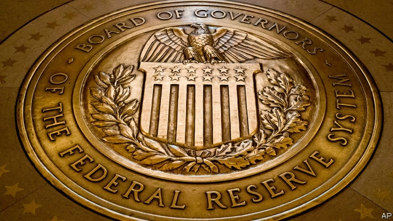
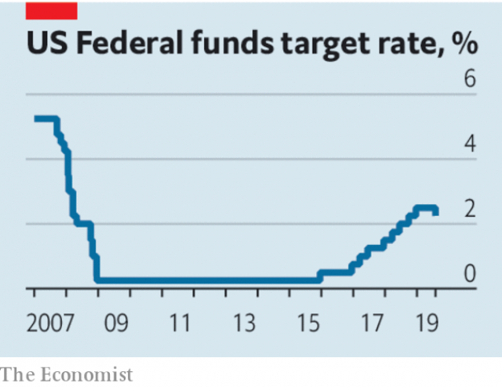

###### The Federal Reserve and emerging markets

# The biggest winners from the Fed’s rate cut 

 

> print-edition iconPrint edition | Leaders | Aug 3rd 2019 

AMERICA’S ECONOMY is caught in two stalemates. The first involves its central bank. On July 31 the Federal Reserve cut interest rates by a quarter of a percentage point, the first reduction since 2008. The Fed is determined not to let the economy succumb to a recession. But nor will the economy warm up enough to let the Fed raise rates to normal levels. The other stalemate is with China. Talks this week in Shanghai confirmed that the trade war is unlikely either to end soon or escalate soon. 

All the signals point to continuing sluggish expansion in America which, after 121 months, is already the longest on record (see article). Less well appreciated is that such tepid conditions have a potential silver lining for the billions of people living in financially exposed emerging economies. An American slump would hurt them, but so might a boom if it led the Fed to raise rates, sucking capital out of the developing world. The Fed’s 0.25-percentage-point cut gives emerging economies welcome breathing space to ease their own interest rates and get back on a path to higher growth. 

They need a break. Emerging markets have had a difficult few years. In July the IMF cut its growth forecast for developing countries to 4.1%, the slowest rate of expansion since 2009. India is losing steam. Turkey and Argentina have suffered currency crises. Investors have also had a rough ride. Since the start of 2013 America’s S&P 500 index of leading firms has more than doubled. Emerging-market equities have dropped by almost 2%. 

It was not meant to be this way. In the early 2000s Brazil, Russia, India and China, the so-called BRICs, grew at miraculous rates. It was easy to think poorer economies would naturally catch up with rich ones, because imitation is easier than innovation, especially when innovative firms build plants in imitative countries. Many also believed that emerging economies had become resilient, with well-run central banks, higher dollar reserves and more flexible currencies. 

 

Sadly the pace of convergence between poor countries and rich has slowed and its scope has narrowed (see Free exchange). It appears those barnstorming growth rates relied heavily on China’s transformation into the workshop of the world, a feat that will not be repeated. Meanwhile there have been several bouts of market jitters: the taper tantrum in 2013, the commodity-price collapse in 2014, China’s devaluation in 2015, the Fed’s interest-rate rises in 2018, financial carnage in Turkey and Argentina, and the uncertainties of the trade war this year. 

That is where monetary policy comes in. In America the central bank can ease policy to offset threats to growth. But many emerging economies felt unable to cut interest rates last year, because the Fed was doing the opposite. Tighter American monetary policy tends to spoil investors’ appetite for risky emerging-market assets. To stabilise their currencies, policymakers in many places found themselves tightening into a slowdown. Indonesia’s central bank, for example, raised rates by 1.75 percentage points in 2018, even though inflation remained below 3.5%. Central banks in Russia and India also turned hawkish, and Brazil had to stop its easing cycle. 

The Fed’s doveish turn has changed that. Emerging economies now feel able to ease, too. South Korea has just lowered its benchmark rate for the first time in three years. Brazil cut rates to record lows this week. South Africa and Indonesia have loosened. Mexico is expected to ease soon. Easier money will help revive growth. But to sustain it much more is required. Emerging economies must use benign times to prepare for bad ones by, for instance, reducing short-term, foreign-currency debt. And to exploit catch-up growth, they must make themselves hospitable to global manufacturing, emulating China rather than riding on its coat-tails. The euphoria of the BRICs era may never return. But the Fed’s cut creates a moment of opportunity. Emerging markets should use it.■ 

-- 

 单词注释:

1.Aug[]:abbr. 八月（August） 

2.stalemate['steilmeit]:n. 僵持状态, 僵局, 陷于困境, 胶着状况 vt. 将...逼和, 使僵持, 使陷入困境 

3.succumb[sә'kʌm]:vi. 屈从, 屈服, 死 

4.recession[ri'seʃәn]:n. 后退, 凹处, 衰退, 归还 [医] 退缩 

5.escalate['eskәleit]:vi. 逐步扩大, 逐步升高, 逐步增强 vt. 使逐步上升 

6.sluggish['slʌgiʃ]:a. 偷懒的, 懒惰的, 迟钝的 [经] 萧条的, 呆滞的 

7.les[lei]:abbr. 发射脱离系统（Launch Escape System） 

8.tepid['tepid]:a. 微温的, 温热的, 不太热烈的 [医] 微温的 

9.financially[]:adv. 金融上；财政上 

10.slump[slʌmp]:n. 暴跌, 垂头弯腰的姿态 vi. 猛然掉落, 陷入, 衰落(经济等) 

11.IMF[]:国际货币基金组织 [经] 国际货币基金 

12.Argentina[.ɑ:dʒәn'ti:nә]:n. 阿根廷 

13.investor[in'vestә]:n. 投资者 [经] 投资者 

14.equity['ekwiti]:n. 公平, 公正 [经] 权益, 产权 

15.Brazil[brә'zil]:n. 巴西 

16.brics[]:abbr. 金砖四国（巴西、俄罗斯、印度及中国） 

17.miraculous[mi'rækjulәs]:a. 奇迹的, 不可思议的 

18.imitation[.imi'teiʃәn]:n. 模仿, 效法, 冒充, 赝品 [医] 模仿, 仿制, 仿制品 

19.innovation[.inәu'veiʃәn]:n. 改革, 创新 [法] 创新, 改革, 刷新 

20.innovative['inәjveitiv]:a. 革新的, 创新的, 富有革新精神的 

21.imitative['imitәtiv]:a. 喜模仿的, 伪造的, 仿制的, 摹拟的 

22.resilient[ri'ziliәnt]:a. 弹回的, 有弹力的 [医] 回弹的, 回能的 

23.convergence[kәn'vә:dʒәns]:n. 集中, 收敛 [计] 收敛, 会聚 

24.barnstorming['bɑrnstɔrmɪŋ]:n. 演说家所做之事 a. 有关演说家的 v. 作巡回演说（barnstorm的现在分词） 

25.feat[fi:t]:n. 壮举, 功绩, 技艺表演 a. 灵巧的, 合适的, 整洁的 

26.bout[baut]:n. 一回, 回合, 较量 [医] 发作 

27.taper['teipә]:n. 带子操作工, 小蜡烛, 尖细, 渐弱, 锥形, 尖塔 a. 尖细的, 分等级的 v. (使)一头逐渐变细, (使)逐渐减少 

28.tantrum['tæntrәm]:n. 发脾气, 发怒 [医] 暴怒, 发脾气 

29.devaluation[,di:vælju'eiʃәn]:n. 降低价值, 贬值 [经] 贬值 

30.carnage['kɑ:nidʒ]:n. 大屠杀, 残杀 

31.uncertainty[.ʌn'sә:tnti]:n. 不确定, 不可靠, 不确定的事物 [化] 不确定度 

32.monetary['mʌnitәri]:a. 货币的, 金钱的 [经] 货币的, 金融的 

33.offset['ɒ:fset]:n. 抵消, 把...并列, 旁系, 支管, 用胶印法印 vt. 弥补, 抵消, 胶印 vi. 装支管 n. 偏移量 [计] 偏移量 

34.risky['riski]:a. 危险的 

35.asset['æset]:n. 资产, 有益的东西 

36.stabilise['steibilaiz]:vt.vi. (使)稳定, (使)安定, (使)坚固 vt. 装稳定器 

37.policymaker['pɔlisi.meikә]:n. 政策制定者；决策人 

38.tighten['taitn]:vt. 勒紧, 使变紧 vi. 变紧, 绷紧 

39.slowdown['slәudaun]:n. 降低速度, 减速 

40.inflation[in'fleiʃәn]:n. 胀大, 夸张, 通货膨胀 [化] 充气吹胀; 膨胀 

41.hawkish['hɒ:kiʃ]:a. 像鹰的, 鹰派的, 强硬派的 

42.doveish[]:[网络] 鸽子 

43.Korea[kә'riә]:n. 朝鲜, 韩国 

44.benchmark[]:[计] 基准程序; 基准 

45.Indonesia[.indәu'ni:ʒә]:n. 印尼 

46.revive[ri'vaiv]:vt. 使苏醒, 使复兴, 使振奋, 回想起, 重播 vi. 苏醒, 复活, 复兴, 恢复精神 

47.benign[bi'nain]:a. 善良的, 良性的 [医] 良性的 

48.hospitable['hɒspitәbl]:a. 好客的, 招待周到的 

49.manufacturing[.mænju'fæktʃәriŋ]:n. 制造业 a. 制造业的 

50.emulate['emjuleit]:vt. 效法, 尽力赶上, 同...竞争 [计] 仿真 

51.euphoria[ju:'fɒ:riә]:n. 兴奋, 陶醉, 陶醉感 [医] 精神愉快, 欣快 

