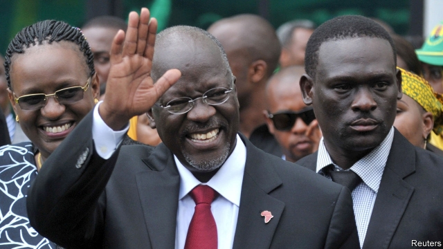

###### Tyranny in Tanzania

# Another critic of President John Magufuli is silenced 

 

> print-edition iconPrint edition | Middle East and Africa | Aug 1st 2019 

JOHN MAGUFULI, Tanzania’s president, is known as “the Bulldozer”. When he took office in 2015 the nickname was seen as a compliment: at last the East African country of 57m people had a leader who would take on graft and get things done. In his first months in charge Mr Magufuli wasted no time in cracking down on corruption (at least among his enemies). But since then the only things being squashed in Tanzania are civil liberties. 

One observer who knows this well is Erick Kabendera. A journalist, Mr Kabendera has written for the Economist Intelligence Unit, our sister company, and many other international outlets. He has documented Mr Magufuli’s abuses of power, including a proposal last year that would make it illegal to contradict official statistics. 

On July 29th Mr Kabendera was forcibly removed from his home on the outskirts of Dar es Salaam, the commercial capital, by plain-clothes policemen. His phone, and those of his wife and neighbours, were taken. The premise for the abduction is unclear and his whereabouts are unknown. 

Mr Kabendera’s arrest is not the first attack on journalists in Tanzania under Mr Magufuli. Azory Gwanda, a freelance, was abducted in 2017 and has not been seen since. At least four newspapers and two radio stations have been closed. Legislation enacted in 2016 made it harder to criticise those in power. (The East African Court of Justice says it violates press freedom.) 

Other critics of the regime, including opposition MPs, are frequently arrested. One MP, Tundu Lussu, was shot in 2017 in an assassination attempt. Companies such as Acacia Mining have been shaken down for huge tax bills. 

The repression is hurting Tanzania. Earlier this year the IMF warned that authoritarianism and arbitrary policies were crimping growth in what was once one of the continent’s fastest-growing economies. Mr Magufuli, naturally, blocked the report’s release. 

But it is the human cost that is most apparent. Tanzania was until recently a relatively liberal country in a region dotted with tyrannies. Under Mr Magufuli that reputation is in tatters. It is a story that Mr Kabendera has told. He seems to be paying the price for that.■ 

