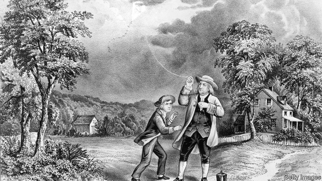

###### Alternative energy sources

# How to wring power from the night air 

 

> print-edition iconPrint edition | Science and technology | Aug 3rd 2019 

SOLAR POWER is all very well, but it is available only during daylight hours. If something similarly environmentally friendly could be drawn on during the hours of darkness, that would be a great convenience. Colin Price, an atmospheric scientist at Tel Aviv University, in Israel, wonders if he might have stumbled across such a thing. As he told a meeting of the International Union of Geodesy and Geophysics, held in Montreal in July, it may be possible to extract electricity directly from damp air—specifically, from air of the sort of dampness (above 60% relative humidity) found after sundown, as the atmosphere cools and its ability to hold water vapour diminishes. 

Dr Price’s apparatus is a pair of concentric metal cylinders. The outer cylinder is earthed while the inner one is not, creating a capacitor. Passing suitably moist air through the inner cylinder causes that cylinder to accumulate electric charge, thus creating a potential difference between the cylinders which could be harnessed to drive a current through an external circuit. 

In effect, and at an extremely small scale (so far, a maximum of just under a volt), Dr Price thinks he has tamed lightning—which is surprising, in a way, because no one truly knows how lightning works. As Dr Price himself observes, “Thunderstorms produce electricity...But if they didn’t know it, theoreticians would never predict lightning to exist on Earth. They might predict clouds forming, but not a 10km-high spark, building in half an hour out of nothing.” 

One thing that is known about lightning, however, is that it requires water to be present in all three states of matter: solid, liquid and vapour. Dr Price suspects that in his experiment the surface of the inner cylinder is taking on the role played in a thunderhead by water’s solid phase, ice. His comparison of different metals’ effectiveness in that role—zinc is best, copper is useless—may help elucidate the details of the process, not only in his putative generator, but also in a natural thunderstorm. 

His hypothesis is that things start when water droplets condense out of the humid air and onto the metal surface. Though water consists mostly of molecules of hydrogen and oxygen (H2O), at any given time a few of those molecules will have broken up spontaneously into positively charged hydrogen ions (H+) and negatively charged hydroxyl ions (OH-). These two types of ion will then move through a droplet at different rates, depending on the nature of the surface to which the droplet is attached, separating the positive and negative charges within that droplet. This charge separation will, in turn, induce a charge on the surface of the cylinder, and thus a potential difference in the capacitor. 

Having established the principle, the question Dr Price now faces is whether he can scale things up to a useful degree. This will involve tinkering with cylinders made from various combinations of metals and metal alloys, and also playing with the configurations of the cylinders with respect to one another. That there actually is, out there, a combination of substance and geometry which will yield useful amounts of electricity is, perhaps, a long shot. But, given the power of lightning itself, it certainly seems worth looking into.■ 

