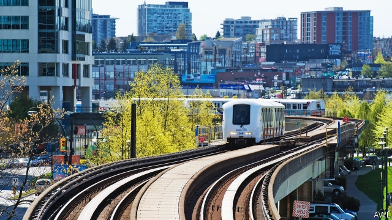

###### Stop and go

# British Columbia gives Uber a cautious go-ahead 

 

> print-edition iconPrint edition | The Americas | Aug 3rd 2019 

IF YOU LOOK Chinese and speak Mandarin you can summon a ride in Vancouver by using an app, as long as it’s Chinese. The drivers normally call to confirm the order, says Daniel Merkin, who lives in the Canadian city. “Sometimes they’ll hang up on me when they realise I don’t speak Mandarin,” he says. But he keeps trying, because popular ride-hailing services, such as Uber and Lyft, are not available. Vancouver is the only big North American city where they do not operate. The Chinese service is not legal, but it is tolerated. 

Mr Merkin hopes that his options will soon expand. In July the province of British Columbia, which licenses drivers, said it would allow the big ride-hailing services in. They could start operations by late September. But British Columbia has made their entry difficult by requiring drivers to hold commercial licences. That may deter part-timers who provide much of the services’ workforce. Lyft does not operate in places that require such licences. 

The regulators have reason to proceed cautiously. In many cities where ride-hailing has taken off, congestion has worsened and use of public transport has dropped. In San Francisco, congestion, as measured by extra time required to complete a journey, increased by 60% from 2010 to 2016, according to Greg Erhardt, a professor at the University of Kentucky. More than half of the rise was caused by the growth of ride-hailing. Population and employment growth accounted for the rest. Ride-hailing led to a 12% drop in ridership on public transport in the city. San Francisco’s experience is a “cautionary tale for Vancouver”, says Joe Castiglione, who analyses data for its transport authority. 

Even without Uber and Lyft, Vancouver is one of North America’s most traffic-jammed cities, in part because its downtown is small. Ride-hailing might worsen congestion. Its absence has made Vancouver one of the few North American cities where public transport is attracting more passengers. The number of journeys started on TransLink, the city’s public-transport system, rose by 7.1% to 437m in 2018, making it “another record-breaking year” for the network of buses and trains. From 2016 to 2018 the number rose by 18.4%. British Columbia’s higher petrol prices and growth in employment and population explain some of that rise. Not allowing Uber and Lyft helped, says Andrew Curran, TransLink’s head of policy. (It has also boosted car-sharing services, which let people book vehicles they drive themselves. Vancouver has 3,000 cars that can be hired for such services, double the number in San Francisco, which has more people.) 

Vancouver was among the first cities Uber tried to enter, in 2012, and “the first city that Uber ever left”, in the same year, says Michael van Hemmen, who leads the company’s operations in western Canada. Forbidding rules, such as classifying it as a limousine service, which for some reason must charge a minimum of C$75 ($57) per trip, killed its business. British Columbia is now inviting it back to Vancouver (and other cities in the province) in hopes of complementing its public-transport system rather than undermining it. It will not be classified as a limousine service. 

Mr Curran says ride-hailing could increase use of public transport by ferrying people from their houses to a bus or train stop. It could also improve transport for people with disabilities. Currently, TransLink hires taxis to give door-to-door rides to some disabled people. The requirement for drivers to have commercial licences will contain the services’ growth and protect taxi-drivers, ride-hailing’s fiercest foes, or so the province hopes. 

But the commercial-licence requirement could have the opposite effect. Analysts think it will reduce the number of drivers available to pick up passengers in distant suburbs. Instead, they will cluster in the centre. Some of Uber’s future competitors say they are not worried. The commercial-licence rule will discourage most drivers, believes Chris Iuvancigh of Sharenow, which runs Car2go, one of Vancouver’s four car-sharing services. A driver who offers rides in his Mercedes SUV to people who hire him via WeChat, a Chinese app, thinks they will stay loyal. If ride-hailing does come to Vancouver, he predicts, it will just slow their journeys down. ■ 
<<<<<<< HEAD

-- 

 单词注释:

1.Columbia[kә'lʌmbiә]:n. 哥伦比亚 

2.uber['ju:bә]:[医] 乳房 

3.Aug[]:abbr. 八月（August） 

4.mandarin['mændәrin]:n. 中国官话, 国语, 满清官吏, 柑橘 a. (中国式)紧身马褂的 

5.summon['sʌmәn]:vt. 召唤, 召集, 号召, 振奋, 唤起, 鼓起 [经] 传唤, 传讯 

6.vancouver[væn'ku:vә]:n. 温哥华（加拿大主要港市） 

7.APP[]:[计] 应用, 应用程序; 相联并行处理器 

8.daniel['dænjәl]:n. 丹尼尔（男子名） 

9.merkin['mɜ:kɪn]: [人名] 默金 

10.lyft[]:[网络] 散落 

11.deter[di'tә:]:vt. 制止, 吓住, 威慑 

12.regulator['regjuleitә]:n. 调整者, 校准者, 校准器, 调整器, 标准钟 [化] 调节剂; 调节器 

13.cautiously['kɒ:ʃәsli]:adv. 慎重地 

14.congestion[kәn'dʒestʃәn]:n. 拥挤, 充血 [计] 拥挤, 拥塞 

15.worsen['wә:sn]:vt. 使更坏, 使恶化 vi. 变得更坏, 恶化 

16.san[sɑ:n]:abbr. 存储区域网（Storage Area Networking） 

17.francisco[fræn'siskәu]:n. 弗朗西斯科（男子名, 等于Francis） 

18.greg[greg]:n. 格雷格（男子名, 等于Gregory） 

19.erhardt['erhɑ:t]: [人名] 埃哈特 

20.Kentucky[kәn'tʌki]:n. 肯塔基州 

21.ridership['raidәʃip]:n. 乘客数 

22.cautionary['kɒ:ʃәnәri]:a. 警告的 

23.joe[dʒәu]:n. 乔（男子名） 

24.Castiglione[]:卡斯蒂廖内（人名） 

25.datum['deitәm]:n. 论据, 材料, 资料, 已知数 [医] 材料, 资料, 论据 

26.TransLink[]:[网络] 大温交通局；运输联线；运输联网 

27.andrew['ændru:]:n. 安德鲁（男子名） 

28.Curran[]:n. (Curran)人名；(英)柯伦；(意、瑞典)库兰 

29.michael['maikl]:n. 迈克尔（男子名） 

30.limousine['limәzi:n]:n. 轿车 

31.complement['kɒmplimәnt]:n. 补足物, 补语, 补数 vt. 补充, 补足 [计] 补码; 反相器; 补数 

32.undermine[.ʌndә'main]:vt. 在...下面挖, 渐渐破坏, 暗地里破坏 [法] 暗中破坏, 以阴谋中伤伤害 

33.currently['kʌrәntli]:adv. 现在, 当前, 一般, 普通 [计] 当前 

34.foe[fou]:n. 仇敌, 反对者, 敌人, 对手 

35.analyst['ænәlist]:n. 分析者, 精神分析学家 [化] 分析员; 化验员 

36.cluster['klʌstә]:n. 串, 丛, 群, 簇 vi. 成串, 丛生 vt. 使聚集 [计] 簇 

37.chris[kris]:n. 克里斯（男子名）；克莉丝（女子名） 

38.mercedes['mә:sidi:z]:n. 梅塞德斯（人名）；梅赛德斯（公司名） 

39.suv[]:abbr. 多功能车（SportsUtilityVehicle）；小型单层水泡（small unilamellar vesicles） 

40.WeChat[]:[网络] 微信；微讯；腾讯微信 
=======
>>>>>>> 50f1fbac684ef65c788c2c3b1cb359dd2a904378

