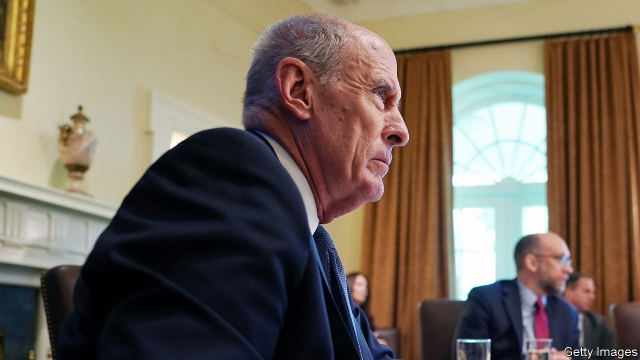

###### Shame the devil

# Donald Trump wants a loyalist as America’s top intelligence official 

 

> print-edition iconPrint edition | United States | Aug 3rd 2019 

FOR DECADES America’s top intelligence official, responsible for assessing and co-ordinating information from the country’s multiple intelligence agencies, was the Director of Central Intelligence, who also headed the CIA. Many had qualms about this arrangement. Running an agency as large and complex as the CIA was a formidable job in its own right; combining it with cross-government information assessment and being the president’s chief intelligence analyst was somewhere between unwieldy and impossible. 

Those misgivings grew after the September 11th attacks, and the 9/11 Commission recommended creating a Director of National Intelligence (DNI) to head an office focused solely on intelligence co-ordination and reducing bureaucratic barriers to sharing intelligence. 

The job is something of a poisoned chalice. It combines tremendous responsibility with scant authority. America has 16 different intelligence agencies (not including the DNI’s office); the DNI cannot order them to do anything. Except for the CIA, the heads of those agencies all report to other bosses—the defence agencies to the defence secretary, the FBI chief to the attorney-general, and so forth. The DNI’s task is to give the president honest intelligence assessments, even if they are not what he wants to hear. 

Dan Coats did that. He defended the assessment that Russia interfered in the 2016 election, even as Donald Trump publicly accepted Vladimir Putin’s denial. He testified that Islamic State, which Mr Trump claims to have defeated, remains capable of causing harm in Syria. For such sins, his relationship with Mr Trump suffered; he will step down on August 15th. 

Mr Trump intends to replace him with John Ratcliffe, a conservative congressman from Texas, who has, in the words of Mike Morell, a former deputy CIA director, “the least national security experience and the most partisan political experience of any previous DNI”. He was mayor of a small town in Texas for eight years, served briefly as interim US attorney for the Eastern District of Texas (the district’s lead federal prosecutor), and is in his third term in the House of Representatives and first on the Intelligence Committee. 

By contrast, Mr Coats spent 24 years in Congress, was ambassador to Germany and nearly became George W. Bush’s defence secretary. His predecessor, James Clapper, ran two intelligence agencies and oversaw four as undersecretary of defence for intelligence. The first DNI, John Negroponte, spent 37 years in the foreign service before serving as America’s first post-Saddam ambassador to Iraq. 

But what Mr Ratcliffe lacks in experience he makes up for in devotion to Mr Trump. Mr Ratcliffe falsely accused Robert Mueller, during his congressional testimony, of having exceeded his brief as special counsel. He propounded the conspiracy theory that “there may have been a secret society” of federal agents working against Mr Trump. The New York Times uncovered embellishments to his biography, including one claim that he “arrested 300 illegal aliens in a single day” (prosecutors do not have powers of arrest), and another that he “convicted individuals funnelling money to Hamas” (he did not). 

Mr Ratcliffe’s nomination is not assured. Earlier this year Mr Trump tried to nominate two unqualified partisans, Stephen Moore and Herman Cain, to the Federal Reserve’s board of governors; both withdrew their names because they lacked enough congressional support. At least a few Republican senators may similarly quail at handing a difficult, non-partisan job to a lightly qualified politician. 

Yet just the floating of Mr Ratcliffe’s name highlights the contempt that Mr Trump has for America’s intelligence services. He says Mr Ratcliffe’s job would be to “rein…in” the intelligence services that have “run amok”, by which he seems to mean that they offered views that displease him. That is worrying; some of America’s greatest foreign-policy debacles have stemmed from politicised intelligence. ■ 
<<<<<<< HEAD

-- 

 单词注释:

1.loyalist['lɒiәlist]:n. 忠诚的人, 反对独立者, 反佛朗哥派的人 

2.Aug[]:abbr. 八月（August） 

3.CIA[]:中央情报局 [计] 中国互联网络协会 

4.qualm[kwɒ:m]:n. 晕眩, 不安, 疑虑 [法] 疑虑, 不安, 内疚 

5.formidable['fɒ:midәbl]:a. 巨大的, 优秀的, 可怕的, 艰难的 

6.analyst['ænәlist]:n. 分析者, 精神分析学家 [化] 分析员; 化验员 

7.unwieldy[.ʌn'wi:ldi]:a. 难处理的, 笨大难使用的, 笨拙的 

8.misgiving[mis'^iviŋ]:n. 疑虑, 不安, 害怕, 担扰, 疑惧 

9.dni['nɪ]: [医][=defective non-interfering virus]缺陷性非干扰病毒 

10.chalice['tʃælis]:n. 酒杯, 圣餐杯 

11.scant[skænt]:a. 不充分的, 不足的 vt. 减少, 吝啬, 限制, 藐视, 忽略 

12.cannot['kænɒt]:aux. 无法, 不能 

13.FBI[]:美国联邦调查局 [经] 美国联邦调查局 

14.dan[dæn]:n. 段(柔道、围棋运动员的等级) [建] 小车, 空中吊运车, 杓 

15.Vladimir[vlɑ'dimɪr]:n. 弗拉基米尔（古罗斯弗拉基米尔-苏兹达里公国的古都） 

16.denial[di'naiәl]:n. 否认 [法] 否定, 否认, 拒绝接受 

17.testify['testifai]:v. 证明, 作证, 声明, 表明 

18.Islamic[iz'læmik]:a. 伊斯兰教的, 穆斯林的 

19.Syria['siriә]:n. 叙利亚 [经] 叙利亚 

20.john[dʒɔn]:n. 盥洗室, 厕所, 嫖客 

21.Ratcliffe[]:n. (Ratcliffe)人名；(英)拉特克利夫 

22.congressman['kɒŋgresmәn]:n. 国会议员, 众议院议员 [法] 国会议会 

23.Texas['teksәs]:n. 德克萨斯 

24.mike[maik]:vi. 偷懒, 游手好闲 n. 休息, 游手好闲, 扩音器, 话筒 

25.morell[]:n. (Morell)人名；(西)莫雷利；(德、法、芬、瑞典、英)莫雷尔 

26.partisan['pɑ:tizn]:n. 党羽, 虔诚信徒, 同党, 游击队员 a. 党派的, 偏袒的, 效忠的, 献身的, 盲目推崇的 

27.briefly['brifli]:adv. 简短地, 扼要地, 简明地, 简单地 

28.interim['intәrim]:a. 暂时的, 临时的, 间歇的 n. 过渡时期 

29.attorney[ә'tә:ni]:n. 代理人, 律师 [经] 律师, 代理人 

30.prosecutor['prɒsikju:tә]:n. 实行者, 告发者, 公诉人 [法] 原告, 起诉人, 检举人 

31.george[dʒɔ:dʒ]:n. 乔治（男子名）；自动操纵装置；英国最高勋爵勋章上的圣乔治诛龙图 

32.W['dʌb(ә)lju:]:[计] 等待, 写, 字 [医] 钨(74号元素) 

33.predecessor[.predi'sesә]:n. 前任, 先辈, 前身 [医] 初牙, 前辈, 祖先 

34.jame[]: 灰岩井 

35.clapper['klæpә]:n. 拍手者, 铃锤, 钟锤 [电] 铃锤 

36.oversee[.әuvә'si:]:vt. 向下看, 了望, 监督, 偷看到 [法] 监察, 监督, 俯瞰 

37.undersecretary['ʌndә'sekritәri]:n. 次长, 副部长 

38.negroponte[]: [人名] 内格罗蓬特 

39.Iraq[i'rɑ:k]:n. 伊拉克 

40.falsely['fɒ:lsli]:adv. 虚伪地, 错误地, 不实地 

41.Robert['rɔbәt]:[法] 警察 

42.Mueller[]:米勒（人名） 

43.congressional[kәn'greʃәnl]:a. 会议的, 议会的, 国会的 [法] 代表大会的, 大会的, 议会的 

44.testimony['testimәni]:n. 证言, 证据, 声明 [医] 证据 

45.counsel['kaunsәl]:n. 商议, 忠告, 法律顾问 v. 商议, 劝告 

46.propound[prә'paund]:vt. 提出供考虑 [法] 提出建议, 提出供考虑, 提出 

47.conspiracy[kәn'spirәsi]:n. 同谋, 阴谋, 阴谋集团 [法] 阴谋, 通谋, 共谋 

48.york[jɔ:k]:n. 约克郡；约克王朝 

49.embellishment[im'beliʃmәnt]:n. 装饰, 润色, 修饰 

50.alien['eiljәn]:n. 外国人, 外侨 a. 外国的, 相异的 

51.convict[kәn'vikt]:n. 囚犯, 罪犯 vt. 宣告有罪, 使知罪 

52.funnel['fʌnl]:n. 漏斗, 漏斗状的东西, 烟囱 [化] 漏斗 

53.Hama['hæmә]:哈马[叙利亚西部城市] 

54.nomination[.nɒmi'neiʃәn]:n. 提名, 任命, 提名权 

55.nominate['nɒmineit]:vt. 提名, 任命, 命名 [法] 提名...为候选人, 指定, 推荐 

56.unqualified[.ʌn'kwɒlifaid]:a. 不合格的, 无资格的, 不胜任的 [经] 无条件的, 不合格的, 无资格的 

57.stephen['sti:vn]:n. 斯蒂芬（男子名） 

58.moore['muә]:n. 摩尔（男子名） 

59.herman['hә:mәn]:n. 赫尔曼（男子名） 

60.cain[kein]:n. 凶手；杀兄弟者；该隐（亚当之子） 

61.senator['senәtә]:n. 参议员, (某些大学的)理事 [法] 参议员, 上议员 

62.quail[kweil]:n. 鹌鹑 vi. 胆怯, 畏缩 

63.amok[ә'mɔk]:adv. 乱砍乱杀, 杀气腾腾地横冲直撞 [医] [抑郁后暴发]杀人狂 

64.debacle[dei'bɑ:kl]:n. 崩溃, 大失败 

65.politicise[pɒ'lɪtɪsaɪs]:vt. 使政治化, 使具有政治性; 使对政治有兴趣 
=======
>>>>>>> 50f1fbac684ef65c788c2c3b1cb359dd2a904378

