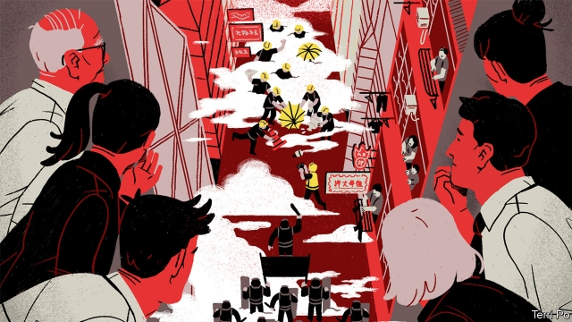
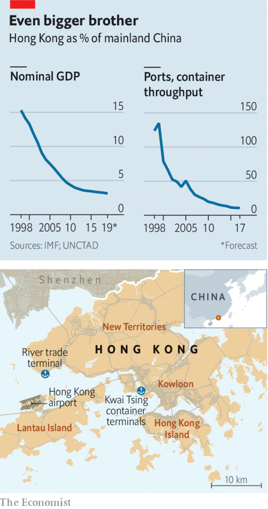
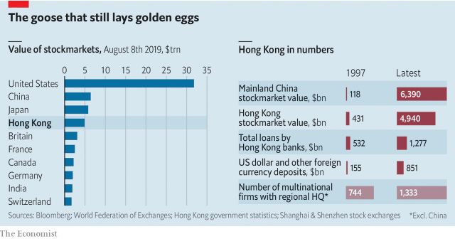

###### Turmoil in Hong Kong

# Hong Kong remains crucially important to mainland China 

 

> print-edition iconPrint edition | Briefing | Aug 8th 2019 

FOR THE past nine weeks and counting huge anti-government protests have rocked Hong Kong, with no obvious end in sight. On August 5th pro-democracy protesters organised the first general strike in the territory for half a century. It shut down parts of the transport system. Banks, advertising companies and many other businesses also closed, or urged their employees to work from home. 

The absolute number of protesters on the streets has fallen—from an estimated 2m who marched, largely peacefully, on June 16th, to 350,000 strikers. But the fluid tactics of the black-clad vanguard, which is increasingly using violence, has challenged the resources of a police force determined to crack down on the protests. As the methods of the protesters have changed, so too has their target: what began as opposition to a bill that would have allowed suspects in Hong Kong to be extradited to mainland China has become a popular revolt against the local government—and, for at least some on the streets, against Chinese rule itself. 

How China and the international community, particularly America, react to the continuing crisis will shape the future of Asia’s pre-eminent financial centre. Already it is clear that, were somehow the protests to be quelled peacefully, Hong Kong cannot simply revert to its imagined old form. Gone, possibly for ever, is the notion, rooted in colonial days but slavishly repeated by China after the territory’s handover from the British in 1997, that Hong Kong can endeavour to be an “economic” city in which politics plays a minor role, and only then among an enlightened, disinterested elite. Politics has, now, firmly taken hold. 

Chinese officials and Communist Party media divine Western “black hands” behind the protests. The rhetoric from the mainland has escalated markedly since July 21st, when protesters defaced the national insignia of the central liaison office, the central government’s representative in the territory. At the end of July Major General Chen Daoxiang, commander of the usually invisible Hong Kong garrison of the People’s Liberation Army (PLA) called the unrest “absolutely impermissible”, sending the message that the PLA would not hesitate to step in to restore order if Xi Jinping, China’s ruler, demanded it. In an unsubtle message, the garrison released a video showing Chinese forces using machine-guns to suppress mock riots. 

This has led to anxious speculation in Hong Kong and around the world that Chinese security forces might be preparing to intervene in a territory to which, in its formula of “one country, two systems” it had promised “a high degree of autonomy”. On August 5th, at a press conference after two weeks hidden from public view, a rattled Mrs Lam spoke of Asia’s financial hub being on the “verge of a very dangerous situation”. A day later, at an even rarer press conference, a spokesperson for the Hong Kong and Macau affairs office in Beijing emphasised the mainland’s faith in Mrs Lam, but also warned that Hong Kong’s “shocking” protests had gone beyond legitimate free assembly and were pushing the territory into a “dangerous abyss”. 

 

China is no longer as directly dependent on Hong Kong for its economic welfare as it once was, when foreign firms operating from the territory, managerial expertise and access to international markets via its port were critical. At the time of the handover in 1997, the territory’s economy was equivalent to nearly a fifth of China’s. Today the figure is 3%, and its port is no longer important in shipping goods from the mainland (see chart). 

The structure of Hong Kong’s economy has changed little in two decades. In terms of their contribution to the economy, trade and logistics along with finance are remarkably similar (22% and 19% respectively). The same old family-run conglomerates in Hong Kong have a lock on property development, port operators, utilities and supermarkets. Meanwhile Shenzhen, across the border, has been transformed into a hub for new giant tech firms such as Huawei, Tencent and ZTE. 

Yet Hong Kong remains more important to the mainland than might at first appear, and not just as a showcase for how China acts in a way befitting a country claiming greater status on the world stage. The paradox is that the more autocratic the mainland gets the more it needs Hong Kong commercially. Had China reformed its financial and legal system, the territory would be irrelevant to its global business. Instead the opposite has happened: China has grown fast and globalised, but not opened up. 

As a result, Hong Kong’s economy is disproportionately useful to China. It has a status within a body of international law and rules that gives it seamless access to Western markets. The status is multifaceted. It includes: a higher credit rating; lower risk-weights for bank and counterparty exposures; the ability to clear dollars easily; independent membership of the WTO; “equivalence” status for its stock exchange with those in America, Europe and Japan; recognition as a “developed” stockmarket by index firms and co-operation agreements with other securities regulators. 

Cross-border bank lending booked in Hong Kong has roughly doubled in the past decade, much of it Chinese companies borrowing dollars intermediated through the territory. Hong Kong’s stockmarket is now the world’s fourth largest, behind Tokyo’s but ahead of London’s (see chart). About 70% of the capital raised on it is for Chinese firms, but strikingly the mix has shifted from state enterprises to tech firms such as Tencent, Meituan and Xiaomi. These firms have specifically chosen not to do mainland listings because the markets there are too immature and closed off from Western investors. Alibaba, an e-commerce conglomerate, is also in the process of doing a Hong Kong listing (at present it is only listed in New York). 

 

Most Chinese foreign direct investment flows through Hong Kong. The stock domiciled in the territory has roughly doubled in the last decade, to $2trn. Hong Kong’s share of total FDI flowing into mainland China has remained fairly constant, at 60%. Although the amount of multinational money flowing into and out of China has soared, most firms still prefer to have Hong Kong’s legal stamp. 

Meanwhile, the number of multinationals with their regional headquarters in the territory has increased by two-thirds since 1997, to around 1,500. Hong Kong hosts the most valuable life insurer in the world, excluding mainland China, AIA, while a global firm with a big Asian arm, Prudential, is about to shift its regulatory domicile to Hong Kong. 

This all means that how turmoil in Hong Kong is resolved matters to more than just to its own people. Already boards of multinationals are debating over whether to move their regional domicile to Singapore. Indeed, one existing weak spot for Hong Kong is that major American tech firms, such as Google, Amazon and Facebook, have set up their regional headquarters in Singapore, perhaps because of cyber-worries. An executive with a biotech startup says the company is moving money out of the territory and considering an American listing instead. 

China will not take action in Hong Kong lightly: it knows how much is at stake economically and how much its biggest firms depend on the territory, quite apart from the reputational risk. Yet it also sees the situation spiralling into a threat to the Communist Party itself—one that America, it believes, is trying to exploit. 

Its evidence for this is that the American government, already caught up in a gargantuan tussle with China over trade, cyber-technology and dominance in Asia, is taking an increasing interest in developments in Hong Kong. President Donald Trump called the demonstrations “riots”, echoing the language coming from Beijing. Yet his administration is staffed with China hawks. Many see the protests as a response to the way China has undermined Hong Kong’s autonomy. 

Should the party intervene more forcibly, says a senior administration official, it would be “a tragedy for Hong Kong, bad for China and the latest act of decoupling from the free world and regressing to the darkness of the Mao years.” The official likens Hong Kong’s status, in some respects, to “West Berlin during the cold war”. “‘One country, two systems,’” the official adds, “risks dying a premature death.” 

China knows that America has a formidable weapon to wield in the form of the Hong Kong Policy Act of 1992, which recognises Hong Kong as a separate legal and economic entity from China with all the rights of an open economy. An intervention by the Chinese army might lead the administration to declare Hong Kong to be in breach of the act. This, though, would be a nuclear option: one that America is likely to take only in extremis. 

In the meantime, Congress, led by Senator Marco Rubio, is working on legislation that would, among other things, test Hong Kong’s system of export controls to make sure Chinese companies are not circumventing rules, as well as ensure that demonstrators are not penalised if they seek American visas, just because they were arrested during the protests. 

If it ever happened, intervention by the Chinese army would not necessarily be in the form of tanks and blazing machine-guns. Its deployment would follow a process set out in Hong Kong’s post-colonial constitution, the Basic Law, and a piece of Chinese legislation called the Garrison Law. These allow Hong Kong to ask the central government for the PLA garrison’s help in maintaining public order. This could, in theory, merely entail a few discreet units backing up Hong Kong’s police. It would be very unlikely to involve the random violence seen, for example, in 1989 in Tiananmen: the PLA today is far better trained, and the garrison has been drilling its men in crowd-control techniques that resemble those of the Hong Kong police. But avoiding any such eventuality, says one of Mrs Lam’s advisers, has always been the Hong Kong government’s “number one” priority. Having the PLA come in is “the last thing” anyone wants to have happen. It would show Hong Kong incapable of “keeping our house in order”. 

Perhaps Mrs Lam’s administration thinks that the protests might lose steam along with popular support. At the outset, many parents marched with their children. But now, growing numbers of Hong Kong people are deeply concerned about the escalating violence on all sides; it is the chief topic of everyday office conversation. Parents with children at school or university have been withholding pocket money in the hopes that, penniless and underfed, they will come back home. Many long for the start of the new academic year in early September, hoping that young protesters will return to their studies. 

But it is not only students who are critical of the government. Even groups that in the past have been staunch supporters of the administration have been having second thoughts. This week many businesses made it clear to their staff that they would not be penalised for joining the general strike. And though it strongly condemns recent violence, describing it as a threat to Hong Kong’s position as a financial centre, the Hong Kong General Chamber of Commerce, the largest business organisation, has backed protesters’ calls for an independent inquiry as a necessary step for restoring calm. By the standards of Hong Kong business, that is a bold move. A few other organisations and individual companies, risking becoming the target of online anger from the mainland, are more quietly backing the peaceful aspirations of protesters (among whom number their staff). 

An emerging viewpoint, even among some pro-party types, acknowledges that many Hong Kong businesses had concerns about how the extradition bill might add to the arbitrary risks of doing business with the mainland. This viewpoint admits to sympathy for Hong Kong’s disaffected youth, who are alarmed at the rapid integration of the territory’s economy with China’s. Members of this camp may hold that the political job is now to tilt the economic playing field in favour of the young—more public housing, for instance—but they do not acknowledge a democratic dimension to the protests. 

It will prove a hot and critical August. For now, the line in Beijing avoids any direct threat of intervention: stand behind Mrs Lam’s stricken authority, urge the police and courts to be tough, and be on a ruthless lookout for separatist tendencies. On August 7th Hong Kong members of two mainland bodies, the National People’s Congress and the Chinese People’s Political Consultative Conference were ordered to Shenzhen to hear the message first-hand. 

Mr Xi has an urgent reason to wish that a tighter grip and a firmer message will bring order to Hong Kong. On October 1st he presides over China-wide celebrations marking the 70th anniversary of the Communist Party coming to power: the birth of a “new” China which Mr Xi can now claim is also a powerful one. To ensure the anniversary is marked without a hitch, security across the mainland is being tightened and dissent stifled even more vigorously than usual. 

However, firmness in the face of unrest has been tried before in Hong Kong, and though it succeeded in the immediate aim, it failed in the long run. The authorities wore down the umbrella protests demanding democracy in 2014 and restricted even further the scope for representative politics. That just bred a more radical generation of protesters. As for the increasing “mainlandisation” of Hong Kong politics, among ordinary Hong Kong folk it has fostered only cynicism and a sense of powerlessness. The central liaison office, once almost invisible, now owns Hong Kong’s largest publisher, provides loans to patriotic businesses, ensures China’s choice of chief executive and backs candidates favoured by the Communist Party in elections for the legislature and district councils. Now it is also pushing loyal placemen into the leadership of many professions. 

 

A hopeful scenario does exist for Hong Kong. According to an adviser to Mrs Lam, if the streets grew calm it would be possible to imagine the government presenting once more a package of political reforms that it first offered five years ago. It would include allowing universal suffrage in choosing the chief executive. In 2014 democrats in the legislature rejected the package, partly because, in effect, only party-approved candidates would be allowed to run. This time, says Anson Chan, a former chief secretary who now backs the democratic cause, a deal could be done, so long as a timetable for universal suffrage were agreed. Mrs Lam should consider this option. After all, her crisis of legitimacy comes, at heart, from not being elected by Hong Kong. All her unelected predecessors ended their terms in failure too. 

Indeed, some democrats are urging hothead protesters to rethink their tactics. Attacking police stations, they say, just plays into the hands of the authorities. A more valuable battleground is emerging: elections for the territory’s district councils in November. While ordinarily such elections have to do with matters such as rubbish collection and bus lanes, in the current climate they will be a referendum on political values. Unless democrats move from the streets to the campaign stump, says Kevin Yam, a lawyer and columnist, the pro-establishment camp, whose grass-roots organisations in housing estates and the villages of the New Territories is funded by the central liaison office, risks dominating. Should that camp win, Mr Yam argues, it will say: “you see, we [not you] are the silent majority.” 

If the violence continues, avenues for peaceful advocacy and dissent will be blocked by one side or the other. At best this scenario would entail a long tearing of Hong Kong’s social fabric and a relentless decline in the territory’s economy. At worst it could mean the end of Hong Kong as it has long been imagined, as soon as the armoured anti-riot vehicles roll out of the garrison compound. ■ 

