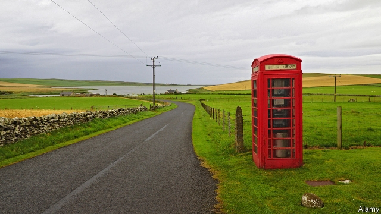

###### Our island Instagram story

# Looking for a 5G signal? Try this remote Scottish island 

 

> print-edition iconPrint edition | Britain | Aug 10th 2019 

THERE ARE no traffic lights on the Orkney islands. Despite having the highest rate of car ownership in Scotland, with 919 vehicles per 1,000 adults, the archipelago is so thinly populated that there is no need for stop signals. Drivers politely make way for each other on the narrow lanes, waving as they pass. The occasional roundabout regulates busier junctions. 

Orkney’s rural nature makes it a pleasure to drive in. But it also makes it a nightmare for mobile connectivity. “By the time something is rolled out to the extremities of the country…it is out of date,” complains James Stockan, the leader of the Orkney Islands Council. That is only a slight exaggeration. The first 4G signal arrived in Kirkwall, Orkney’s biggest settlement, in 2016, nearly four years after it came to urban Britain. Smaller islands, such as Papa Westray, have no 3G coverage, let alone 4G. 

In all, only 35% of Orkney households can make a voice call on all four networks, and 4% can do so on none at all, according to Ofcom, the telecoms regulator. It is worse for data services. Only 18% of premises can access 4G on all four networks and 7% get no signal. Skara Brae, a Neolithic site protected by UNESCO, has no network coverage, forcing tourists to wait until they return to Kirkwall to post pictures to Instagram. 

It is not just social-media addicts who suffer. Farmers have trouble accessing mandatory forms; jobseekers struggle to make applications; civil servants miss out on online training. As mobile networks start to roll out 5G coverage this year, Mr Stockan is keen to avoid the delays of the past. He would like Orkney to “jump over one generation to the next”. 

Such talk of leapfrogging usually focuses on the poor world, where charities and tech firms promise to send balloons and drones to bring the internet to people without landlines. Yet something similar is now under way in Orkney. 5G RuralFirst, a consortium of 30 organisations backed by a £4.3m ($5.2m) government grant and led by Cisco, which makes networking gear, has been running a private 5G network on the island for the past year. Investment by mobile-network operators purely because of consumer demand “is not likely to happen”, says Greig Paul of the University of Strathclyde, which is part of the consortium. RuralFirst is trying to figure out how to make it commercially viable. 

Its main idea is to find local industrial uses for the tech. That is part of the promise of 5G networks in general: not only can they offer much greater speeds, but they are designed to be super-responsive and capable of connecting to many more devices at once. “If we can drive industrial use then there will be more demand, which means more revenue, which means more capacity,” says Mr Paul. 

In the Orkneys, local businesses seem keen. Scapa, a whisky-maker, sees potential in automating bits of production and tracking employees throughout the distillery. Richard Gauld, who runs a small wind farm, says replacing copper wires with 5G would make the local electricity grid safer and more efficient. Out in the Scapa Flow, Richard Darbyshire of Scottish Sea Farms says 5G would offer a more reliable connection from base to barge. That would allow his men to feed fish remotely in bad weather, and support high-definition live video from the salmon pens. 

There are also ideas for ways to cut costs, such as making more efficient use of radio spectrum, using software to do things that typically require hardware, and sharing infrastructure among mobile networks. The biggest expense is access to spectrum, which costs billions at auction. That will soon be less of an obstacle. On July 25th Ofcom announced that it would offer spectrum to local communities for as little as £80 a year. 

The Orkney programme runs until the end of September, after which the consortium will evaluate the business case for 5G in rural areas. “If it works for us, maybe we can offer the service to other small communities that want to have their own 5G cell,” says Greg Whitton, who runs CloudNet, the local internet service provider. Getting online on the island could soon be as easy and speedy as driving around it. ■ 

