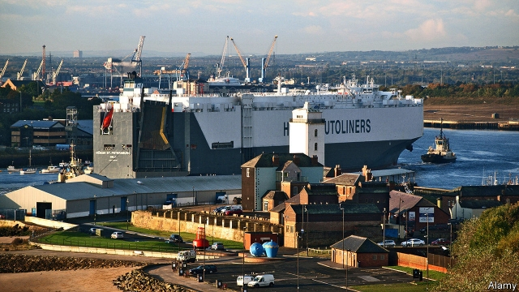

###### Free-for-all

# What free ports can and can’t achieve 

 

> print-edition iconPrint edition | Britain | Aug 10th 2019 

THE VAST, bulbous-bowed Höegh Autoliners car-carrier, with room for 6,500 vehicles, takes up the space of three normal-sized ships in the Port of Tyne. Inside are several thousand shiny new Nissan Leafs, Qashqais and Jukes bound for the continent. Newcastle’s deep-sea port is not the country’s busiest, but because it serves nearby Nissan Sunderland, the biggest carmaking site, it is among the first in line to become one of the government’s swashbuckling new “free ports”. 

Such zones are physically inside a country but legally outside it for customs purposes. As well as zero tariffs, free ports pile on other goodies such as low taxes and loose regulation. The idea is that firms will flock to them. Brexiteers in particular dream of free ports pulling in companies and container ships from everywhere. Boris Johnson, the prime minister, has promised to anoint ten free ports—mostly big harbours and perhaps some airports. On August 2nd Liz Truss, the trade secretary, set up a free ports advisory panel. 

Other countries are fans. Dubai’s Jebel Ali free zone hosts 7,000 global firms. America is dotted with 265 foreign-trade zones. Europe has dozens of free ports. Regulators worry that some are havens for money-laundering or tax evasion—though they are most concerned about facilities where the rich store art and other fancy goods, such as those in Luxembourg, not the type of zone Britain is contemplating. 

If the Port of Tyne became a free port, enthuses Matt Beeton, its chief executive, more firms would move into space currently occupied by weeds and cormorants. Nissan is keen. More business activity would further boost the port’s contribution to the local area, including deprived South Shields. Another policy aim of free ports is to help left-behind places, by generating investment and pulling in economic activity. The old industrial area around the mouth of the river Tees has been preparing since last year to become a free port. 

Yet they are no panacea. On the tariff side, their utility may be tiny. The plan post-Brexit is for Britain to maintain low tariffs on most goods. American foreign-trade zones are supposed to encourage domestic production by letting firms bring in inputs tariff-free (solving the problem of tariff inversion, where finished goods carry a lower tariff than their component parts). But Brexit is unlikely to lead to higher tariffs on inputs than on finished goods, according to a paper by the UK Trade Policy Observatory, which examined World Trade Organisation (WTO) tariff schedules. 

Another, subtler function could be to help Britain navigate WTO tariff rules, notes Meredith Crowley, an economist at Cambridge University who sits on the free ports advisory panel. The country will have to decide between setting tariffs at 10% or at 0% on car parts, for example. Either rate would apply to all countries, including China, meaning a risk of being swamped by Chinese imports. If Britain sets the tariff at 10% it could use free ports to help big manufacturers that use European supply chains. 

A well-known problem with free zones is that they can turn into a domestic beggar-thy-neighbour policy. Cutting taxes in one place encourages firms to leave others. Mr Beeton wants a free port, but to make sure it would not suck activity from the hinterland he wants to draw a bigger boundary and to use supply-chain tracking systems to create a “virtual” free zone. But free ports could still take business away from elsewhere. 

 

Another argument against is that Britain used to have a few until 2012, but no one complained when they were phased out. That was probably because EU state-aid rules prevented them from bringing in truly freewheeling policies on regulation, tax and labour standards. The WTO is less stringent. Mr Johnson’s government may therefore use aggressive supply-side policies to create real free ports, but the Treasury would count the cost. 

Which ports will win the new status? The government wants free ports to help rebalance the economy away from the south-east. Of 30 big ports, 17 are in poor areas, mainly in the north and Wales. They should be at the front of the queue. But the south is home to many ports (see map). It might be hard to overlook Bristol Port, which gave to Mr Johnson’s campaign. Ben Houchen, mayor of Tees Valley, says Teesside should come ahead of Dover. If free ports are the gateway to prosperity, as Ms Truss says, it will be hard to be left out. ■ 

