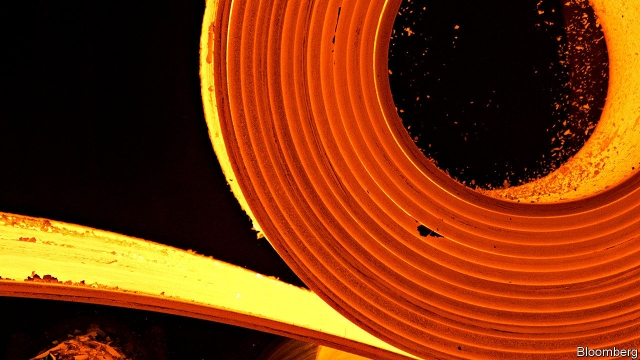
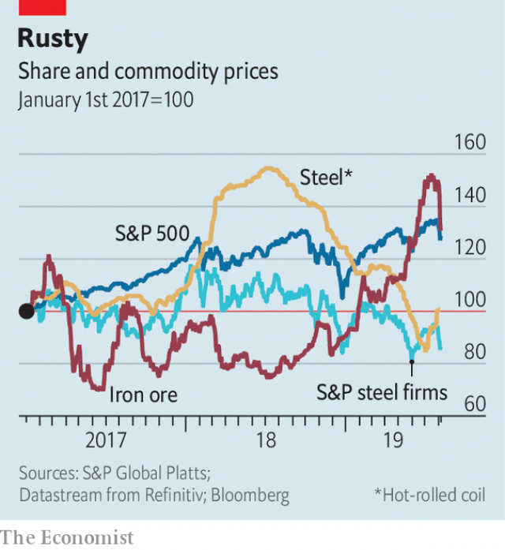

###### Double-edged

# American steel tariffs cut both ways for domestic producers 

 

> print-edition iconPrint edition | Business | Aug 10th 2019 

“IF I HADN’T been elected, you would have no steel industry right now,” declared President Donald Trump last month. He claimed that his “massive” tariffs of 25% on steel imports, imposed in March last year, have returned the domestic industry to rude health. A year ago he would have been right, if habitually hyperbolic. A tonne of hot-rolled coil, an industry benchmark, which sold for roughly $600 in America at the start of 2018, fetched over $800 by the summer. Volumes that American steelmakers shipped domestically rose too, by 5% in 2018 compared with the previous year. 

Today the boast looks out of date. Steel prices have slumped back to pre-tariff levels. Although the price of iron ore, from which a third of American steel is smelted, has tumbled in the past month, it remains roughly double what it was a year ago. Steelmakers’ profits collapsed. Nucor, US Steel and Steel Dynamics, the country’s three biggest producers, all reported a steep fall in second-quarter earnings. The industry’s share prices languish a fifth below their level a year ago (see chart). Mr Trump’s recent promise to force federal agencies to buy steel with at least 95% domestic content, up from a minimum of half today, is unlikely to change things. It could even make matters worse. 

The reason is economics. By raising domestic prices the tariffs distorted incentives. The extra cash, combined with an apparent rise in demand, induced steel companies to splash out on new capacity. Timna Tanners of Bank of America Merrill Lynch estimates that by 2022 the projects currently in the works could increase output by the equivalent of a fifth of America’s steel consumption in 2017. 

 

There may be nowhere for all the extra steel to go. Overseas, America’s high-cost producers cannot compete with cheap alloys from places like China. At home, last year’s uptick in volumes was caused chiefly by customers substituting domestic steel for suddenly pricier imports. Demand is now likely to grow at its underlying rate of 1-2% a year, estimates Andreas Bokkenheuser of UBS, an investment bank. 

Higher prices may even be dampening it. Some American manufacturers have delayed steel-heavy projects or switched to alternative materials. With factory activity slowing, as it did in July for the fourth straight month, demand for steel is slipping, too. US Steel has acknowledged that “market conditions have softened”. 

Peter Marcus of World Steel Dynamics, a research firm, praises Mr Trump for stimulating “massive investment that will modernise the industry”. Most has gone into “electric arc” furnaces, which smelt steel more cheaply from scrap metal rather than from iron ore. But high fixed costs, testy trade unions—and Mr Trump himself—discourage companies from retiring old, inefficient blast furnaces. Some of these will have to go if the industry is to avoid what Ms Tanners calls a “steelmageddon” of excess capacity. Fresh levies from the trade-warrior-in-chief may postpone it—but at a cost of making the eventual reckoning all the more painful.■ 
<<<<<<< HEAD

-- 

 单词注释:

1.tariff['tærif]:n. 关税, 关税表, 价格表, 收费表 vt. 课以关税 [计] 价目表 

2.producer[prә'dju:sә]:n. 生产者, 制作者, 制作人 [化] 发生器; (炉煤气)发生炉; 制气炉; 生产者 

3.Aug[]:abbr. 八月（August） 

4.habitually[hә'bitjjәli]:adv. 习惯(性), 惯常, 习以为常, 出于习惯, 已成规则 

5.hyperbolic[,haipә:'bɔlik]:a. 双曲线的, 夸张法的 [计] 双曲线的 

6.tonne[tʌn]:n. 吨, 公吨 [经] 吨 

7.benchmark[]:[计] 基准程序; 基准 

8.steelmaker['sti:lˌmeɪkə]:n. 炼钢工; 钢铁制造商 

9.domestically[dәu'mestikli]:adv. 家庭式地, 国内地 

10.slump[slʌmp]:n. 暴跌, 垂头弯腰的姿态 vi. 猛然掉落, 陷入, 衰落(经济等) 

11.smelt[smelt]:n. 胡瓜鱼 vt. 精炼, 熔炼 smell的过去式和过去分词 

12.nucor[]:[网络] 纽柯；纽柯钢铁公司；纽柯公司 

13.earning['ә:niŋ]:n. 收入（earn的现在分词） 

14.languish['læŋgwiʃ]:vi. 憔悴, 凋萎, 苦思 

15.distort[dis'tɒ:t]:vt. 扭曲, 歪曲 [法] 歪区, 曲解, 纂改 

16.incentive[in'sentiv]:n. 动机 a. 激励的 

17.induce[in'dju:s]:vt. 引诱, 招致, 归纳出, 感应 [医] 诱导, 感应 

18.timna[]:[网络] 亭纳；狄姆纳；稊娜 

19.tanner['tænә]:n. 制革工人, 硝皮匠, 六便士 

20.Merrill[]:n. 美林（美国证券公司）；美林（美国城市） 

21.lynch[lintʃ]:n. 私刑, 私罚 vt. 处以私刑处死, 加私刑 

22.currently['kʌrәntli]:adv. 现在, 当前, 一般, 普通 [计] 当前 

23.oversea['әuvә'si:]:adv. 海外, 向国外, 向海外, 国外 a. 外国的, 在国外的, 在海外的, 舶来的 

24.cannot['kænɒt]:aux. 无法, 不能 

25.uptick['ʌptik]:[商](股票)报升(成交价格比上一个交易高的成交或价格) 

26.chiefly['tʃi:fli]:adv. 主要地 

27.pricy['praisi]:a. 昂贵的, 价格高的 

28.underlie[.ʌndә'lai]:vt. 位于...之下, 成为...的基础 

29.andrea['ændriә,ɑ:n'dreiә]:n. 安德里亚（男子名） 

30.UB[]:[计] 上限 

31.dampen['dæmpәn]:vt. 弄湿, 使沮丧 vi. 变湿, 丧气 

32.soften['sɒftn]:v. (使)变柔软, (使)变柔和 

33.peter['pi:tә]:vi. 逐渐消失, 逐渐减少 

34.Marcus['mɑ:kәs]:n. 马库斯（男子名） 

35.modernise['mɔdәnaiz]:vt.vi. (使)现代化, (使)适应现代需要 vi. 用现代方法 

36.arc[ɑ:k]:n. 弧, 弧形, 弓形, 弧光 [化] 弧 

37.cheaply['tʃipli]:adv. 便宜地 

38.scrap[skræp]:n. 碎片, 残余物, 些微, 片断, 铁屑, 吵架 vt. 扔弃, 敲碎, 拆毁 vi. 互相殴打 a. 零碎拼凑成的, 废弃的 

39.testy['testi]:a. 易怒的, 暴躁的 

40.levy['levi]:n. 税款, 所征的人数, 征收 vi. 征税, 课税 vt. 征收, 强求, 召集 

41.eventual[i'ventʃuәl]:a. 最后的, 终于的 

42.reckon['rekәn]:vt. 计算, 总计, 估计, 认为, 猜想 vi. 数, 计算, 估计, 依赖, 料想 
=======
>>>>>>> 50f1fbac684ef65c788c2c3b1cb359dd2a904378

