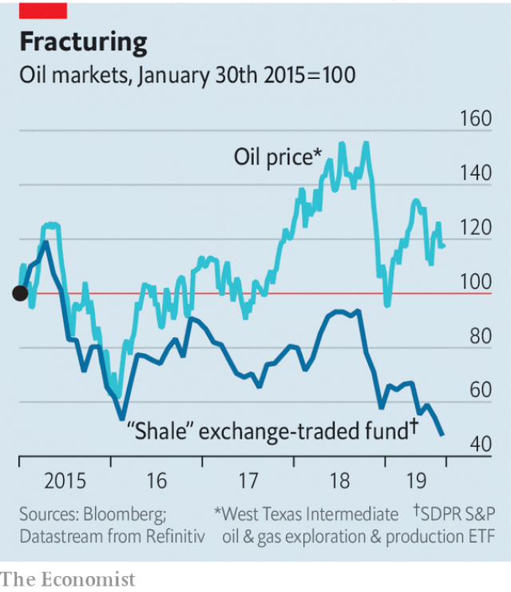

###### Shale sale

# Investors flee the Permian 

 

> print-edition iconPrint edition | Business | Aug 10th 2019 

FOR MORE than a decade investors have waited for America’s shale industry to mature. Ahead of the latest quarterly reports, they wanted to know if firms could produce more oil and rein in spending. For some big producers, the answer was “no”. Many shareholders got tired of waiting. 

The share price of Concho Resources, a firm with operations in Texas’s Permian basin, sank by more than 20% overnight, despite the assurance of a “free cashflow inflection in 2020”. An admission by Whiting Petroleum, which drills mainly in North Dakota and Montana, that it would not meet targets for production wiped more than a third off its market capitalisation over 24 hours. 

Other shale companies, including EOG, Diamondback and Parsley, presented evidence that they could boost output efficiently. Yet an index of American exploration-and-production firms plunged by 12% in the week to August 7th, worse than the market as a whole. 

Because fracking depletes wells quickly, companies must spend more to sustain output. In the past year producers have shown signs of living within their means. On August 6th Diamondback reported that its well costs continued to drop. Consolidation could boost efficiency. Based in part on that logic, shareholders of Anadarko, with big holdings in the Permian, were expected to approve its $38bn acquisition by Occidental Petroleum on August 8th, after The Economist went to press. 

Some attempts at boosting efficiency look counterproductive, however. Drill wells too close together and they produce less oil. The price of gas, which once boosted firms’ profits, briefly fell below zero this spring, when companies were paying customers to take the stuff off their hands amid a supply glut. 

 

The shale industry, whose shares prices used to track that of oil, down by 18% since April, now looks untethered (see chart). “Investors have decided it’s too volatile,” says Bob Brackett of Bernstein, a research firm. So they are diverting capital elsewhere. Occidental’s massively oversubscribed $13bn bond offering on August 6th shows fixed-income investors’ thirst for yield rather than an appetite for shale. 

The energy behemoths have the balance-sheets to buy the wildcatters. But many, like ExxonMobil, have enough land in the Permian to keep them busy. They are in no hurry and, like others, wary of overpaying—reasonable enough in light of shale firms’ falling value. The market has punished recent acquirers, including Concho, which bought RSP Permian last year. Carl Icahn, an activist investor, calls the Anadarko purchase “a travesty” and is trying to sack four of Occidental’s board members. Rumours swirled in 2018 that Royal Dutch Shell would buy a company called Endeavor. No announcement has come. ■ 

