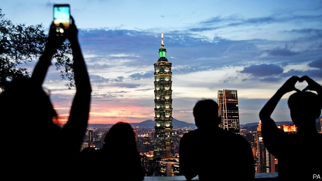

###### Backpacking backtrack

# China is trying to browbeat Taiwan by keeping its tourists away 

 

> print-edition iconPrint edition | China | Aug 10th 2019 

ON THE AFTERNOON of July 31st youngsters in dozens of Chinese cities raced to government offices, pursuing a precious commodity. Earlier that day the authorities had announced that from midnight they would no longer issue the passes that allow mainland tourists to visit Taiwan independently, without having to join a tour. A 25-year-old newlywed from the eastern province of Zhejiang, who uses the nickname Yuyi, says she got a permit just before the cut-off. Now she wonders whether, given rising tensions between China and Taiwan, it might be wiser to junk the September getaway on the island that she and her husband have been planning. 

China has long used carrots and sticks to persuade Taiwan’s people to accept its demand for “peaceful reunification”. But the sudden suspension of the solo-travel programme, launched eight years ago, was still a surprise. A spokesperson for China’s government blamed Taiwan’s ruling Democratic Progressive Party (DPP), which abhors the idea of unification. He said it had “incited hostility towards the mainland”. Tsai Ing-wen, Taiwan’s president, retorted that China had made “a big strategic mistake” and that its decision would irk both mainlanders and Taiwanese. 

Visitors from China accounted for just over one-quarter of Taiwan’s tourist arrivals in the first half of this year. About 40% of them were individual travellers. Taiwanese travel agents predict that the Chinese government’s new policy could cut visitor numbers by up to 700,000 over the next six months, costing the tourism industry around $900m in revenue. Barclays, a bank, says the policy could cost Taiwan sums equal to 0.2% of GDP (the Taiwanese government has predicted that its economy will grow by nearly 2.2% this year). There will be intangible costs, too. Research suggests that independent travellers tend to leave with a better impression of Taiwan than those who visit in groups. 

All this will leave a mark, but it is no crushing blow. Taiwan is much less reliant on mainland tourists than it was five years ago, when they made up two-fifths of all visitors. That is in part because of restrictions China began imposing on group travel shortly before Ms Tsai’s inauguration in 2016. It is also because Taiwan has lately pushed hard to attract visitors from elsewhere. Tourist arrivals reached a record 11.1m last year, mainly because of a surge of travellers from South-East Asian countries. 

China is angry with Ms Tsai for rejecting its overtures, and with America for being nice to her. It complained bitterly about her two recent stopovers in America, where she spoke at Columbia University and hobnobbed with foreign diplomats. It raged about the Trump administration’s decision last month to approve a long-negotiated arms deal with Taiwan worth about $2.2bn. But it is probably most annoyed by Ms Tsai’s loud support in recent weeks for anti-government protesters in Hong Kong. She says they have “legitimate concerns”. 

By stemming the flow of tourists, China may be trying to warn Taiwanese voters of what could happen if they re-elect Ms Tsai and support other politicians like her in presidential and legislative elections in January—Taiwan’s economy is heavily reliant on China’s. The biggest opposition party, the Kuomintang (KMT), supports friendlier ties with the mainland and made big gains in regional elections last November. China’s leaders would like it to vanquish the DPP in next year’s polls. But Ms Tsai’s support for Hong Kong’s democrats has helped her once-dismal ratings to rebound. She could even keep her job. 

In an attempt to capture some of her newfound support, the KMT’s presidential candidate, Han Kuo-yu, is trying to sound a bit more sceptical about China (earlier in the year some Taiwanese criticised him for a chummy meeting with mainland officials in Hong Kong, ostensibly to promote trade). Mr Han is the mayor of the southern port of Kaohsiung. Fan Shih-ping of Taiwan National Normal University says the city will suffer disproportionately from China’s block on tourism—Kaohsiung has tended to be popular with solo tourists because it is easily reached by train. But the KMT appears to have decided not to make political hay out of China’s decision to cut the flow. 

China will doubtless have more tricks to play in the run-up to January’s polls. Having already poached five of Taiwan’s diplomatic allies in the three years since Ms Tsai came to power, it may try to peel off at least one more. In the past China has called off military exercises around the strait in advance of Taiwanese elections, for fear of provoking a backlash at the ballot box. Andrew Yang, a former defence minister, thinks that this time China may step up its drills, partly because it has lots of new kit it wants to try out. Taiwan has accused the mainland of trying to influence the island’s politics by spreading “fake news” through social media. But how much any of this will work is hotly debated in Taiwan. It may be that such efforts will deter voters from supporting radical anti-China politicians (Ms Tsai is relatively restrained in her approach to the mainland). But the unrest in Hong Kong has shown that even in a place where it has many levers, China can struggle to get its political way. ■ 

