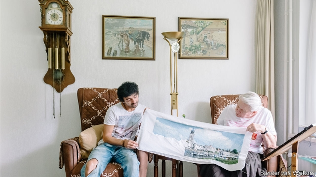

###### Club 18-108

# A Dutch care home experiments with housing students with the old 

 

> print-edition iconPrint edition | Europe | Aug 10th 2019 

SORES DUMAN is a normal 29-year-old. He goes to the cinema, follows the Champions League attentively, parties occasionally and talks about life and love with his friends. Later in the week he will see an action movie with his mate Piebe. Before that, he may go to McDonald’s with Martey, another chum. It might take more time than usual for his friends to get ready for these activities. Piebe is 79 and Martey a sprightly 94. Does Sores think his weekend plans are odd? “No, I do similar things with friends my own age. I don’t see the difference in age as an obstacle.” 

Mr Duman lives at the Humanitas care home in Deventer, in central Holland. His housemates’ average age is over 85. He has been there for three years, along with five other students from nearby universities and around 150 elderly residents. They are part of a scheme started in 2012 that provides them with free housing in exchange for 30 hours per month of their time living as a “good neighbour”. Only one activity is mandatory: preparing and serving a meal on weekday evenings. 

Both parties appear to benefit from the programme. Mr Duman estimates that he has saved over €10,000 ($11,200) in rent. He claims that living in a care home has not impinged on his university experience. “We have big parties here,” he says, pointing to a room for hire that sits empty at night. “We host everything from beer-pong tournaments to yoga classes.” In a promotional video, one resident calls the initiative gezellig, a Dutch word that roughly translates as cosy: “Now and then they put me into the walker and race me through the hall,” she explains. 

Onno Selbach, the first student to move in, says he learnt to be more patient as a result of the experience; the pace of life is slower at the home. The scheme has helped attract prospective residents. The home now has a waiting list, which it previously did not. And students are queuing up. When two left the home in April, 27 applied to replace them. 

Humanitas is not the first institution to urge old and young people to live together. Municipalities across Spain and care homes in Lyon, France, and Cleveland, Ohio, have also experimented with the idea. A team from Finland visited Deventer and was inspired to start a similar scheme. 

Such initiatives could help combat loneliness, an increasing problem across the rich world. The very old, migrants, the sick or disabled, and singletons are most at risk of feeling lonely. It goes hand in hand with social isolation. About 18% of adult EU citizens—some 75m people—see friends or family at most only once a month. Nearly half of Britons over the age of 65 say that television or pets are their main form of company. Loneliness is also reckoned to have serious health consequences: a study from 2015 found that lonely people had on average a 26% higher risk of dying in its seven-year study period than those who were not lonely. And the problem may only get worse. The share of people who are aged over 80 will more than double in the EU by 2080. Social isolation is becoming more common partly because people are marrying later. Creating a space for the elderly to mingle with youngsters can lift spirits—and help cash-strapped millennials. ■ 

