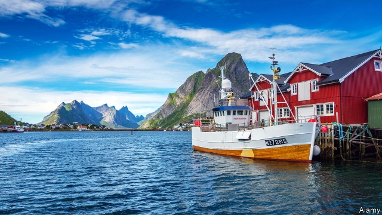

###### Cod awful

# Norway has haddock enough of fish smugglers 

 

> print-edition iconPrint edition | Europe | Aug 10th 2019 

AT MOST INTERNATIONAL borders the authorities look for anything they think smells fishy: drugs, weapons, cigarettes or alcohol. In Norway they also look for fish. This summer, Norwegians are worrying that tourists are depleting their crystal-clear waters and smuggling their catch out of the country. 

Popular prejudice says that the typical fish-smuggler is a beer-bellied German. But new statistics show that Ukrainians, Czechs, Poles, Lithuanians and Belgians are the true scoundrels. Border guards seized eight tonnes of illegal catch from vehicles driven by people from those countries in the first six months of this year. 

Visitors to Norway are allowed to take home 10kg of their catch (salmon, trout and char are not counted), and double that if they fish with a licensed tourist company. The current bout of turistfisk  activity, as the phenomenon is known, suggests many are going far past that limit. In recent weeks officials have caught dozens of cars and motorhomes laden sometimes with 100kg or more of fish, mainly cod. 

Officials refuse to be drawn on whether the smugglers are simply enthusiastic holidaymakers, or part of a bigger racket. But the fact that some of those caught in the trawl have been exporting fillets ready for consumption rather than fresh fish suggests they may be organised, and are trying to evade Norway’s systems of licences and controls for commercial fishing. 

In an attempt to stop the piscine flow, spot-checks have increased, says Geir Pollestad, a Centre Party MP and chairman of the Norwegian parliament’s committee for business and industry. Prosecutors have also doubled the fines for smuggling. 

Norwegians increasingly see tourists as a problem, not a boon. Cruise ships bring thousands to tiny villages at the heads of hitherto pristine fjords. Nusfjord, in the northern archipelago of Lofoten, has already set a limit of two tourist coaches a day. “We’ve had enough of people coming here and leaving nothing but shit and pollution,” says one resident. A growing number of politicians support a tourist tax. The idea would be to raise money while deterring those tourists who strain infrastructure but spend no money. Now that tourists are after precious Norwegian fish, perhaps parliament will bite.■ 
<<<<<<< HEAD

-- 

 单词注释:

1.cod[kɒd]:n. 鳕, 欺骗, 愚弄 v. 欺骗, 愚弄 

2.Norway['nɒ:wei]:n. 挪威 

3.haddock['hædәk]:n. 黑斑鳕 

4.smuggler['smʌglә]:n. 走私者, 走私船 [经] 走私者, 走私船 

5.Aug[]:abbr. 八月（August） 

6.Norwegian[nɒ:'wi:dʒәn]:n. 挪威人, 挪威语 a. 挪威的, 挪威人的, 挪威语的 

7.deplete[di'pli:t]:vt. 耗尽, 使衰竭 [医] 排除, 减少 

8.smuggle['smʌgl]:vt. 偷运, 走私, 私运 vi. 走私 

9.statistic[stә'tistik]:n. 统计量 a. 统计的, 统计学的 

10.ukrainian[ju(:)'kreinjәn]:a. 乌克兰的；乌克兰人的 

11.Czech[tʃek]:n. 捷克人, 捷克语 a. 捷克的, 捷克语的, 捷克人的 

12.Lithuanian[.liθju:'einiәn]:n. 立陶宛人 a. 立陶宛的, 立陶宛人的, 立陶宛语的 

13.Belgian['beldʒәn]:n. 比利时人 a. 比利时的 

14.scoundrel['skaundrәl]:n. 恶棍 a. 卑鄙的 

15.tonne[tʌn]:n. 吨, 公吨 [经] 吨 

16.salmon['sæmәn]:n. 鲑鱼, 大麻哈鱼 [医] 鲑 

17.trout[traut]:n. 鲑鱼 

18.char[tʃɑ:]:n. 家庭杂务, 炭 vi. 打杂, 烧焦 

19.bout[baut]:n. 一回, 回合, 较量 [医] 发作 

20.motorhome[ˈməʊtəhəʊm]:n. 旅宿车 

21.cod[kɒd]:n. 鳕, 欺骗, 愚弄 v. 欺骗, 愚弄 

22.holidaymaker['hɒlәdi.meikә]:n. 度假者 

23.trawl[trɒ:l]:n. 拖网 v. 用拖网捕鱼 

24.fillet['filit]:n. 头带, 带子 vt. 用带缚 

25.evade[i'veid]:v. (巧妙地)逃脱, 规避, 逃避 

26.piscine['pisain]:a. 鱼的, 鱼族的 n. 浴池 

27.geir[]:n. (Geir)人名；(葡)热尔；(冰)吉尔；(挪)盖尔 

28.MP[]:国会议员, 下院议员 [计] 宏处理程序, 维护程序, 线性规划, 微程序, 多处理器 

29.Norwegian[nɒ:'wi:dʒәn]:n. 挪威人, 挪威语 a. 挪威的, 挪威人的, 挪威语的 

30.prosecutor['prɒsikju:tә]:n. 实行者, 告发者, 公诉人 [法] 原告, 起诉人, 检举人 

31.boon[bu:n]:n. 恩惠 

32.cruise[kru:z]:n. 巡航, 巡弋, 漫游 v. 巡航, 巡弋, 漫游 

33.hitherto[.hiðә'tu:]:adv. 迄今, 至今 

34.pristine['pristi:n]:a. 太古的, 原来的, 古时的, 原始的 

35.fjord[fjɔ:d]:n. 峡湾 

36.nusfjord[]:[网络] 努斯峡湾；纳斯峡湾；罗弗敦的纳斯峡湾 

37.archipelago[.ɑ:ki'pelәgәu]:n. 群岛, 多岛屿的海 

38.lofoten[]: [地名] [挪威] 罗弗敦群岛 

39.shit[ʃit]:vi. 拉屎 vt. 欺骗, 在...拉屎 n. 粪, 屎 interj. 狗屁 

40.deter[di'tә:]:vt. 制止, 吓住, 威慑 

41.infrastructure['infrәstrʌktʃә]:n. 基础结构, 基础设施 [经] 基础设施 
=======
>>>>>>> 50f1fbac684ef65c788c2c3b1cb359dd2a904378

